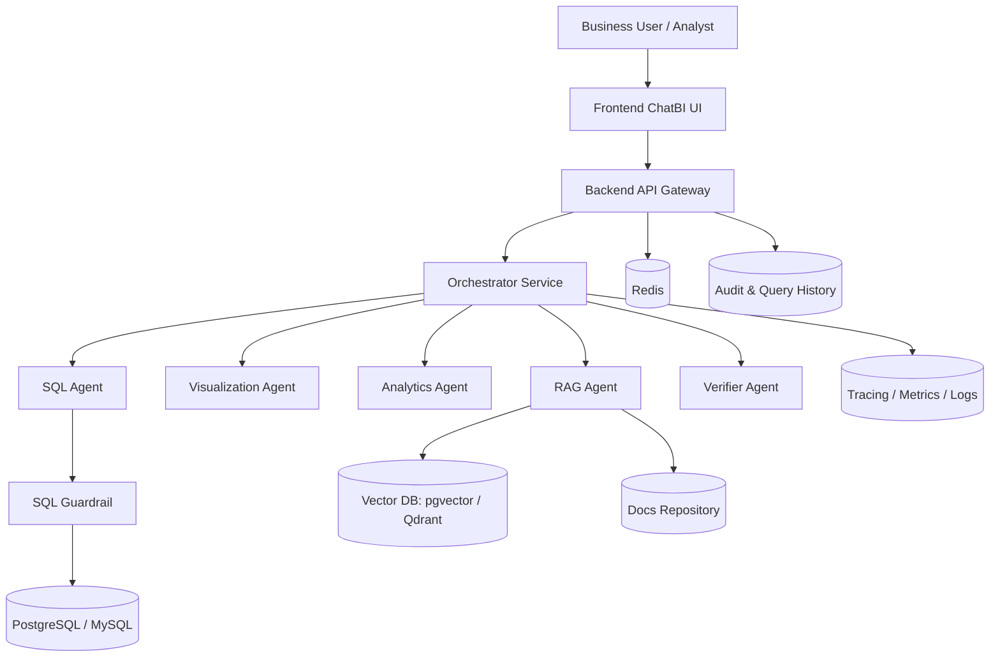
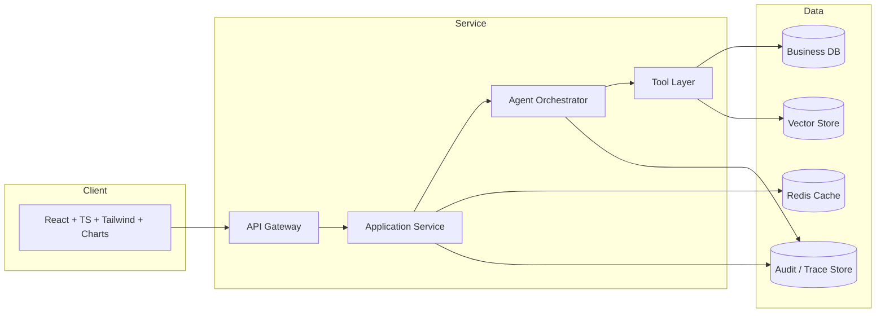

# Overall Architecture Design (English)

## 1. Document Info
- Version: v1.0
- Status: Detailed Design
- Owner: Architecture Team / AI Platform Team
- Last Updated: 2026-06-16

## 2. Design Goals
1. Build a layered enterprise ChatBI architecture with clear boundaries.
2. Support a full loop from natural-language questions to data-backed, verified answers.
3. Meet production-readiness requirements for reliability, security, observability, and auditability.

## 3. Scope
In Scope:
1. Frontend ChatBI experience layer.
2. Backend API and orchestration layer.
3. Multi-agent execution layer.
4. Structured data and knowledge retrieval layer.
5. Governance, audit, evaluation, and monitoring layer.

Out of Scope:
1. Multi-tenant billing.
2. Multi-cluster HA deployment on Kubernetes.
3. Complex enterprise IAM federation.

## 4. Core Requirements
Functional requirements:
1. Support KPI query, comparative analysis, anomaly detection, forecasting, and RAG explanation.
2. Return tables, charts, narratives, evidence citations, and risk hints.
3. Support query history and replay.

Non-functional requirements:
1. Reliability: core E2E success rate >= 99.0%.
2. Performance: standard query P95 <= 8s, advanced analysis P95 <= 20s.
3. Security: read-only SQL enforcement, privilege checks, sensitive-field protection.
4. Maintainability: modular design with replaceable agents and extensible data sources.

Governance requirements:
1. Full audit logging.
2. Table-level and field-level authorization.
3. Traceability from final answers to SQL and evidence sources.

## 5. System Structure Diagram (Logical Layers)

## 6. System Architecture Diagram (Runtime View)

## 7. Layer Responsibilities
1. Experience layer: conversation UX, chart rendering, state display, history replay entry.
2. Access layer: authentication, throttling, session routing, response normalization.
3. Orchestration layer: decomposition, agent routing, parallel scheduling, fallback.
4. Intelligence layer: SQL, visualization, analytics, retrieval, verification.
5. Tool and data layer: DB, vector retrieval, cache, logs, evaluation data.
6. Governance and observability layer: policy engine, access control, audit traces, SLO monitoring.

## 8. End-to-End Key Workflow
Happy path:
1. User submits a natural-language question.
2. API authenticates and creates a trace id.
3. Orchestrator classifies the task and builds a plan.
4. SQL Agent generates SQL from semantic definitions, then Guardrail validates.
5. Result data is processed by Visualization, Analytics, RAG, and Verifier.
6. Orchestrator aggregates outputs into answer + chart + evidence + risk notes.
7. Full process is persisted to history and audit stores.

Exception path:
1. SQL blocked: return safe explanation and retry guidance.
2. Query timeout: return partial degraded answer.
3. Empty RAG hit: provide data-only insight with evidence gap warning.
4. Low verifier confidence: attach risk warning and human-review recommendation.

## 9. Data and Interface Contracts
Input contract (Ask API):
1. user_id
2. session_id
3. question
4. locale
5. role

Output contract (Answer API):
1. answer_text
2. sql_text
3. table_result
4. chart_spec
5. forecast_result
6. anomaly_result
7. evidence_list
8. confidence
9. warnings
10. trace_id

Recommended APIs:
1. POST /api/v1/chat/query
2. GET /api/v1/chat/history
3. GET /api/v1/query/{trace_id}
4. GET /api/v1/metrics/catalog

## 10. Security and Governance
1. SQL governance: SELECT-only, auto-limit, timeout cancellation.
2. Access control: role-based table and field permissions.
3. Data masking: policy-based masking for PII.
4. Audit fields: user_id, question, sql_hash, status, latency, rule_hit, trace_id.
5. Trust signals: confidence score and risk labels in all answers.

## 11. Observability
Key metrics:
1. E2E success rate.
2. E2E latency (P50/P95/P99).
3. SQL interception rate.
4. RAG hit rate.
5. Low-confidence verifier rate.

Tracing model:
1. One trace id per request.
2. Step-level logs for each agent with input/output summary and duration.

Alerting strategy:
1. Alert when E2E P95 exceeds threshold for 15 minutes.
2. Alert on sudden SQL interception spikes.
3. Alert when error rate exceeds 2%.

## 12. Testing and Acceptance
Unit tests:
1. Routing policy tests.
2. SQL rule-engine tests.
3. Response-schema validation tests.

Integration tests:
1. Query -> chart -> verifier chain.
2. Query -> forecasting chain.
3. Query -> RAG -> verifier chain.

Acceptance criteria:
1. At least 20 key business questions pass E2E.
2. All dangerous SQL statements are blocked.
3. Every answer is traceable to SQL and evidence.

## 13. Risks and Open Questions
Risks:
1. Inconsistent metric definitions may cause output mismatch.
2. Low-quality evidence retrieval may reduce explanation trustworthiness.
3. Orchestration latency may increase under high concurrency.

Open questions:
1. Single FastAPI backend first or split service architecture in v1.
2. Primary vector store choice: pgvector or Qdrant.
3. Default forecasting priority: ARIMA or Prophet.

## 14. Milestones
1. M1 (Week 1): architecture design, API contracts, semantic examples.
2. M2 (Week 2): MVP development and integration.
3. M3 (Week 3): evaluation, optimization, and demo assets.
