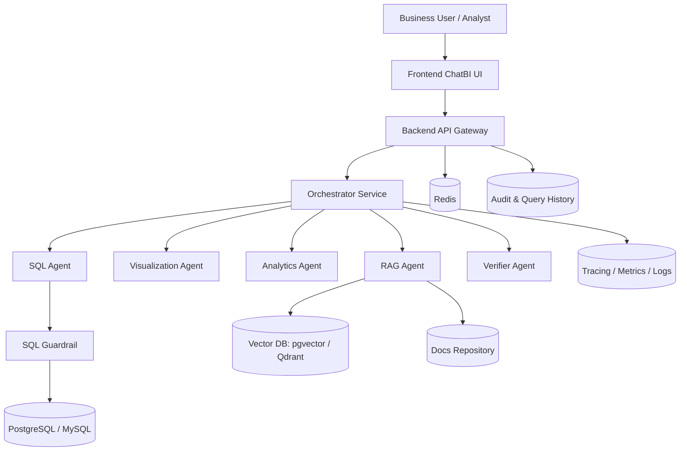
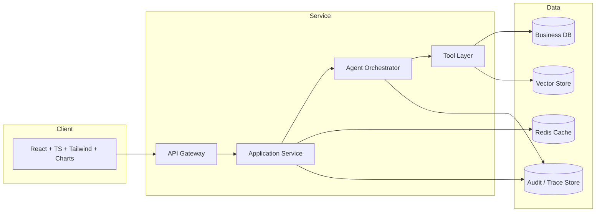

# 总体架构设计（中文）

## 1. 文档信息
- 版本：v1.0
- 状态：详细设计
- 负责人：架构组 / AI 平台组
- 最后更新：2026-06-16

## 2. 设计目标
1. 构建企业级 ChatBI 平台的分层架构，保证功能完整、边界清晰。
2. 支持“自然语言提问 -> 数据查询 -> 分析预测 -> 证据解释 -> 验证输出”的闭环。
3. 在可靠性、安全性、可观测性、审计性上达到可生产落地标准。

## 3. 作用范围
In Scope：
1. 前端 ChatBI 体验层。
2. 后端 API 与编排层。
3. 多智能体执行层。
4. 结构化数据与知识检索层。
5. 治理、审计、评估、监控层。

Out of Scope：
1. 多租户计费系统。
2. K8s 多集群高可用发布。
3. 复杂组织级 IAM 对接。

## 4. 核心需求
功能需求：
1. 支持 KPI 查询、对比分析、异常检测、趋势预测、RAG 解释。
2. 输出表格、图表、文字结论、证据引用、风险提示。
3. 支持查询历史和结果回放。

非功能需求：
1. 可靠性：核心链路成功率 >= 99.0%。
2. 性能：普通查询 P95 <= 8s，复杂分析 P95 <= 20s。
3. 安全性：SQL 只读、越权拦截、敏感字段受控。
4. 可维护性：模块化、可替换 Agent、可扩展数据源。

合规与治理需求：
1. 记录完整审计日志。
2. 支持表级与字段级授权策略。
3. 输出必须可追溯到 SQL 和证据来源。

## 5. 系统结构图（逻辑分层）

## 6. 系统架构图（运行时架构）

## 7. 分层职责设计
1. 体验层：负责对话交互、图表渲染、状态展示、历史回放入口。
2. 接入层：统一鉴权、限流、会话路由、响应标准化。
3. 编排层：任务分解、Agent 路由、并行调度、失败回退。
4. 智能能力层：SQL、可视化、预测、检索、验证。
5. 工具与数据层：数据库、向量检索、缓存、日志、评估数据。
6. 治理观测层：规则引擎、权限控制、审计追踪、SLO 监控。

## 8. 端到端关键流程
主流程：
1. 用户输入自然语言问题。
2. API 完成鉴权并生成 trace id。
3. Orchestrator 分类任务并拆解执行计划。
4. SQL Agent 结合语义层产出 SQL 并通过 Guardrail 校验。
5. 查询结果交给 Visualization / Analytics / RAG / Verifier 并行处理。
6. Orchestrator 汇总结果，输出结论 + 图表 + 证据 + 风险说明。
7. 结果与过程写入审计和历史。

异常流程：
1. SQL 拦截：返回安全提示与可重试建议。
2. 查询超时：触发降级结果，返回部分可用信息。
3. RAG 空召回：只给数据结论，标注证据不足。
4. Verifier 低置信：输出风险警告并建议人工复核。

## 9. 数据与接口契约
输入契约（Ask API）：
1. user_id
2. session_id
3. question
4. locale
5. role

输出契约（Answer API）：
1. answer_text
2. sql_text
3. table_result
4. chart_spec
5. forecast_result
6. anomaly_result
7. evidence_list
8. confidence
9. warnings
10. trace_id

接口建议：
1. POST /api/v1/chat/query
2. GET /api/v1/chat/history
3. GET /api/v1/query/{trace_id}
4. GET /api/v1/metrics/catalog

## 10. 安全与治理设计
1. SQL 治理：仅允许 SELECT，自动 limit，超时中断。
2. 访问控制：按角色限制表和字段访问。
3. 数据脱敏：PII 字段按策略遮蔽。
4. 审计字段：user_id、question、sql_hash、status、latency、rule_hit、trace_id。
5. 结果可信度：必须携带置信度与风险标签。

## 11. 可观测性设计
核心指标：
1. E2E 成功率。
2. E2E 延迟（P50/P95/P99）。
3. SQL 拦截率。
4. RAG 命中率。
5. Verifier 低置信率。

追踪设计：
1. 每次请求全链路 trace id。
2. 每个 Agent step 记录开始、结束、输入摘要、输出摘要、耗时。

告警策略：
1. E2E P95 > 目标阈值持续 15 分钟告警。
2. SQL 拦截率突增告警。
3. 错误率 > 2% 告警。

## 12. 测试与验收
单元测试：
1. 路由规则。
2. SQL 规则引擎。
3. 输出 schema 校验。

集成测试：
1. 查询 -> 图表 -> 验证链路。
2. 查询 -> 预测链路。
3. 查询 -> RAG -> 验证链路。

验收标准：
1. 20 条核心业务问题端到端可用。
2. 所有危险 SQL 被阻断。
3. 结果可追溯到 SQL 与证据。

## 13. 风险与待决事项
风险：
1. 指标口径不统一会导致结果不一致。
2. 检索证据质量不足会影响解释可信度。
3. 高并发下 Agent 编排延迟可能上升。

待决事项：
1. 首版是否采用 FastAPI 单后端，还是双服务拆分。
2. 向量库首选 pgvector 还是 Qdrant。
3. Forecast 默认方法优先级（ARIMA 或 Prophet）。

## 14. 里程碑
1. M1（第 1 周）：完成架构设计、接口定义、语义层样例。
2. M2（第 2 周）：完成 MVP 开发与联调。
3. M3（第 3 周）：完成评估、优化、演示资料。
