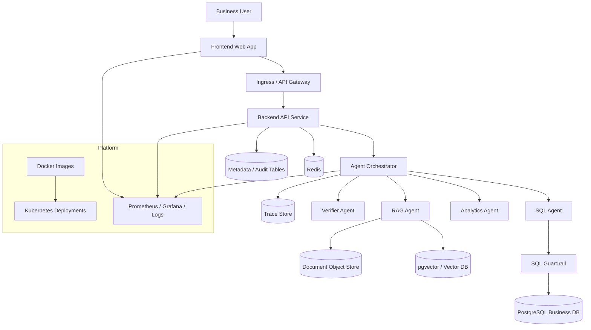

# Overall Architecture Design v2 (English)

## 1. Document Info
- Version: v2.0
- Status: Engineering Architecture Upgrade Design
- Owner: Architecture Team / AI Platform Team
- Last Updated: 2026-06-22
- Baseline Document: [README.en.md](README.en.md)

## 2. v2 Upgrade Goals
v1 defined the logical layers and Agent capability boundaries of ChatBI. v2 upgrades the system into an engineering architecture that can run locally with Docker, connect frontend and backend, use a real database, and deploy to Kubernetes.

Core upgrades:
1. Split the frontend, backend API, Agent orchestration, database, cache, vector retrieval, and observability components into deployable units.
2. Use PostgreSQL as the primary store for business data, runtime history, audit logs, and semantic configuration.
3. Use Redis for session cache, query state, rate-limit counters, and short-lived result cache.
4. Use pgvector or an independent vector database for RAG document retrieval.
5. Use Docker Compose for local one-command startup and Kubernetes for production deployment.
6. Include observability, health checks, configuration management, and release rollback in the main architecture.

## 3. v2 Runtime Architecture

## 4. Service Decomposition
1. `frontend-web`: ChatBI UI for conversation, result rendering, history replay, and metric catalog.
2. `backend-api`: REST API, authentication, sessions, history, query entry points, and unified response model.
3. `agent-orchestrator`: task classification, Agent scheduling, state aggregation, and failure degradation.
4. `query-executor`: database connection pool, read-only SQL execution, and result normalization.
5. `rag-indexer`: document cleaning, chunking, embedding, and incremental indexing.
6. `worker`: asynchronous evaluation, long-running analytics, and batch document processing.
7. `postgres`: business data, semantic catalog, audit, trace, and evaluation results.
8. `redis`: cache, rate limits, short task state, and temporary session context.

## 5. Database Connectivity Design
1. The backend reads `DATABASE_URL`, `REDIS_URL`, and `VECTOR_STORE_URL` from environment variables.
2. All business SQL runs through a read-only connection pool; migrations and seed data use a separate admin connection.
3. The query execution layer must enforce statement timeout, row limit, and read-only transactions.
4. Audit and trace records are written to independent tables to avoid coupling with business fact tables.
5. Local development uses PostgreSQL from Docker Compose; production injects connection strings through Kubernetes Secrets.

## 6. Docker Design
1. Every runnable service has an independent image that contains only runtime dependencies.
2. `docker-compose.yml` starts the frontend, backend, PostgreSQL, Redis, vector store, and basic observability components locally.
3. Images use both `service:git_sha` and `service:version` tags.
4. Containers must expose `/healthz`, `/readyz`, and `/metrics`.
5. Database initialization scripts, sample data, and semantic configuration run through mounts or migration jobs.

## 7. Kubernetes Deployment Design
1. Stateless services use `Deployment`; databases should preferably use managed cloud services, while local demos may use `StatefulSet`.
2. External traffic enters through `Ingress`; internal service discovery uses `ClusterIP Service`.
3. Configuration uses `ConfigMap`, secrets use `Secret`, and secrets must not be baked into images.
4. The backend, orchestrator, and worker scale horizontally independently.
5. Readiness probes prevent uninitialized Pods from receiving traffic.
6. Liveness probes handle runtime failures such as deadlocks and exhausted connection pools.

## 8. Frontend-Backend Integration Contract
1. The frontend calls only `backend-api`; it never calls Agents or databases directly.
2. Every request carries `session_id`, `trace_id`, `locale`, and user identity context.
3. The backend returns a unified envelope: `data`, `error`, `warnings`, and `trace_id`.
4. Long-running queries use asynchronous tasks or streaming events, and the frontend shows stage-level status.
5. Charts use `chart_spec`; tables use `table_result`.

## 9. Releases and Environments
1. `dev`: Docker Compose, local database, and mock or sample document sources.
2. `staging`: single Kubernetes namespace, test database, and full logging enabled.
3. `prod`: multi-replica Kubernetes services, managed database, least-privilege Secrets, and alerts enabled.
4. Release flow: build image -> run tests -> push image -> run migration -> Kubernetes rollout.
5. Rollback strategy: keep the previous image and ensure database migrations are backward compatible.

## 10. v2 Acceptance Criteria
1. A local `docker compose up` can complete one end-to-end ChatBI query.
2. The backend can connect to a real PostgreSQL database and execute controlled read-only queries.
3. The frontend can render text, tables, charts, evidence, risk warnings, and history.
4. Kubernetes manifests can deploy the frontend, backend, worker, Redis dependencies, and configuration.
5. Every request has trace, metrics, and audit records.
