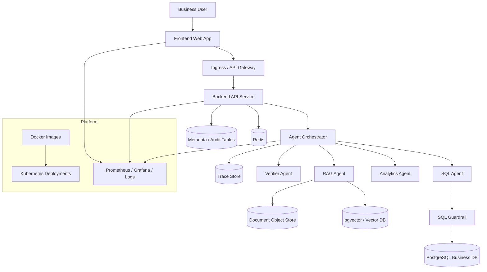

# 总体架构设计 v2（中文）

## 1. 文档信息
- 版本：v2.0
- 状态：工程化架构升级设计
- 负责人：架构组 / AI 平台组
- 最后更新：2026-06-22
- 基线文档：[README.zh-CN.md](README.zh-CN.md)

## 2. v2 升级目标
v1 定义了 ChatBI 的逻辑分层和 Agent 能力边界。v2 将系统升级为可本地 Docker 化、可前后端联调、可连接真实数据库、可部署到 Kubernetes 的工程架构。

核心升级：
1. 将前端、后端 API、Agent 编排、数据库、缓存、向量检索、观测组件拆成可部署单元。
2. 使用 PostgreSQL 作为业务数据、运行历史、审计日志和语义配置的主存储。
3. 使用 Redis 支撑会话缓存、查询状态、限流计数和短期结果缓存。
4. 使用 pgvector 或独立向量库支撑 RAG 文档检索。
5. 使用 Docker Compose 支撑本地一键启动，使用 Kubernetes 支撑生产部署。
6. 将可观测性、健康检查、配置管理和发布回滚纳入主架构。

## 3. v2 运行时架构

## 4. 服务拆分
1. `frontend-web`：ChatBI UI，负责对话、结果渲染、历史回放、指标目录。
2. `backend-api`：REST API、鉴权、会话、历史、查询入口、统一响应模型。
3. `agent-orchestrator`：任务分类、Agent 调度、状态聚合、失败降级。
4. `query-executor`：数据库连接池、只读 SQL 执行、结果标准化。
5. `rag-indexer`：文档清洗、切片、embedding、增量索引。
6. `worker`：异步评估、长任务分析、批量文档处理。
7. `postgres`：业务数据、语义目录、审计、trace、评估结果。
8. `redis`：缓存、限流、短任务状态、临时会话上下文。

## 5. 数据库连接设计
1. 后端通过环境变量读取 `DATABASE_URL`、`REDIS_URL`、`VECTOR_STORE_URL`。
2. 所有业务 SQL 通过只读连接池执行，迁移和种子数据使用独立管理员连接。
3. 查询执行层必须设置 statement timeout、row limit、只读事务。
4. 审计与 trace 写入独立表，避免与业务事实表耦合。
5. 本地开发使用 Docker Compose PostgreSQL，生产使用 K8s Secret 注入连接串。

## 6. Docker 设计
1. 每个可运行服务拥有独立镜像，镜像内只包含运行时依赖。
2. `docker-compose.yml` 负责本地启动前端、后端、PostgreSQL、Redis、向量存储和观测基础组件。
3. 镜像标签采用 `service:git_sha` 与 `service:version` 双标签。
4. 容器启动必须暴露 `/healthz`、`/readyz`、`/metrics`。
5. 数据库初始化脚本、样例数据和语义配置通过挂载或 migration job 执行。

## 7. Kubernetes 部署设计
1. 无状态服务使用 `Deployment`，数据库优先使用云托管服务；本地演示可使用 `StatefulSet`。
2. 外部访问通过 `Ingress`，内部服务通过 `ClusterIP Service`。
3. 配置使用 `ConfigMap`，密钥使用 `Secret`，不得写入镜像。
4. 后端、编排器、worker 独立水平扩缩容。
5. 使用 readiness probe 防止未完成初始化的 Pod 接流量。
6. 使用 liveness probe 处理死锁、连接池耗尽等运行时异常。

## 8. 前后端接入契约
1. 前端只调用 `backend-api`，不直接访问 Agent 或数据库。
2. 所有请求携带 `session_id`、`trace_id`、`locale` 和用户身份上下文。
3. 后端返回统一 envelope：`data`、`error`、`warnings`、`trace_id`。
4. 长查询采用异步任务或流式事件，前端显示阶段性状态。
5. 图表统一使用 `chart_spec`，表格统一使用 `table_result`。

## 9. 发布与环境
1. `dev`：Docker Compose，本地数据库和模拟文档源。
2. `staging`：K8s 单命名空间，连接测试数据库，启用完整日志。
3. `prod`：K8s 多副本服务，托管数据库，最小权限 Secret，开启告警。
4. 发布流程：构建镜像 -> 运行测试 -> 推送镜像 -> 执行 migration -> K8s rollout。
5. 回滚策略：保留上一版镜像和数据库向后兼容 migration。

## 10. v2 验收标准
1. 本地 `docker compose up` 后可完成一次端到端 ChatBI 查询。
2. 后端能连接真实 PostgreSQL 并执行只读受控查询。
3. 前端能展示文本、表格、图表、证据、风险提示和历史记录。
4. K8s manifest 能部署前端、后端、worker、Redis 依赖和配置。
5. 每次请求具备 trace、metrics、audit 记录。
