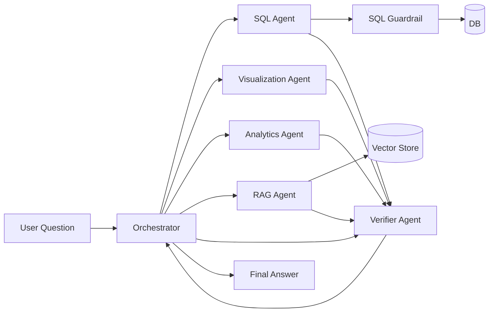
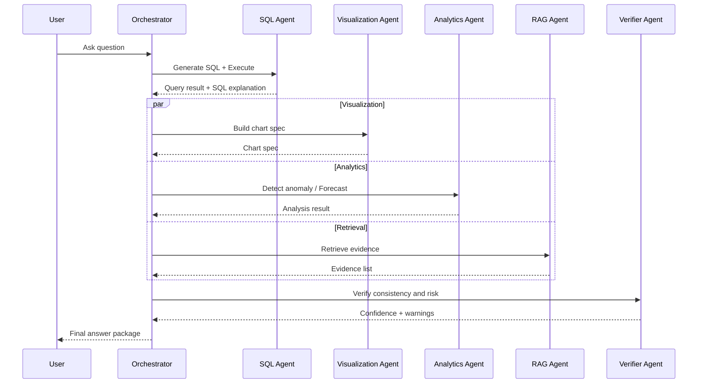
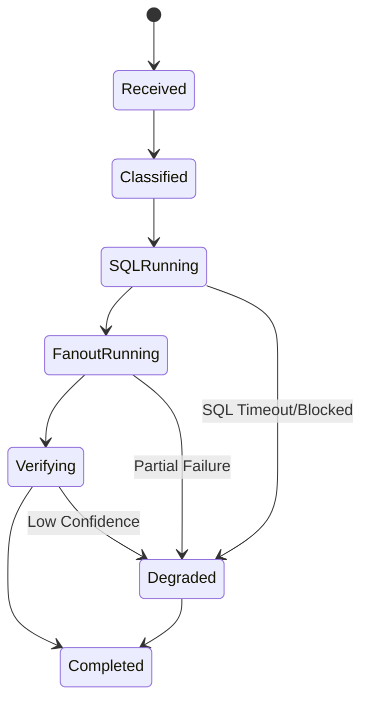

# Multi-Agent Orchestration Design (English)

## 1. Document Info
- Version: v1.0
- Status: Detailed Design
- Owner: Agent Platform Team
- Last Updated: 2026-06-16

## 2. Design Goals
1. Define clear boundaries and collaboration contracts between Orchestrator and specialized agents.
2. Deliver an executable orchestration strategy with serial/parallel execution, retries, and graceful degradation.
3. Ensure final outputs are verifiable, traceable, and auditable.

## 3. Scope
In Scope:
1. Task classification and routing.
2. Agent input/output contracts.
3. Orchestration state machine and failure handling.
4. Confidence aggregation and final response assembly.

Out of Scope:
1. Multi-active LLM provider switching.
2. Cross-region disaster recovery for distributed queues.

## 4. Agent Roles
1. Orchestrator Agent: intent recognition, task decomposition, scheduling, and aggregation.
2. SQL Agent: semantic mapping, SQL generation, SQL explanation, and query execution.
3. Visualization Agent: chart selection and chart-spec generation.
4. Analytics Agent: anomaly detection, forecasting, and statistical interpretation.
5. RAG Agent: retrieval, evidence extraction, and cause hypothesis generation.
6. Verifier Agent: consistency checks, confidence scoring, and risk tagging.

## 5. Orchestration Structure Diagram

## 6. Orchestration Sequence Diagram

## 7. Scheduling Strategy
Task classes:
1. QueryOnly: SQL + Visualization.
2. QueryPlusAnalytics: SQL + Analytics + Visualization.
3. QueryPlusRAG: SQL + RAG + Verifier.
4. FullReasoning: SQL + Visualization + Analytics + RAG + Verifier.

Execution strategy:
1. SQL execution is a hard prerequisite for downstream analysis.
2. Visualization, Analytics, and RAG run in parallel after query data is ready.
3. Verifier runs after all branch outputs are available.
4. Any critical failure triggers degraded aggregation.

Retry and timeout policy:
1. Default retry once per agent.
2. Per-agent timeout: 8s; orchestration timeout: 25s.
3. Timeout branch is skipped and marked in degraded response.

## 8. State Machine

## 9. Data Contracts
Common request context:
1. trace_id
2. session_id
3. user_role
4. locale
5. question

Standard agent output fields:
1. status: success | partial | failed
2. payload: module-specific result
3. confidence: 0.0 to 1.0
4. warnings: risk list
5. metrics: duration, token usage, hit ratio

Final aggregated package:
1. answer_text
2. sql
3. table
4. chart
5. analytics
6. evidence
7. verifier
8. trace_id

## 10. Confidence Aggregation
Weights:
1. SQL trust score: 0.35.
2. Verifier score: 0.35.
3. RAG evidence sufficiency: 0.15.
4. Analytics stability: 0.15.

Scoring rules:
1. confidence = sum(weight_i * score_i).
2. confidence < 0.6 requires high-risk warning.
3. confidence between 0.6 and 0.8 requires medium-risk warning.

## 11. Security and Governance
1. Orchestrator must not execute DB operations directly.
2. SQL Agent must pass Guardrail before DB execution.
3. RAG responses must include source and timestamp metadata.
4. Verifier must validate claim-to-evidence boundaries.
5. All agent events must be logged into trace storage.

## 12. Observability
Key metrics:
1. route_accuracy.
2. fanout_latency_p95.
3. degraded_ratio.
4. verifier_reject_ratio.

Event log model:
1. Events: plan_created, agent_started, agent_finished, fallback_triggered, answer_emitted.
2. Fields: trace_id, agent_name, duration_ms, status, error_code.

## 13. Testing and Acceptance
Unit tests:
1. Task classifier tests.
2. Scheduler fanout merge tests.
3. Confidence aggregation tests.

Integration tests:
1. FullReasoning end-to-end path.
2. SQL-blocked degraded path.
3. Empty-RAG degraded path.

Acceptance criteria:
1. Routing accuracy >= 95% on 30 predefined questions.
2. No uncaught exception on critical paths.
3. Every answer has replayable agent traces.

## 14. Risks and Open Questions
Risks:
1. Multiple parallel branches can increase tail latency.
2. Agent payload drift can break final aggregation.
3. Poor confidence calibration can mislead users.

Open questions:
1. Whether to adopt LangGraph for state-machine management.
2. Whether Verifier should be split into SQL and answer verifier sub-agents.
3. Whether to support async partial-result streaming in v1.

## 15. Milestones
1. M1 (Week 1): contracts and state machine implementation.
2. M2 (Week 2): multi-agent integration and fallback validation.
3. M3 (Week 3): replay evaluation and performance tuning.
