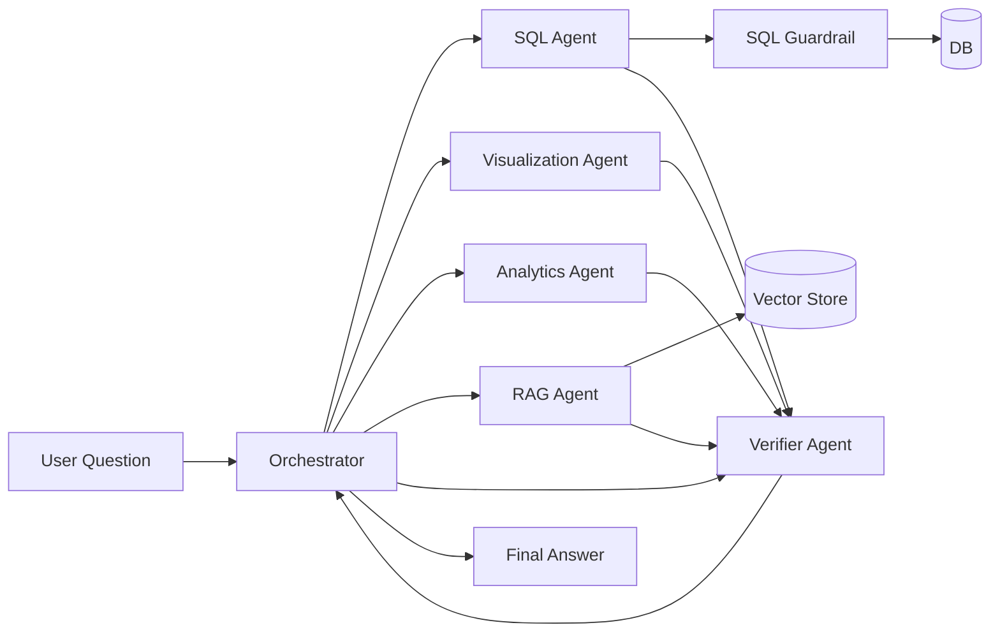
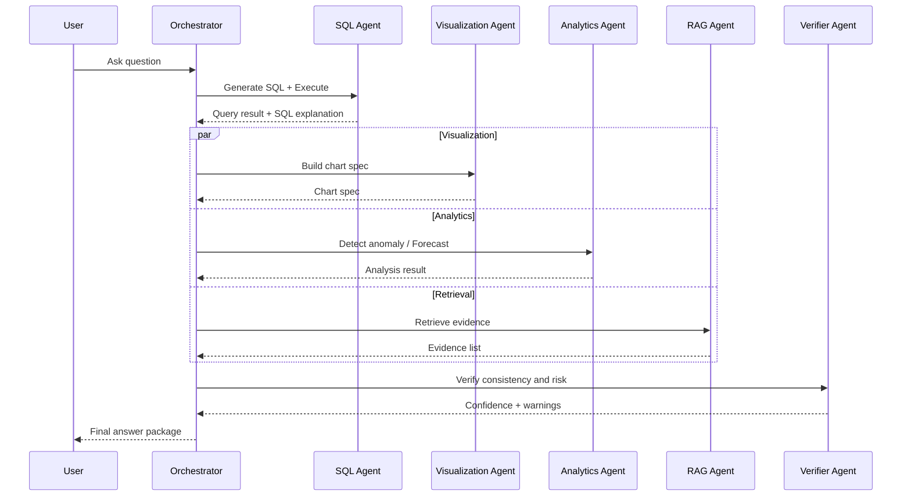
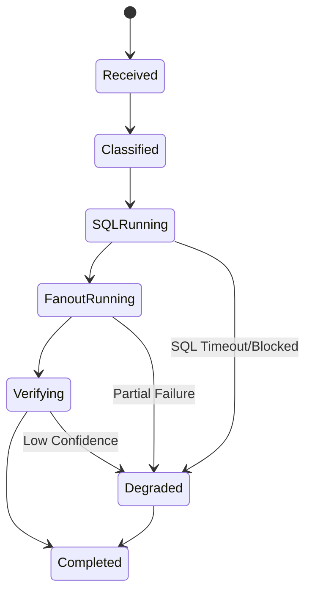

# 多智能体编排设计（中文）

## 1. 文档信息
- 版本：v1.0
- 状态：详细设计
- 负责人：Agent 平台组
- 最后更新：2026-06-16

## 2. 设计目标
1. 定义 Orchestrator 与各专用 Agent 的职责边界和协同协议。
2. 形成可执行的调度策略，支持串行、并行、重试、降级。
3. 保证最终输出可验证、可追踪、可审计。

## 3. 作用范围
In Scope：
1. 任务分类与路由。
2. Agent 输入输出 schema。
3. 编排状态机与异常处理策略。
4. 置信度聚合与最终回答组装。

Out of Scope：
1. 底层 LLM Provider 多活切换。
2. 分布式任务队列的跨地域容灾。

## 4. Agent 角色定义
1. Orchestrator Agent：意图识别、任务拆解、调度与聚合。
2. SQL Agent：语义映射、SQL 生成、SQL 解释、查询执行。
3. Visualization Agent：图表类型选择与 chart spec 生成。
4. Analytics Agent：异常检测、趋势预测、统计解释。
5. RAG Agent：文档检索、证据提取、原因候选生成。
6. Verifier Agent：一致性校验、可信度评分、风险标记。

## 5. 编排结构图



## 6. 编排时序图



## 7. 调度策略
任务分类：
1. QueryOnly：SQL + Visualization。
2. QueryPlusAnalytics：SQL + Analytics + Visualization。
3. QueryPlusRAG：SQL + RAG + Verifier。
4. FullReasoning：SQL + Visualization + Analytics + RAG + Verifier。

执行策略：
1. SQL 执行必须先于其他分析链路。
2. Visualization、Analytics、RAG 在有查询结果后可并行。
3. Verifier 在所有子结果返回后执行。
4. 任一关键节点失败时触发降级聚合。

重试与超时：
1. 每个 Agent 默认重试 1 次。
2. 单 Agent 超时 8s，整体编排超时 25s。
3. 超时后跳过该 Agent，进入降级回答。

## 8. 状态机设计



## 9. 数据契约
通用输入头：
1. trace_id
2. session_id
3. user_role
4. locale
5. question

Agent 输出标准字段：
1. status：success | partial | failed
2. payload：模块结果主体
3. confidence：0.0 到 1.0
4. warnings：风险列表
5. metrics：耗时、token、命中率

最终聚合包：
1. answer_text
2. sql
3. table
4. chart
5. analytics
6. evidence
7. verifier
8. trace_id

## 10. 置信度聚合策略
权重定义：
1. SQL 可信度权重：0.35。
2. Verifier 结果权重：0.35。
3. RAG 证据充分性权重：0.15。
4. Analytics 稳定性权重：0.15。

计算公式（仅对实际参与的 agent 做归一化加权平均）：

```
confidence = Σ(weight_i × score_i) / Σ(weight_i)
```

未参与当次任务的 agent 不计入分子和分母，避免"缺席 agent"稀释最终得分。

最终结果保留 4 位小数。

预警规则：
1. confidence >= 0.6 → 无警告。
2. confidence < 0.6 → 高风险警告："Answer confidence is below 0.60; human review is recommended."

注意：当前实现只有一个阈值（0.60），不存在"中风险"档位。

计算示例：

示例 1 — WHY_EXPLANATION 任务（SQL + VERIFIER + RAG 参与）：
- SQL score = 0.80，weight = 0.35
- VERIFIER score = 0.90，weight = 0.35
- RAG score = 0.70，weight = 0.15
- confidence = (0.80×0.35 + 0.90×0.35 + 0.70×0.15) / (0.35 + 0.35 + 0.15)
             = (0.280 + 0.315 + 0.105) / 0.85
             = 0.700 / 0.85
             ≈ 0.8235 → 无警告

示例 2 — KPI_QUERY 任务（仅 SQL + VERIFIER 参与，无 RAG/Analytics）：
- SQL score = 0.80，weight = 0.35
- VERIFIER score = 0.90，weight = 0.35
- confidence = (0.80×0.35 + 0.90×0.35) / (0.35 + 0.35)
             = (0.280 + 0.315) / 0.70
             = 0.595 / 0.70
             ≈ 0.8500 → 无警告

示例 3 — 低置信度场景：
- SQL score = 0.40，weight = 0.35
- VERIFIER score = 0.50，weight = 0.35
- confidence = (0.40×0.35 + 0.50×0.35) / (0.35 + 0.35)
             = (0.140 + 0.175) / 0.70
             = 0.315 / 0.70
             = 0.4500 → 触发高风险警告

## 11. 安全与治理
1. Orchestrator 禁止直接执行数据库操作。
2. SQL Agent 必须经过 Guardrail 才能落库执行。
3. RAG 返回内容必须包含来源与时间元数据。
4. Verifier 必须检查“结论是否越过证据边界”。
5. 所有 Agent 过程日志必须写入 trace store。

## 12. 可观测性
核心指标：
1. route_accuracy：路由正确率。
2. fanout_latency_p95：并发阶段 P95。
3. degraded_ratio：降级回答比例。
4. verifier_reject_ratio：验证拒绝率。

日志模型：
1. 事件：plan_created、agent_started、agent_finished、fallback_triggered、answer_emitted。
2. 字段：trace_id、agent_name、duration_ms、status、error_code。

## 13. 测试与验收
单元测试：
1. 任务分类器测试。
2. 调度器并行合并测试。
3. 置信度计算测试。

集成测试：
1. FullReasoning 端到端路径。
2. SQL 被拦截后的降级路径。
3. RAG 空召回路径。

验收标准：
1. 预设 30 条问题中，路由正确率 >= 95%。
2. 关键路径无未捕获异常。
3. 每次回答均可回放其 Agent 轨迹。

## 14. 风险与待决事项
风险：
1. 并发分支多导致长尾延迟。
2. Agent 结果格式漂移导致聚合失败。
3. 置信度设计不合理导致误导性输出。

待决事项：
1. 是否引入 LangGraph 管理状态机。
2. 是否将 Verifier 拆分为 SQL 验证与答案验证双 Agent。
3. 是否启用异步模式返回“阶段性结果”。

## 15. 里程碑
1. M1（第 1 周）：完成协议与状态机实现。
2. M2（第 2 周）：完成多 Agent 联调和降级策略。
3. M3（第 3 周）：完成评估集回放与性能调优。
