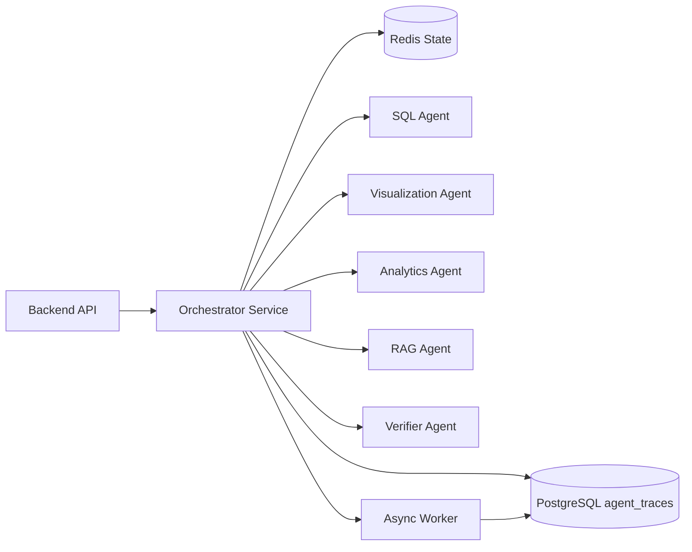

# Multi-Agent Orchestration Design v2 (English)

## 1. Document Info
- Version: v2.0
- Status: Engineering Architecture Upgrade Design
- Last Updated: 2026-06-22
- Baseline Document: [README.en.md](README.en.md)

## 2. v2 Upgrade Goals
v2 upgrades the v1 logical Agent collaboration model into a deployable, recoverable, and observable runtime orchestration system.

Upgrade focus:
1. Upgrade the Orchestrator from in-memory function calls to a service-oriented orchestration component.
2. Write Agent steps into PostgreSQL trace tables for replay, debugging, and evaluation.
3. Execute long-running tasks through a Redis queue or worker to avoid blocking API requests.
4. Give every Agent explicit input/output schemas, timeouts, retries, and degradation policies.
5. Allow the orchestrator to scale independently in Docker Compose and Kubernetes.

## 3. v2 Orchestration Topology

## 4. State Management
1. Request-level state is stored under `trace_id` and includes stage, input summary, output summary, error, and latency.
2. Short-lived execution state is written to Redis, while final trace, audit, and answer records are written to PostgreSQL.
3. Agent steps use an idempotency key: `trace_id + step_name + attempt`.
4. After orchestrator restart, PostgreSQL traces can support read-only replay without re-running expensive external calls.

## 5. Agent Runtime Contract
Unified input fields:
1. `trace_id`
2. `session_id`
3. `user_context`
4. `semantic_context`
5. `task_payload`
6. `deadline_ms`

Unified output fields:
1. `status`
2. `result`
3. `confidence`
4. `warnings`
5. `evidence`
6. `metrics`
7. `error`

## 6. Scheduling Strategy Upgrade
1. SQL generation and Guardrail run serially and cannot be bypassed.
2. Visualization, Analytics, and RAG run in parallel after SQL results are available.
3. Verifier runs before final aggregation, and low-confidence results trigger risk warnings.
4. A failed Agent does not block the whole answer unless that Agent is required for the current task.
5. If the request deadline is exceeded, the system returns partial results and records the degradation reason.

## 7. Kubernetes Runtime Requirements
1. `agent-orchestrator` runs as a Deployment with at least 2 replicas.
2. `worker` runs as an independent Deployment and scales by queue depth.
3. The orchestrator reads Agent switches, timeouts, and model configuration from environment variables.
4. Every Pod exposes `/healthz`, `/readyz`, and `/metrics`.
5. Routing policies are managed through `ConfigMap`; model and database credentials are managed through `Secret`.

## 8. v2 Acceptance Criteria
1. A single request generates at least Orchestrator, SQL, and Verifier trace steps.
2. If any non-critical Agent fails, the frontend still receives a structured degraded result.
3. Redis state and PostgreSQL trace records can be linked by the same `trace_id`.
4. The worker can process asynchronous analytics or offline evaluation tasks.
