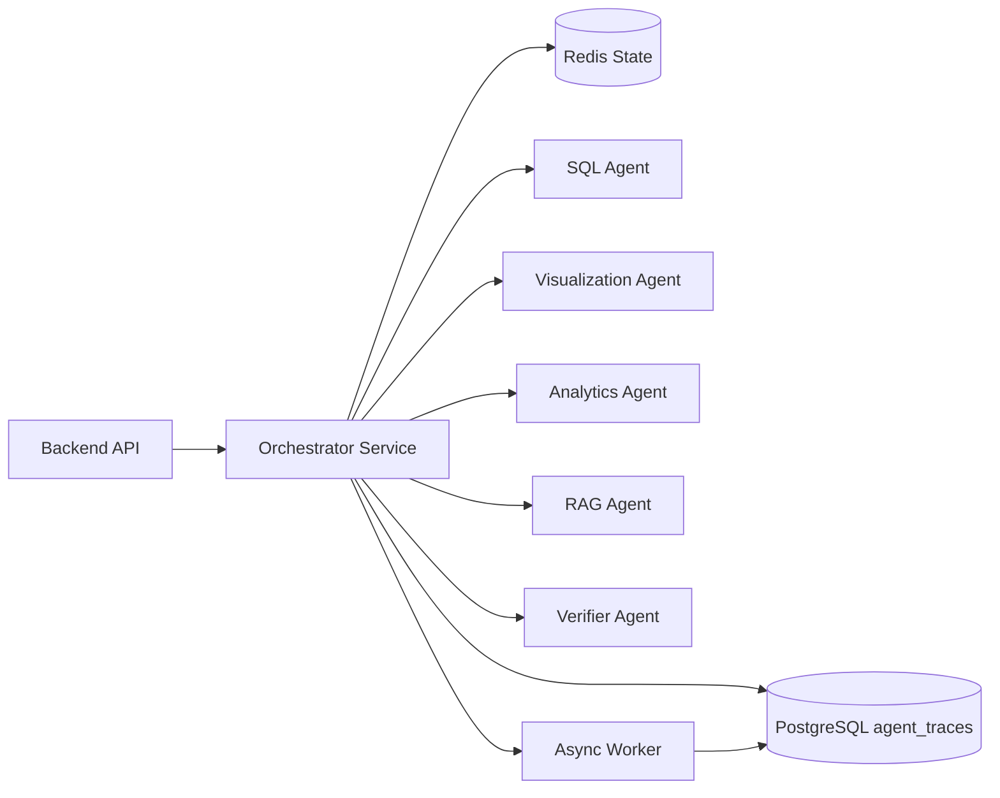

# 多智能体编排设计 v2（中文）

## 1. 文档信息
- 版本：v2.0
- 状态：工程化架构升级设计
- 最后更新：2026-06-22
- 基线文档：[README.zh-CN.md](README.zh-CN.md)

## 2. v2 升级目标
v2 将 v1 的 Agent 逻辑协作升级为可部署、可恢复、可观测的运行时编排体系。

升级重点：
1. Orchestrator 从内存函数调用升级为服务化编排组件。
2. Agent step 写入 PostgreSQL trace 表，支持回放、调试和评估。
3. 长任务通过 Redis 队列或 worker 执行，避免阻塞 API 请求。
4. 每个 Agent 拥有明确输入输出 schema、超时、重试和降级策略。
5. 编排器可在 Docker Compose 和 Kubernetes 中独立扩缩容。

## 3. v2 编排拓扑

## 4. 状态管理
1. 请求级状态保存在 `trace_id` 下，包含阶段、输入摘要、输出摘要、错误和耗时。
2. 短期执行状态写入 Redis，最终 trace、audit、answer 写入 PostgreSQL。
3. Agent step 使用幂等 key：`trace_id + step_name + attempt`。
4. 编排器重启后可根据 PostgreSQL trace 恢复只读回放，不重复执行高成本外部调用。

## 5. Agent 运行契约
统一输入字段：
1. `trace_id`
2. `session_id`
3. `user_context`
4. `semantic_context`
5. `task_payload`
6. `deadline_ms`

统一输出字段：
1. `status`
2. `result`
3. `confidence`
4. `warnings`
5. `evidence`
6. `metrics`
7. `error`

## 6. 调度策略升级
1. SQL 生成与 Guardrail 串行执行，不允许绕过。
2. Visualization、Analytics、RAG 在 SQL 结果可用后并行执行。
3. Verifier 在最终聚合前执行，低置信结果会触发风险提示。
4. 失败 Agent 不阻断整个回答，除非该 Agent 是当前任务的必需节点。
5. 超过请求 deadline 时返回部分结果并写入降级原因。

## 7. Kubernetes 运行要求
1. `agent-orchestrator` 使用 Deployment 部署，至少 2 副本。
2. `worker` 独立 Deployment，按队列长度扩缩容。
3. 编排器通过环境变量读取 Agent 开关、超时和模型配置。
4. 每个 Pod 暴露 `/healthz`、`/readyz`、`/metrics`。
5. 通过 `ConfigMap` 管理路由策略，通过 `Secret` 管理模型和数据库凭据。

## 8. v2 验收标准
1. 一次请求至少生成 Orchestrator、SQL、Verifier 三类 trace step。
2. 任一非关键 Agent 失败时，前端仍能收到结构化降级结果。
3. Redis 状态和 PostgreSQL trace 可关联到同一个 `trace_id`。
4. worker 可处理异步分析或离线评估任务。
