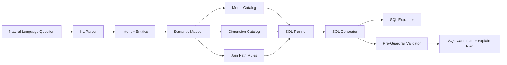
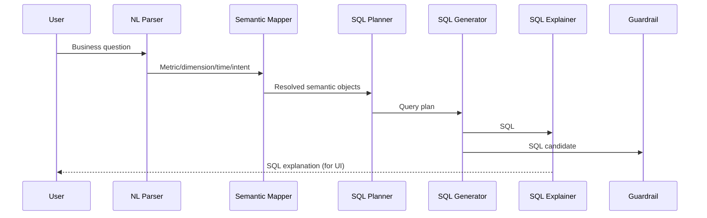

# Semantic Layer and NL2SQL Design (English)

## 1. Document Info
- Version: v1.0
- Status: Detailed Design
- Owner: Data Semantics Team / AI SQL Team
- Last Updated: 2026-06-16

## 2. Design Goals
1. Build a stable semantic layer to standardize enterprise metric definitions and reduce SQL hallucination.
2. Build a controllable NL2SQL pipeline from natural language to executable SQL with full explainability.
3. Provide versioned semantic configurations that can evolve safely.

## 3. Scope
In Scope:
1. Semantic models (metric, dimension, time grain, filter, join path).
2. Natural-language parsing and intent extraction.
3. SQL generation, SQL self-check, and SQL explanation.
4. Integration points before and after SQL Guardrail.

Out of Scope:
1. Enterprise-wide automated lineage platform.
2. Full multilingual semantic catalogs (v1 supports CN/EN question input only).

## 4. Core Requirements
Functional requirements:
1. Support core metrics such as revenue, order_count, refund_rate, active_users.
2. Support dimensional slicing by region, product, channel, and time grain.
3. Support YoY, MoM, Top-N, and multi-dimensional comparisons.

Non-functional requirements:
1. SQL generation stability for semantically similar questions.
2. Explainability: every SQL must include metric/filter/aggregation explanations.
3. Maintainability: semantic configurations must be versioned and rollback-capable.

Governance requirements:
1. Metric definitions are managed only in the semantic layer.
2. Direct free-form joins outside semantic policy are not allowed.

## 5. Semantic Logical Architecture



## 6. Semantic Model Design
Core entities:
1. metric: business metric definition with expression, filters, dimensions.
2. dimension: group-by fields and semantic labels.
3. time_grain: day/week/month/quarter.
4. filter_template: reusable business filters such as paid_order_only.
5. join_path: approved paths between fact and dimension tables.

Example (simplified):

```yaml
metrics:
	revenue:
		table: orders
		expression: SUM(order_amount)
		default_filters:
			- status = 'paid'
		dimensions:
			- region
			- product_category
			- channel
		time_column: order_date

	refund_rate:
		numerator: SUM(refund_amount)
		denominator: SUM(order_amount)
		default_filters:
			- status = 'paid'
```

## 7. NL2SQL Flow



Happy path:
1. Parse question into intent, metric, dimension, and time expressions.
2. Map entities to standardized semantic objects.
3. Build query plan with fact table, joins, filters, and aggregation grain.
4. Generate SQL via deterministic template rules.
5. Produce explain plan and risk hints.
6. Submit SQL candidate to Guardrail.

## 8. Disambiguation and Fallback
1. Metric ambiguity: normalize synonyms to canonical metrics.
2. Time ambiguity: default to last 30 days if absent.
3. Missing dimension: return aggregate + suggested dimensions.
4. Definition conflicts: ask clarification when multiple metric definitions match.

## 9. Data and Interface Contracts
Input (internal nl2sql request):
1. question
2. locale
3. user_role
4. context_window
5. semantic_version

Output (internal nl2sql response):
1. intent_type
2. resolved_metrics
3. resolved_dimensions
4. time_range
5. generated_sql
6. sql_explanation
7. confidence
8. warnings

## 10. Metric Versioning and Change Management
1. Every metric change increments semantic_version.
2. Online requests persist semantic_version for replay.
3. Version changes require regression tests on benchmark question sets.

## 11. Security and Governance
1. SQL generation stage must prohibit write-operation keywords.
2. Semantic metadata must include field sensitivity level.
3. High-sensitive fields are blocked by default.
4. All SQL generation events are written to audit logs.

## 12. Observability
Key metrics:
1. semantic_hit_rate.
2. sql_compile_success_rate.
3. ambiguity_rate.
4. sql_revision_rate after guardrail interception.

Trace fields:
1. trace_id
2. semantic_version
3. intent_type
4. resolved_entities
5. sql_hash

## 13. Testing and Acceptance
Unit tests:
1. Metric synonym mapping tests.
2. Time-expression parsing tests.
3. SQL template generation tests.

Integration tests:
1. CN question to SQL end-to-end.
2. EN question to SQL end-to-end.
3. Ambiguity clarification path.

Acceptance criteria:
1. SQL accuracy >= 90% on 50 benchmark questions.
2. Every result is traceable to semantic version.
3. All high-sensitive field access attempts are restricted.

## 14. Risks and Open Questions
Risks:
1. Fast-changing business terms can increase dictionary maintenance cost.
2. Complex multi-table joins can hurt correctness and performance.
3. Cross-team metric definition conflicts may reduce trust.

Open questions:
1. Whether to introduce a DSL intermediate layer before SQL templates.
2. Whether to support user-defined draft metrics with approval workflow.
3. Whether to add few-shot SQL correction in v1.

## 15. Milestones
1. M1 (Week 1): semantic model and config schema.
2. M2 (Week 2): core NL2SQL pipeline and explainer.
3. M3 (Week 3): regression evaluation and production governance integration.
