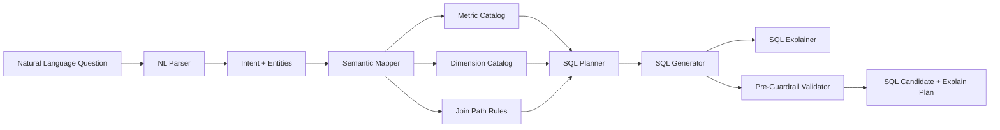
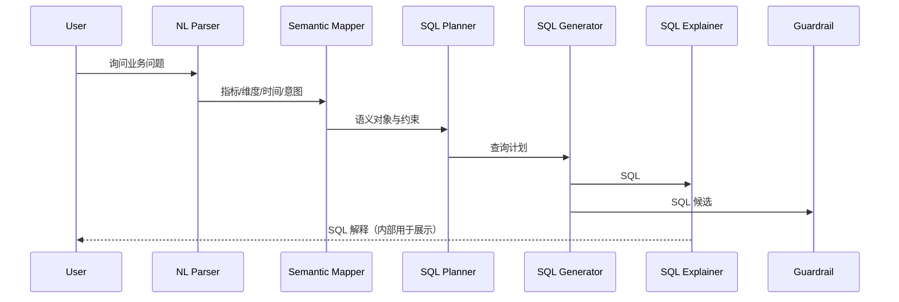

# 语义层与NL2SQL设计（中文）

## 1. 文档信息
- 版本：v1.0
- 状态：详细设计
- 负责人：数据语义组 / AI SQL 组
- 最后更新：2026-06-16

## 2. 设计目标
1. 构建稳定的语义层，统一企业指标口径，降低 SQL 幻觉与业务歧义。
2. 建立 NL2SQL 可控链路，从自然语言到可执行 SQL 全程可解释、可验证。
3. 提供可扩展的语义配置和版本机制，支持业务持续演进。

## 3. 作用范围
In Scope：
1. 语义模型定义（metric、dimension、time grain、filter、join path）。
2. 自然语言解析与意图提取。
3. SQL 生成、SQL 自检、SQL 解释。
4. 与 SQL Guardrail 的前后衔接。

Out of Scope：
1. 自动化数据血缘平台建设。
2. 多语言语义层（首版只支持中文/英文问题输入）。

## 4. 核心需求
功能需求：
1. 支持 revenue、order_count、refund_rate、active_users 等核心指标查询。
2. 支持维度切分（地区、产品、渠道）和时间粒度（日/周/月/季度）。
3. 支持同比、环比、TopN、多维对比等常见分析表达。

非功能需求：
1. SQL 生成稳定性：同类问题输出结构一致。
2. 解释性：每条 SQL 必须有“口径说明 + 过滤说明 + 聚合说明”。
3. 可维护性：语义层配置可版本化、可回滚。

治理需求：
1. 指标定义由语义层唯一管理。
2. 不允许绕过语义层直接自由拼表。

## 5. 语义层逻辑架构



## 6. 语义模型设计
核心对象：
1. metric：业务指标定义，含公式、过滤、可用维度。
2. dimension：分组字段与枚举解释。
3. time_grain：day/week/month/quarter。
4. filter_template：可复用过滤模板（如 paid_order_only）。
5. join_path：事实表与维表连接路径及优先级。

示例（简化）：

```yaml
metrics:
	revenue:
		table: orders
		expression: SUM(order_amount)
		default_filters:
			- status = 'paid'
		dimensions:
			- region
			- product_category
			- channel
		time_column: order_date

	refund_rate:
		numerator: SUM(refund_amount)
		denominator: SUM(order_amount)
		default_filters:
			- status = 'paid'
```

## 7. NL2SQL 处理流程



主流程：
1. 解析问题：识别指标、时间、维度、比较关系。
2. 语义映射：将实体映射到标准 metric/dimension。
3. 规划查询：确定事实表、join 路径、过滤条件、聚合粒度。
4. 生成 SQL：根据计划产出 SQL 模板。
5. 自检解释：生成 explain plan 并计算风险标签。
6. 交由 Guardrail 执行安全校验。

## 8. 语义消歧与回退策略
1. 指标歧义：当“营收/收入/成交额”映射同一 metric，按词典同义词归一。
2. 时间歧义：缺省时间范围默认为“最近 30 天”。
3. 维度缺失：无法识别维度时返回“指标总览 + 维度建议”。
4. 口径冲突：命中多个 metric 定义时，触发澄清问题。

## 9. 数据与接口契约
输入（内部 nl2sql 请求）：
1. question
2. locale
3. user_role
4. context_window
5. semantic_version

输出（内部 nl2sql 响应）：
1. intent_type
2. resolved_metrics
3. resolved_dimensions
4. time_range
5. generated_sql
6. sql_explanation
7. confidence
8. warnings

## 10. 指标版本与变更管理
1. 每次指标变更都生成 semantic_version。
2. 线上请求记录 semantic_version 便于回放。
3. 版本变更需通过回归测试：关键问题 SQL 不得回退。

## 11. 安全与治理
1. SQL 生成阶段禁止输出写操作关键字。
2. 语义层必须附带字段敏感级别标签。
3. 对高敏字段（如用户标识）默认不可查询。
4. 所有 SQL 生成记录写入审计日志。

## 12. 可观测性
关键指标：
1. semantic_hit_rate：实体映射命中率。
2. sql_compile_success_rate：SQL 编译成功率。
3. ambiguity_rate：语义歧义触发率。
4. sql_revision_rate：Guardrail 拦截后改写率。

追踪字段：
1. trace_id
2. semantic_version
3. intent_type
4. resolved_entities
5. sql_hash

## 13. 测试与验收
单元测试：
1. 指标映射词典测试。
2. 时间表达解析测试。
3. SQL 模板生成测试。

集成测试：
1. 中文问题到 SQL 端到端。
2. 英文问题到 SQL 端到端。
3. 歧义问题澄清路径。

验收标准：
1. 50 条标准问题 SQL 准确率 >= 90%。
2. 所有结果都可追踪到语义版本。
3. 高敏字段查询全部被限制。

## 14. 风险与待决事项
风险：
1. 业务术语变化快导致词典维护压力大。
2. 复杂多表 join 可能引入性能与正确性风险。
3. 跨部门指标口径不一致会带来争议。

待决事项：
1. 是否引入 DSL 中间层替代直接 SQL 模板。
2. 是否支持用户自定义指标草案并审批发布。
3. 是否在首版加入 Few-shot SQL 纠错链路。

## 15. 里程碑
1. M1（第 1 周）：完成语义模型与配置 schema。
2. M2（第 2 周）：完成 NL2SQL 核心链路与解释器。
3. M3（第 3 周）：完成回归评估与线上治理联调。
