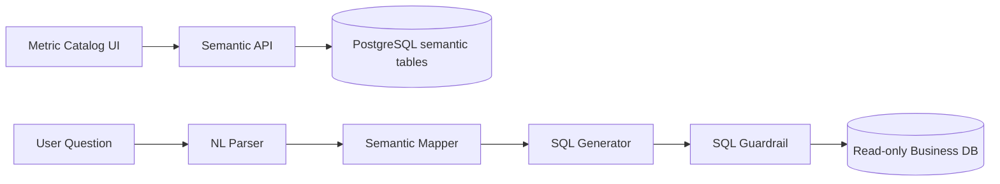

# Semantic Layer and NL2SQL Design v2 (English)

## 1. Document Info
- Version: v2.0
- Status: Engineering Architecture Upgrade Design
- Last Updated: 2026-06-22
- Baseline Document: [README.en.md](README.en.md)

## 2. v2 Upgrade Goals
v2 upgrades the semantic layer from static configuration into an enterprise semantic service with database persistence, versioning, and staged rollout.

Core upgrades:
1. Store the semantic catalog in PostgreSQL instead of relying only on local configuration files.
2. Connect the NL2SQL generation pipeline to real schema introspection and metric versions.
3. Run generated SQL through Guardrail and record the semantic version in audit tables.
4. Load semantic configuration into Docker and Kubernetes environments through migration/seed flows.
5. Let the frontend metric catalog page read from backend semantic APIs.

## 3. v2 Semantic Data Flow

## 4. Database Table Design
1. `metrics_catalog`: metric name, formula, default aggregation, business description, owner, and status.
2. `dimension_catalog`: dimension field, display name, filterability, and permission tags.
3. `semantic_versions`: version number, effective time, publisher, and change summary.
4. `metric_lineage`: dependent tables, dependent fields, and join paths for metrics.
5. `schema_snapshots`: database schema snapshots for detecting field drift.

## 5. NL2SQL Runtime Strategy
1. Parse intent, metrics, dimensions, and time range before generating SQL.
2. Use only metrics and dimensions that the current user is authorized to access.
3. Prefer SQL templates, use LLM generation as a supplement, and ensure final SQL is explainable.
4. Return clarification questions when semantic mapping fails instead of guessing fields.
5. Save `semantic_version_id` in generated results for replay and evaluation.

## 6. Docker and Kubernetes Integration
1. Initialize sample metrics and dimensions locally through database seed data.
2. Update semantic tables in production through migration jobs.
3. Deploy the semantic service as stateless and cache hot catalog entries in Redis.
4. When releasing a new semantic version on Kubernetes, validate it in staging before switching the active version.
5. Run schema drift detection as a scheduled worker task.

## 7. Frontend-Backend Contract
1. `GET /api/v1/metrics/catalog` returns the metric catalog.
2. `GET /api/v1/metrics/{metric_id}` returns metric definition, permissions, and example questions.
3. `POST /api/v1/semantic/resolve` returns the parsed semantic objects for a natural-language question.
4. `POST /api/v1/sql/preview` returns SQL preview and explanation without execution.

## 8. v2 Acceptance Criteria
1. The semantic catalog can be loaded from PostgreSQL and displayed by the frontend.
2. SQL results record semantic version, metric id, and dimension id.
3. Missing fields or unauthorized fields return explainable errors.
4. New metrics can be reproduced in Docker and Kubernetes environments through migration/seed data.
