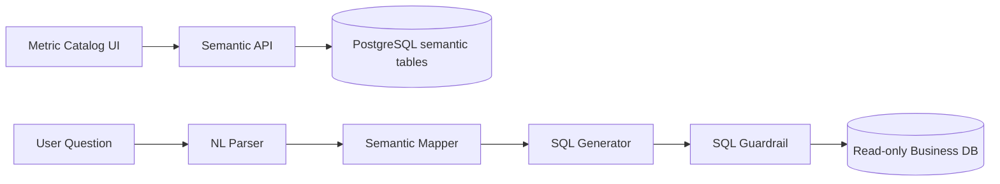

# 语义层与 NL2SQL 设计 v2（中文）

## 1. 文档信息
- 版本：v2.0
- 状态：工程化架构升级设计
- 最后更新：2026-06-22
- 基线文档：[README.zh-CN.md](README.zh-CN.md)

## 2. v2 升级目标
v2 将语义层从静态配置升级为数据库持久化、可版本管理、可灰度发布的企业语义服务。

核心升级：
1. 语义目录存储在 PostgreSQL 中，而不是只依赖本地配置文件。
2. NL2SQL 生成链路接入真实 schema introspection 与指标版本。
3. SQL 生成后必须经过 Guardrail，并在审计表中记录语义版本。
4. 语义配置通过 migration/seed 流程进入 Docker 和 K8s 环境。
5. 前端指标目录页面可读取后端语义 API。

## 3. v2 语义数据流

## 4. 数据库表设计
1. `metrics_catalog`：指标名称、公式、默认聚合、业务描述、owner、状态。
2. `dimension_catalog`：维度字段、展示名、可过滤性、权限标签。
3. `semantic_versions`：版本号、生效时间、发布人、变更摘要。
4. `metric_lineage`：指标依赖表、依赖字段、join path。
5. `schema_snapshots`：数据库 schema 快照，用于检测字段漂移。

## 5. NL2SQL 运行策略
1. 先解析意图、指标、维度、时间范围，再生成 SQL。
2. 只允许使用当前用户有权限的 metric 和 dimension。
3. SQL 模板优先，LLM 生成作为补充，最终 SQL 必须可解释。
4. 语义映射失败时返回澄清问题，不直接猜测字段。
5. 生成结果保存 `semantic_version_id`，便于回放和评估。

## 6. Docker 与 Kubernetes 接入
1. 本地通过数据库 seed 初始化示例指标和维度。
2. 生产环境通过 migration job 更新语义表。
3. 语义服务无状态部署，缓存热点目录到 Redis。
4. K8s 发布新语义版本时先进入 staging 验证，再切换 active version。
5. schema drift 检测作为定时 worker 任务运行。

## 7. 前后端契约
1. `GET /api/v1/metrics/catalog` 返回指标目录。
2. `GET /api/v1/metrics/{metric_id}` 返回指标口径、权限、示例问题。
3. `POST /api/v1/semantic/resolve` 返回自然语言到语义对象的解析结果。
4. `POST /api/v1/sql/preview` 返回 SQL 预览和解释，不直接执行。

## 8. v2 验收标准
1. 语义目录可从 PostgreSQL 加载，并能被前端展示。
2. SQL 结果记录语义版本、指标 id 和维度 id。
3. 字段不存在或无权限时返回可解释错误。
4. 新增指标可通过 migration/seed 在 Docker 和 K8s 环境复现。
