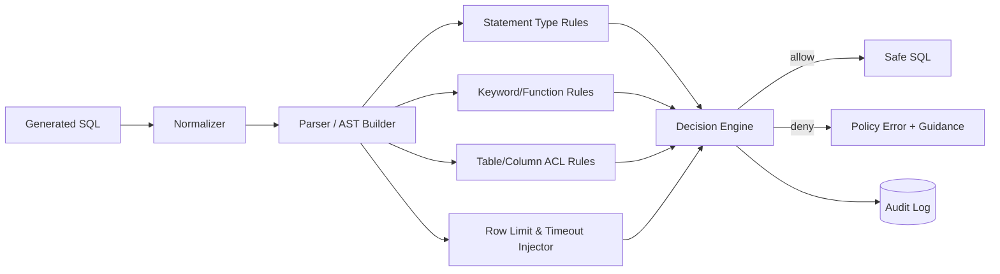
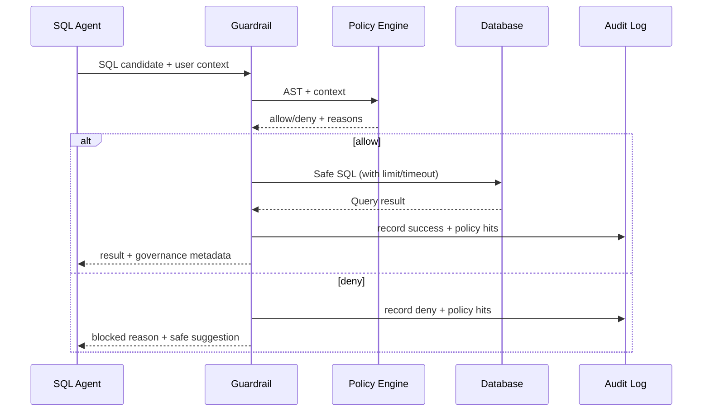

# SQL Guardrail and Governance Design (English)

## 1. Document Info
- Version: v1.0
- Status: Detailed Design
- Owner: Data Security Team / Platform Governance Team
- Last Updated: 2026-06-16

## 2. Design Goals
1. Build a SQL defense system that enforces read-only, controlled, and compliant execution.
2. Build permission governance and auditability to satisfy enterprise compliance and replay requirements.
3. Maximize analytical usability while maintaining strict security boundaries.

## 3. Scope
In Scope:
1. SQL syntax and AST validation.
2. Allow/deny rules, keyword blocking, and function blocking.
3. Table-level and column-level authorization with masking.
4. Query rate, timeout, and row-limit controls.
5. Audit logging, risk scoring, and alerts.

Out of Scope:
1. Deep integration with enterprise IAM federation.
2. Automated orchestration of native DB row-level security policies.

## 4. Core Requirements
Functional requirements:
1. Allow SELECT-only execution.
2. Block DROP, DELETE, UPDATE, INSERT, ALTER, TRUNCATE, and similar statements.
3. Enforce automatic row limits and query timeouts.
4. Enforce role-based table and column access.
5. Return explainable denial responses with safer alternatives.

Non-functional requirements:
1. Guardrail check latency P95 <= 300ms.
2. Interception accuracy >= 99.5%.
3. Zero tolerance for bypassing high-risk statements.

Governance requirements:
1. Every SQL request must carry trace_id.
2. Validation decisions and policy hits must be fully logged.
3. Replay support is mandatory for investigations.

## 5. Guardrail Architecture

## 6. Rule Execution Flow

## 7. Policy Model
Rule levels:
1. L1 statement-level: SELECT-only policy.
2. L2 structure-level: block multi-statements, comment-escape tricks, risky union patterns.
3. L3 object-level: table and column ACL checks.
4. L4 function-level: block dangerous functions and external-link capabilities.
5. L5 runtime-level: inject limit, timeout, concurrency, and rate controls.

Priority rules:
1. Deny overrides allow.
2. Any high-risk hit immediately denies execution.
3. Fixable risks are auto-rewritten (for example row limit injection).

## 8. Authorization and Masking
Role examples:
1. business_user: aggregated metrics only, no sensitive detailed columns.
2. analyst: broader detail access with export-volume limits.
3. admin: full analytical access under audit policy.

Masking examples:
1. user_email -> hash or partial mask.
2. phone -> middle-digit mask.
3. customer_name -> initials or anonymous alias.

## 9. Data and Interface Contracts
Input:
1. sql_text
2. user_id
3. user_role
4. tenant_id
5. trace_id

Output:
1. decision: allow | deny
2. safe_sql
3. policy_hits
4. risk_level
5. message
6. trace_id

Suggested error codes:
1. SQL_DENY_STATEMENT
2. SQL_DENY_OBJECT
3. SQL_DENY_FUNCTION
4. SQL_DENY_TIMEOUT
5. SQL_DENY_RATE_LIMIT

## 10. Audit and Replay
Audit fields:
1. trace_id
2. user_id / role
3. original_sql_hash
4. rewritten_sql_hash
5. decision
6. policy_hits
7. db_latency_ms
8. result_row_count
9. created_at

Replay capabilities:
1. Replay policy-hit path by trace_id.
2. Compare original SQL with rewritten SQL.
3. Reconstruct denial reasons and user-facing messages.

## 11. Observability and Alerts
Metrics:
1. guardrail_allow_rate
2. guardrail_deny_rate
3. deny_by_rule_type
4. guardrail_latency_p95
5. suspicious_query_rate

Alerts:
1. deny_rate spikes above 3x baseline.
2. guardrail_latency_p95 > 300ms for 10 minutes.
3. continuous high-risk keyword hits.

## 12. Testing and Acceptance
Unit tests:
1. AST parsing tests.
2. Policy-hit tests.
3. SQL injection variant tests.

Integration tests:
1. SQL Agent -> Guardrail -> DB full path.
2. Role-based permission differentiation.
3. Denied-case user message validation.

Acceptance criteria:
1. 100% interception on 100 malicious/unauthorized SQL samples.
2. False-positive block rate <= 1% for valid SQL.
3. 100% audit-log completeness.

## 13. Risks and Open Questions
Risks:
1. Over-strict rules can hurt usability.
2. Over-loose rules can create security exposure.
3. SQL dialect variance may cause false policy decisions.

Open questions:
1. Whether to add a DB proxy for second-layer validation.
2. Whether to externalize authorization policy to OPA.
3. Whether to introduce an approval workflow for exceptional access.

## 14. Milestones
1. M1 (Week 1): policy framework and AST validator.
2. M2 (Week 2): authorization, masking, and audit integration.
3. M3 (Week 3): stress testing, red-team testing, and alert go-live.
