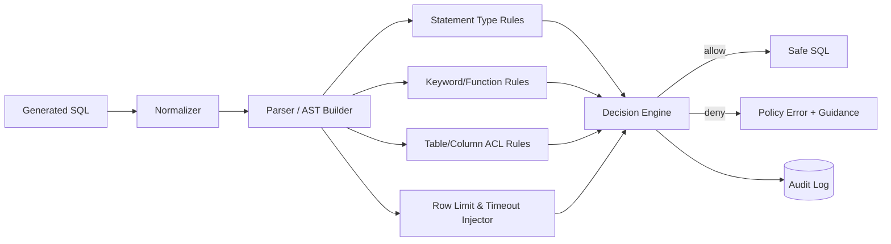
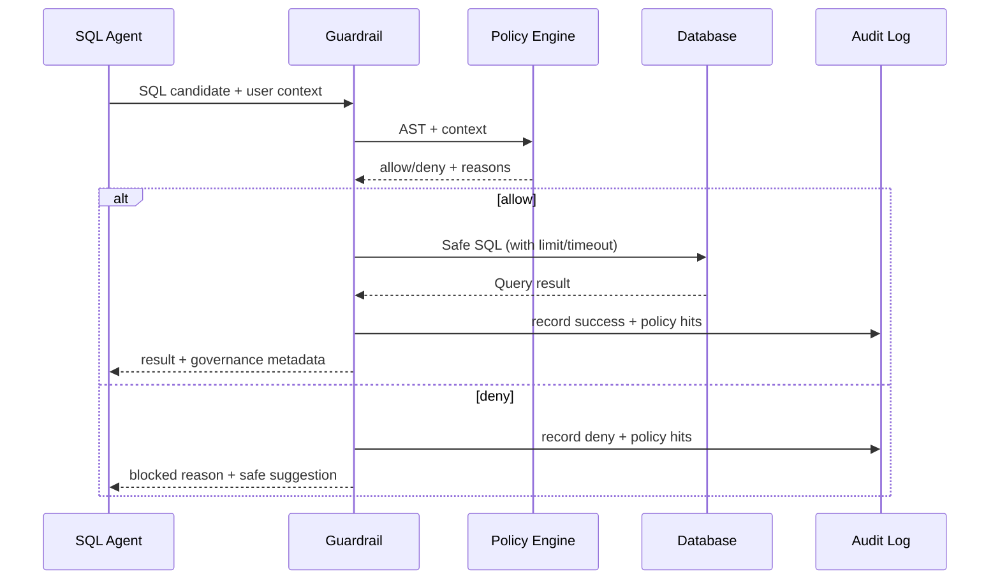

# SQL安全与治理设计（中文）

## 1. 文档信息
- 版本：v1.0
- 状态：详细设计
- 负责人：数据安全组 / 平台治理组
- 最后更新：2026-06-16

## 2. 设计目标
1. 建立 SQL 安全防护体系，确保平台只执行可控、只读、合规查询。
2. 构建权限治理与审计追踪体系，满足企业监管和可回放要求。
3. 在保证安全的前提下，尽量减少对业务分析体验的负面影响。

## 3. 作用范围
In Scope：
1. SQL 语法与 AST 校验。
2. 黑白名单规则、关键字拦截、函数拦截。
3. 表级字段级权限控制与脱敏策略。
4. 查询限流、限时、限量。
5. 审计日志、风险评分和告警。

Out of Scope：
1. 企业统一 IAM 平台深度集成。
2. 数据库层原生 RLS 策略自动编排。

## 4. 核心需求
功能需求：
1. 只允许 SELECT 查询。
2. 拦截 DROP、DELETE、UPDATE、INSERT、ALTER、TRUNCATE 等语句。
3. 自动追加行数限制和查询超时。
4. 按角色控制可访问表字段。
5. 发生拦截时返回可解释错误和替代建议。

非功能需求：
1. Guardrail 检查延迟 P95 <= 300ms。
2. 拦截准确率 >= 99.5%。
3. 不允许“漏拦截”高危语句。

治理需求：
1. 每次 SQL 请求必须有 trace_id。
2. 全量记录校验结果和命中规则。
3. 支持审计回放和责任定位。

## 5. Guardrail 架构图

## 6. 规则执行流程

## 7. 规则模型设计
规则层级：
1. L1 语句级：仅允许 SELECT。
2. L2 结构级：禁止多语句、禁止注释逃逸、禁止 union 注入模式。
3. L3 对象级：表和字段访问授权。
4. L4 函数级：禁止高风险函数与外连能力。
5. L5 运行级：limit、timeout、并发与频率控制。

策略优先级：
1. Deny 优先于 Allow。
2. 命中任一高危规则立即拒绝。
3. 可修复风险由注入器自动改写（如 limit）。

## 8. 权限与脱敏设计
角色示例：
1. business_user：可查聚合指标，不可查明细敏感字段。
2. analyst：可查较多明细字段，但限制导出规模。
3. admin：在审计授权下访问全部分析字段。

脱敏策略：
1. user_email -> 哈希或部分掩码。
2. phone -> 中间位掩码。
3. customer_name -> 仅首字母或匿名标识。

## 9. 数据与接口契约
输入：
1. sql_text
2. user_id
3. user_role
4. tenant_id
5. trace_id

输出：
1. decision：allow | deny
2. safe_sql
3. policy_hits
4. risk_level
5. message
6. trace_id

错误码建议：
1. SQL_DENY_STATEMENT
2. SQL_DENY_OBJECT
3. SQL_DENY_FUNCTION
4. SQL_DENY_TIMEOUT
5. SQL_DENY_RATE_LIMIT

## 10. 审计与可回放
审计字段：
1. trace_id
2. user_id / role
3. original_sql_hash
4. rewritten_sql_hash
5. decision
6. policy_hits
7. db_latency_ms
8. result_row_count
9. created_at

回放能力：
1. 按 trace_id 回放规则命中路径。
2. 对比原始 SQL 与改写 SQL。
3. 复盘拒绝原因与用户反馈。

## 11. 可观测性与告警
指标：
1. guardrail_allow_rate
2. guardrail_deny_rate
3. deny_by_rule_type
4. guardrail_latency_p95
5. suspicious_query_rate

告警：
1. deny_rate 突增 > 基线 3 倍。
2. guardrail_latency_p95 超过 300ms 持续 10 分钟。
3. 高危关键字命中连续出现。

## 12. 测试与验收
单元测试：
1. AST 解析测试。
2. 规则命中测试。
3. SQL 注入变体测试。

集成测试：
1. SQL Agent -> Guardrail -> DB 完整链路。
2. 不同角色权限差异校验。
3. 拒绝场景用户提示校验。

验收标准：
1. 100 条恶意/越权 SQL 样本拦截率 100%。
2. 合法查询误拦截率 <= 1%。
3. 审计日志完整率 100%。

## 13. 风险与待决事项
风险：
1. 规则过严会影响可用性。
2. 规则过松会产生安全隐患。
3. SQL 方言差异可能造成误判。

待决事项：
1. 是否引入数据库代理层二次校验。
2. 是否将权限策略外置到 OPA。
3. 是否增加“人工审批放行”机制。

## 14. 里程碑
1. M1（第 1 周）：完成规则框架与 AST 校验器。
2. M2（第 2 周）：完成权限控制、脱敏和审计。
3. M3（第 3 周）：完成压力测试、攻防测试和告警上线。
