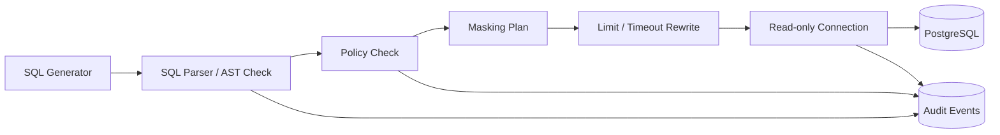

# SQL Guardrail and Governance Design v2 (English)

## 1. Document Info
- Version: v2.0
- Status: Engineering Architecture Upgrade Design
- Last Updated: 2026-06-22
- Baseline Document: [README.en.md](README.en.md)

## 2. v2 Upgrade Goals
v2 upgrades Guardrail from a rule description into an enforced governance layer before real database execution.

Core upgrades:
1. All SQL execution must pass through the Guardrail service or Guardrail module.
2. PostgreSQL uses a read-only account, read-only transactions, and statement timeout.
3. Permission, masking, and audit policies are persisted in the database.
4. Docker and Kubernetes environments must inject least-privilege database credentials.
5. Denial events are written to audit tables and exposed as security metrics.

## 3. v2 Execution Flow

## 4. Database Permission Model
1. `chatbi_readonly`: allows only `SELECT` on approved schemas.
2. `chatbi_migration`: used only by migration jobs and never exposed to runtime Pods.
3. `chatbi_audit_writer`: writes only audit and trace tables.
4. Business query connections default to `SET TRANSACTION READ ONLY`.
5. The database layer sets `statement_timeout` and `idle_in_transaction_session_timeout`.

## 5. Policy Table Design
1. `access_policies`: authorization from roles to tables, fields, and metrics.
2. `masking_policies`: field-level masking rules and display policies.
3. `sql_rule_hits`: matched rules, risk level, and original SQL hash.
4. `query_audit_events`: user, trace, SQL hash, execution status, latency, and row count.
5. `rate_limit_counters`: can live in Redis and limit query frequency by user and organization.

## 6. Container and Kubernetes Security
1. Database passwords are injected through Kubernetes Secrets.
2. Plaintext SQL credentials must not appear in images, ConfigMaps, or logs.
3. Pods run as non-root users.
4. NetworkPolicy allows only backend and worker services to access the database.
5. Production disables plaintext SQL debug logs and keeps only hashes and safe summaries.

## 7. Frontend Security Feedback
1. Denial results return structured error codes such as `SQL_DENIED_WRITE_OPERATION`.
2. The UI shows understandable reasons without exposing internal rule details.
3. Permission-denied cases provide suggestions to request access or use another metric.
4. Masked results display masking indicators.

## 8. v2 Acceptance Criteria
1. Dangerous SQL is blocked at the AST layer and cannot reach the database.
2. The runtime database account cannot execute write operations.
3. Every denial and execution has an audit record.
4. Services can restart and recover after Kubernetes Secret rotation.
