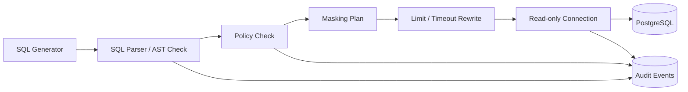

# SQL 安全与治理设计 v2（中文）

## 1. 文档信息
- 版本：v2.0
- 状态：工程化架构升级设计
- 最后更新：2026-06-22
- 基线文档：[README.zh-CN.md](README.zh-CN.md)

## 2. v2 升级目标
v2 将 Guardrail 从规则说明升级为真实数据库执行前的强制治理层。

核心升级：
1. 所有 SQL 执行必须通过 Guardrail service 或 Guardrail module。
2. PostgreSQL 使用只读账号、只读事务和 statement timeout。
3. 权限、脱敏、审计策略持久化到数据库。
4. Docker 和 K8s 环境都必须注入最小权限数据库凭据。
5. 拦截事件进入审计表，并暴露安全指标。

## 3. v2 执行链路

## 4. 数据库权限模型
1. `chatbi_readonly`：只允许 `SELECT` 指定 schema。
2. `chatbi_migration`：只用于 migration job，不暴露给运行时 Pod。
3. `chatbi_audit_writer`：只写审计和 trace 表。
4. 业务查询连接默认 `SET TRANSACTION READ ONLY`。
5. 数据库层设置 `statement_timeout` 和 `idle_in_transaction_session_timeout`。

## 5. 策略表设计
1. `access_policies`：角色到表、字段、指标的授权。
2. `masking_policies`：字段级脱敏规则和展示策略。
3. `sql_rule_hits`：命中规则、风险等级、原始 SQL hash。
4. `query_audit_events`：用户、trace、SQL hash、执行状态、耗时、行数。
5. `rate_limit_counters`：可落 Redis，按用户和组织限制查询频率。

## 6. 容器与 K8s 安全
1. 数据库密码通过 Kubernetes Secret 注入。
2. 禁止在镜像、ConfigMap、日志中输出明文 SQL 凭据。
3. Pod 使用非 root 用户运行。
4. NetworkPolicy 限制只有后端和 worker 可访问数据库。
5. 生产环境关闭 SQL debug 明文日志，仅保留 hash 和安全摘要。

## 7. 前端安全反馈
1. 拦截结果返回结构化错误码，例如 `SQL_DENIED_WRITE_OPERATION`。
2. 向用户展示可理解原因，不暴露内部规则细节。
3. 对权限不足场景提供申请权限或更换指标建议。
4. 对脱敏结果展示 masking 标记。

## 8. v2 验收标准
1. 危险 SQL 在 AST 层被拦截，不能到达数据库。
2. 运行时数据库账号无法执行写操作。
3. 每次拦截和执行都有审计记录。
4. K8s Secret 轮换后服务可重启恢复。
