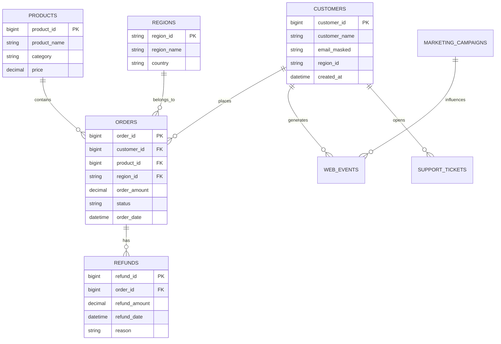
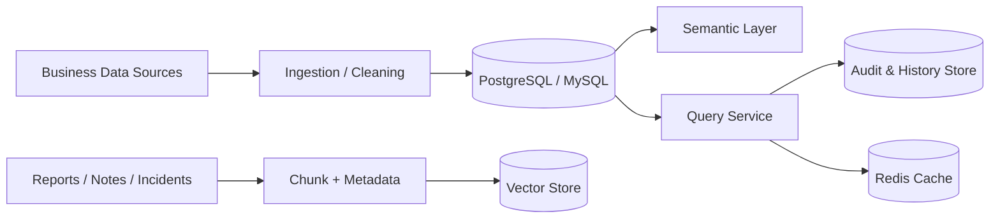

# Data Model Design (English)

## 1. Document Info
- Version: v1.0
- Status: Detailed Design
- Owner: Data Platform Team
- Last Updated: 2026-06-16

## 2. Design Goals
1. Define unified business, knowledge, runtime, and governance data models for enterprise ChatBI.
2. Provide a reliable data foundation for semantic layer, NL2SQL, analytics/forecasting, and RAG.
3. Balance extensibility, traceability, performance, and security.

## 3. Scope
In Scope:
1. Business fact and dimension data models.
2. Metric lineage and semantic mapping.
3. Vector-retrieval document models.
4. Query history, audit, and trace models.
5. Cache and configuration storage models.

Out of Scope:
1. Full data warehouse layered modeling (ODS/DWD/DWS).
2. Enterprise master data platform integration.

## 4. Data Domain Partitioning
1. Business analytics domain: orders, refunds, customers, products, regions, web_events, support_tickets, marketing_campaigns.
2. Semantic governance domain: metrics_catalog, dimension_catalog, semantic_versions.
3. Knowledge retrieval domain: documents, doc_chunks, doc_embeddings.
4. Runtime governance domain: query_history, audit_events, agent_traces, eval_runs.
5. Config and cache domain: system_configs, prompt_versions, cache_keys.

## 5. Core ER Diagram

## 6. Data Flow and Storage Architecture

## 7. Key Table Design (MVP)
1. orders: order fact table at per-order grain.
2. refunds: refund fact table at per-refund grain.
3. customers: customer dimension table.
4. products: product dimension table.
5. regions: region dimension table.
6. web_events: behavior event table for activity and conversion.
7. support_tickets: support case table for ticket volume and quality.
8. marketing_campaigns: campaign table for attribution context.

Recommended indexes:
1. orders(order_date, status).
2. orders(region_id, product_id).
3. refunds(refund_date, order_id).
4. web_events(event_time, event_type, customer_id).

## 8. Metric Lineage and Definition Mapping
Core metric examples:
1. revenue = SUM(orders.order_amount) WHERE status='paid'.
2. order_count = COUNT(DISTINCT orders.order_id).
3. refund_rate = SUM(refunds.refund_amount) / SUM(orders.order_amount).
4. active_users = COUNT(DISTINCT web_events.customer_id) by day.

Lineage principles:
1. Every metric maps to one canonical definition.
2. Metrics are bound to semantic versions.
3. Metric computation paths must be replayable.

## 9. Vector and Knowledge Data Model
1. documents: source metadata, title, type, publish time.
2. doc_chunks: chunk content, chunk index, metadata.
3. doc_embeddings: embedding vectors linked to chunk_id.

Retrieval constraints:
1. Time-window filtering.
2. Document-type filtering.
3. Returned evidence must include source_id and quoted snippet.

## 10. Runtime Governance Model
1. query_history: question, SQL, result summary, latency, status.
2. audit_events: policy hits, denial reasons, permission decisions.
3. agent_traces: step-level agent input/output summaries.
4. eval_runs: evaluation tasks and score records.

## 11. Partitioning, Archival, and Lifecycle
1. Partition large fact tables by month (order_date/refund_date/event_time).
2. Keep hot query_history/audit_events for 180 days.
3. Archive older data to low-cost storage for 2-year retention.

## 12. Data Quality and Consistency
Quality rules:
1. Non-null PKs and valid FK relationships.
2. Non-negative amount fields.
3. No future-dated records beyond tolerance.
4. Missing-rate of critical dimensions < 0.5%.

Consistency strategy:
1. Daily metric reconciliation jobs.
2. Semantic-definition changes trigger SQL regression checks.

## 13. Security and Governance
1. Sensitive-field classification: P0/P1/P2.
2. P0 blocked by default; P1 masked by default; P2 role-based access.
3. Least-privilege DB accounts.
4. Audit logs for all cross-domain access.

## 14. Observability
Metrics:
1. model_query_latency_p95.
2. table_scan_ratio.
3. partition_hit_ratio.
4. data_quality_failed_checks.

Alerts:
1. Slow-query spikes from partition misses.
2. Continuous data-quality rule failures.
3. Audit-write failures.

## 15. Testing and Acceptance
Unit tests:
1. DDL constraint tests.
2. Metric SQL unit tests.
3. Data-masking function tests.

Integration tests:
1. Join correctness on analytics query paths.
2. Metadata filter correctness for RAG retrieval.
3. Consistency between audit and query history.

Acceptance criteria:
1. Core metric outputs match benchmark reports.
2. Core queries remain available under concurrent load.
3. End-to-end data lineage is complete.

## 16. Risks and Open Questions
Risks:
1. Inconsistent quality across sources can cause metric drift.
2. Rapid vector growth may increase storage cost.
3. Incorrect index strategy can cause performance instability.

Open questions:
1. Whether v1 OLTP is fully PostgreSQL.
2. Vector index choice: HNSW vs IVF.
3. Archive strategy: object storage vs cold DB instances.

## 17. Milestones
1. M1 (Week 1): core DDL and metric mapping.
2. M2 (Week 2): knowledge model and governance model.
3. M3 (Week 3): performance tuning, data-quality checks, and acceptance.
