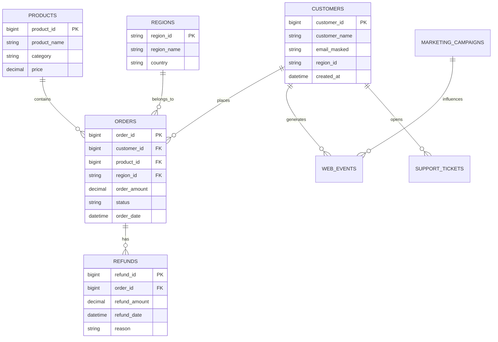
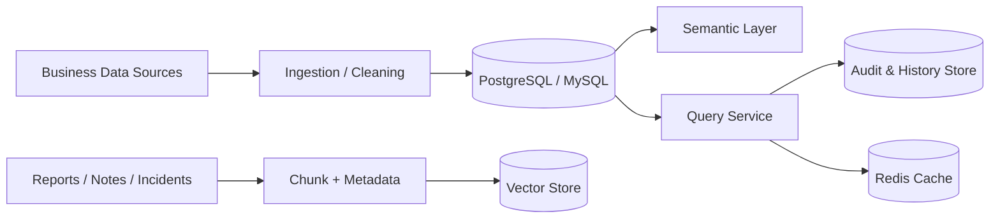

# 数据模型设计（中文）

## 1. 文档信息
- 版本：v1.0
- 状态：详细设计
- 负责人：数据平台组
- 最后更新：2026-06-16

## 2. 设计目标
1. 定义企业 ChatBI 的统一业务数据模型、知识数据模型和运行治理数据模型。
2. 为语义层、NL2SQL、分析预测、RAG 提供稳定的数据基础。
3. 在可扩展性、可追溯性、性能和安全之间建立平衡。

## 3. 作用范围
In Scope：
1. 业务事实表与维度表模型。
2. 指标血缘与口径映射。
3. 向量检索文档存储模型。
4. 查询历史、审计、追踪模型。
5. 缓存与配置存储模型。

Out of Scope：
1. 离线数仓分层建模（ODS/DWD/DWS）。
2. 企业级主数据管理平台接入。

## 4. 数据域划分
1. 业务分析域：orders、refunds、customers、products、regions、web_events、support_tickets、marketing_campaigns。
2. 语义治理域：metrics_catalog、dimension_catalog、semantic_versions。
3. 知识检索域：documents、doc_chunks、doc_embeddings。
4. 运行治理域：query_history、audit_events、agent_traces、eval_runs。
5. 配置与缓存域：system_configs、prompt_versions、cache_keys。

## 5. 核心ER结构图

## 6. 数据流与存储架构

## 7. 关键表设计（MVP）
1. orders：订单事实表，粒度为“单笔订单”。
2. refunds：退款事实表，粒度为“单笔退款”。
3. customers：客户维表。
4. products：产品维表。
5. regions：区域维表。
6. web_events：行为事件表，用于活跃与转化分析。
7. support_tickets：客服工单表，用于问题量和满意度分析。
8. marketing_campaigns：营销活动表，用于归因解释。

关键索引建议：
1. orders(order_date, status)。
2. orders(region_id, product_id)。
3. refunds(refund_date, order_id)。
4. web_events(event_time, event_type, customer_id)。

## 8. 指标血缘与口径映射
核心指标示例：
1. revenue = SUM(orders.order_amount) WHERE status='paid'。
2. order_count = COUNT(DISTINCT orders.order_id)。
3. refund_rate = SUM(refunds.refund_amount) / SUM(orders.order_amount)。
4. active_users = COUNT(DISTINCT web_events.customer_id) by day。

血缘原则：
1. 每个指标必须指向唯一口径定义。
2. 指标与语义版本绑定。
3. 指标计算链条可回放。

## 9. 向量与知识数据模型
1. documents：文档主表，存来源、标题、时间、类型。
2. doc_chunks：切片表，存 chunk_text、chunk_index、metadata。
3. doc_embeddings：向量表，存 embedding_vector 与 chunk_id 关联。

检索约束：
1. 支持按时间窗口过滤。
2. 支持按文档类型过滤。
3. 返回证据必须带 source_id 与引用片段。

## 10. 运行治理模型
1. query_history：保存问题、SQL、结果摘要、耗时、状态。
2. audit_events：保存规则命中、拒绝原因、权限决策。
3. agent_traces：保存每步 agent 输入输出摘要。
4. eval_runs：保存评估任务与指标得分。

## 11. 分区、归档与生命周期
1. 大事实表按月分区（order_date/refund_date/event_time）。
2. query_history 与 audit_events 保留 180 天热数据。
3. 180 天后归档到低成本存储，保留 2 年。

## 12. 数据质量与一致性
质量规则：
1. 主键不为空，外键关联完整。
2. 金额字段非负。
3. 时间字段不允许未来日期（超过容差范围）。
4. 关键维度缺失率低于 0.5%。

一致性策略：
1. 每日指标对账任务。
2. 语义层定义变更触发回归 SQL 验证。

## 13. 安全与治理
1. 敏感字段分级：P0/P1/P2。
2. P0 默认不可查询；P1 默认脱敏；P2 可按角色查询。
3. 数据库账号最小权限原则。
4. 所有跨域访问写审计日志。

## 14. 可观测性
指标：
1. model_query_latency_p95。
2. table_scan_ratio。
3. partition_hit_ratio。
4. data_quality_failed_checks。

告警：
1. 分区未命中导致慢查询激增。
2. 数据质量规则连续失败。
3. 审计写入失败。

## 15. 测试与验收
单元测试：
1. DDL 约束测试。
2. 指标 SQL 单测。
3. 数据掩码函数测试。

集成测试：
1. 业务查询链路与 join 正确性。
2. RAG 检索元数据过滤正确性。
3. 审计与查询历史一致性。

验收标准：
1. 关键指标口径与预期报表一致。
2. 高并发下核心查询可用。
3. 数据追溯链完整。

## 16. 风险与待决事项
风险：
1. 多源数据质量不齐导致口径漂移。
2. 向量库增长过快导致存储成本上升。
3. 索引不当导致查询性能抖动。

待决事项：
1. 首版 OLTP 是否直接使用 PostgreSQL。
2. 向量索引使用 HNSW 还是 IVF。
3. 历史归档采用对象存储还是冷库实例。

## 17. 里程碑
1. M1（第 1 周）：完成核心表 DDL 与指标映射。
2. M2（第 2 周）：完成知识库模型与治理模型。
3. M3（第 3 周）：完成性能优化、质量校验与验收。
