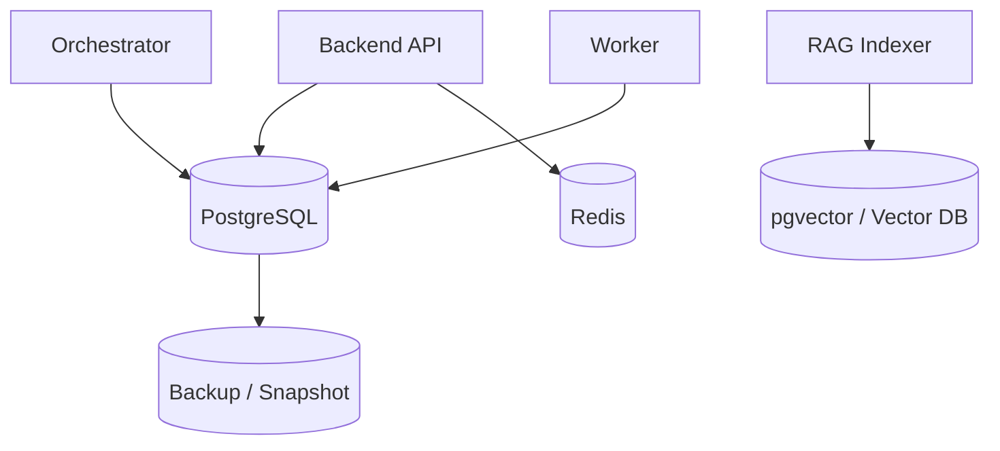

# Data Model Design v2 (English)

## 1. Document Info
- Version: v2.0
- Status: Engineering Architecture Upgrade Design
- Last Updated: 2026-06-22
- Baseline Document: [README.en.md](README.en.md)

## 2. v2 Upgrade Goals
v2 upgrades the data model into a data foundation that can be persisted, migrated, observed, and used by frontend, backend, and Agents.

Core upgrades:
1. Use PostgreSQL as the primary data store for business samples, semantic catalog, session history, audit, and evaluation.
2. Use Redis for cache and runtime state, not as the final source of truth.
3. Use pgvector or a vector database for RAG chunk embeddings.
4. Manage all table structures through migrations that can be reproduced in Docker and Kubernetes environments.
5. Include data lifecycle, indexes, partitioning, and backups in the design.

## 3. v2 Storage Topology

## 4. PostgreSQL Schema Layers
1. `business`: orders, refunds, customers, products, regions, events.
2. `semantic`: metrics, dimensions, semantic_versions, lineage.
3. `runtime`: sessions, messages, query_results, agent_traces.
4. `governance`: audit_events, access_policies, masking_policies.
5. `evaluation`: eval_cases, eval_runs, eval_scores.
6. `knowledge`: metadata for documents, doc_chunks, and doc_embeddings.

## 5. Core Table Relationships
1. `sessions` links to `messages` to form multi-turn conversation context.
2. `messages` links to `query_results` to store structured results and chart specs.
3. `query_results` links to `agent_traces` to support replay.
4. `metrics` links to `semantic_versions` to support semantic version switching.
5. `doc_chunks` links to `documents`; embeddings are stored in pgvector or an external vector database.

## 6. Indexing and Partitioning
1. Partition `audit_events` and `agent_traces` by time.
2. Create composite indexes on `messages` by `session_id` and `created_at`.
3. Create a unique index on `query_results` by `trace_id`.
4. Index `doc_chunks` by `document_id`, `business_tags`, and `published_at`.
5. Use the appropriate ANN index for vector fields.

## 7. Docker and Kubernetes Data Initialization
1. Run schema migrations and sample seed data when Docker Compose starts.
2. Use a migration Job in Kubernetes and release application services only after it succeeds.
3. Local sample data must cover KPI query, anomaly detection, RAG explanation, and permission scenarios.
4. Production database backups are independent of the application Pod lifecycle.

## 8. v2 Acceptance Criteria
1. A blank environment can create the full schema through migrations.
2. Sample data can support one complete end-to-end demo.
3. History, audit, trace, and evaluation results can be connected through `trace_id`.
4. Database schema documentation stays aligned with actual migrations.
