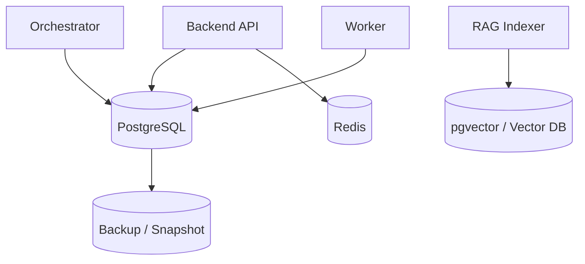

# 数据模型设计 v2（中文）

## 1. 文档信息
- 版本：v2.0
- 状态：工程化架构升级设计
- 最后更新：2026-06-22
- 基线文档：[README.zh-CN.md](README.zh-CN.md)

## 2. v2 升级目标
v2 将数据模型升级为可真实落库、可迁移、可观测、可支持前后端和 Agent 协作的数据底座。

核心升级：
1. PostgreSQL 作为主数据存储，覆盖业务样例、语义目录、会话历史、审计和评估。
2. Redis 用于缓存和运行状态，不作为最终事实来源。
3. pgvector 或向量库用于 RAG chunk embedding。
4. 所有表结构通过 migration 管理，可在 Docker 和 K8s 环境复现。
5. 数据生命周期、索引、分区和备份纳入设计。

## 3. v2 存储拓扑

## 4. PostgreSQL schema 分层
1. `business`：orders、refunds、customers、products、regions、events。
2. `semantic`：metrics、dimensions、semantic_versions、lineage。
3. `runtime`：sessions、messages、query_results、agent_traces。
4. `governance`：audit_events、access_policies、masking_policies。
5. `evaluation`：eval_cases、eval_runs、eval_scores。
6. `knowledge`：documents、doc_chunks、doc_embeddings 元数据。

## 5. 核心表关系
1. `sessions` 关联 `messages`，形成多轮对话上下文。
2. `messages` 关联 `query_results`，保存结构化结果和 chart spec。
3. `query_results` 关联 `agent_traces`，支持回放。
4. `metrics` 关联 `semantic_versions`，支持语义版本切换。
5. `doc_chunks` 关联 `documents`，embedding 存储在 pgvector 或外部向量库。

## 6. 索引与分区
1. `audit_events`、`agent_traces` 按时间分区。
2. `messages` 按 `session_id` 和 `created_at` 建组合索引。
3. `query_results` 按 `trace_id` 建唯一索引。
4. `doc_chunks` 按 `document_id`、`business_tags`、`published_at` 建索引。
5. 向量字段使用适合库的 ANN 索引。

## 7. Docker 与 K8s 数据初始化
1. Docker Compose 启动时执行 schema migration 和 sample seed。
2. K8s 使用 migration Job，成功后再发布应用服务。
3. 本地样例数据必须覆盖 KPI 查询、异常检测、RAG 解释和权限场景。
4. 生产数据库备份策略独立于应用 Pod 生命周期。

## 8. v2 验收标准
1. 空环境可通过 migration 创建完整 schema。
2. 样例数据可支撑一次完整端到端演示。
3. 历史、审计、trace、评估结果可通过 `trace_id` 串联。
4. 数据库 schema 文档与实际 migration 保持一致。
