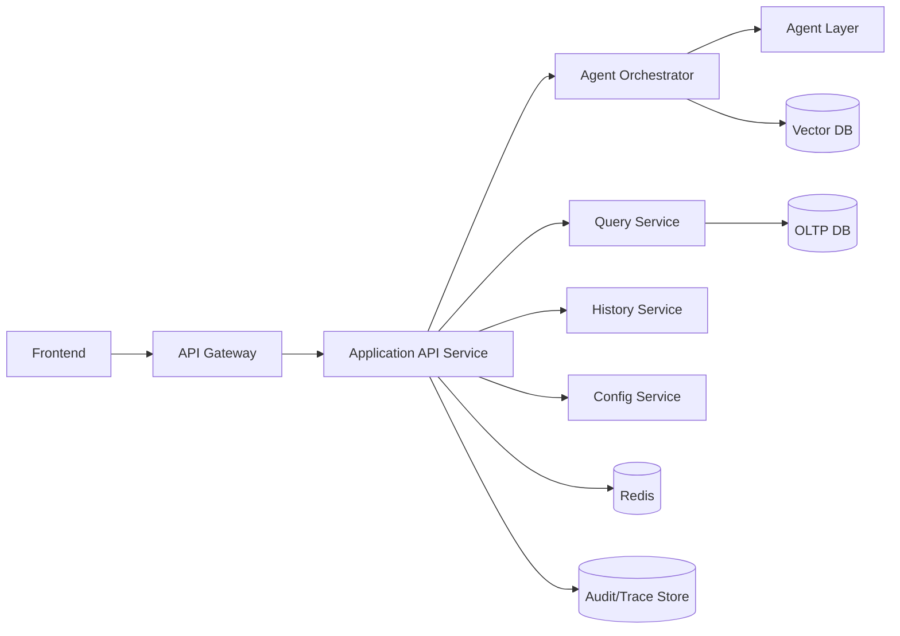
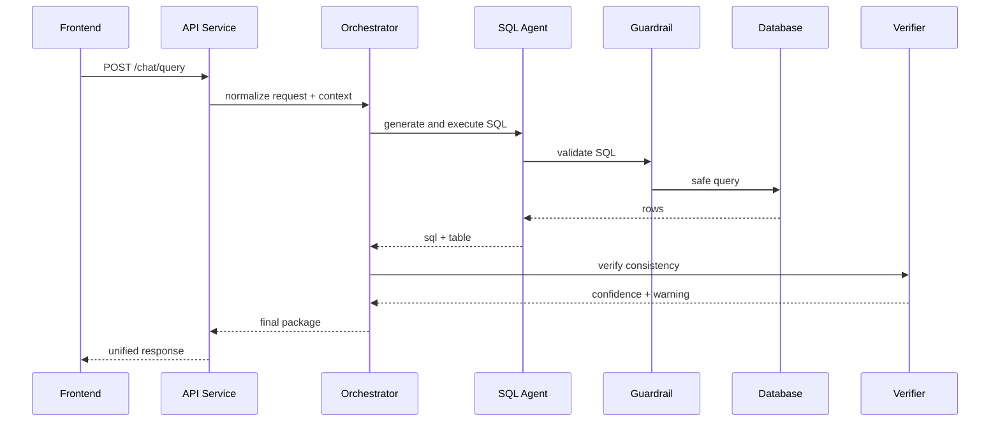

# Backend API Design (English)

## 1. Document Info
- Version: v1.0
- Status: Detailed Design
- Owner: Backend Platform Team
- Last Updated: 2026-06-16

## 2. Design Goals
1. Define a stable, extensible API system to support full ChatBI workflows.
2. Establish clear service boundaries and contracts across frontend, agents, and data services.
3. Achieve production readiness in security, performance, observability, and maintainability.

## 3. Scope
In Scope:
1. API gateway and application service API contracts.
2. Session, query, result, history, and management APIs.
3. Error taxonomy, idempotency, pagination, and rate limiting.
4. AuthN/AuthZ, audit logging, and trace standards.

Out of Scope:
1. Public API commercialization features (billing/quota platform).
2. GraphQL adoption (v1 uses REST).

## 4. Service Architecture



## 5. API Grouping
1. Session and question APIs.
2. Query result and history APIs.
3. Metric and dataset catalog APIs.
4. Evaluation and audit APIs.
5. System config and health APIs.

## 6. Core Endpoint List (v1)
1. POST /api/v1/chat/query
2. GET /api/v1/chat/history
3. GET /api/v1/query/{trace_id}
4. GET /api/v1/metrics/catalog
5. GET /api/v1/datasets/catalog
6. GET /api/v1/audit/{trace_id}
7. POST /api/v1/evals/run
8. GET /api/v1/health

## 7. Request and Response Contracts
Common request headers:
1. Authorization: Bearer token
2. X-Trace-Id
3. X-Request-Id
4. X-User-Role
5. Accept-Language

Unified response envelope:

```json
{
	"code": 0,
	"message": "ok",
	"data": {},
	"trace_id": "trc_xxx",
	"warnings": [],
	"timestamp": "2026-06-16T12:00:00Z"
}
```

Suggested data payload fields for query API:
1. answer_text
2. sql_text
3. table_result
4. chart_spec
5. analytics_result
6. evidence_list
7. confidence

## 8. Sequence Flow (Primary Query Path)



## 9. Error Codes and Exception Model
Error classes:
1. 4xx: invalid input, permission denied, throttling.
2. 5xx: internal faults, downstream timeout, service unavailable.

Key error codes:
1. AUTH_UNAUTHORIZED
2. AUTH_FORBIDDEN
3. REQ_INVALID_ARGUMENT
4. SQL_GUARDRAIL_BLOCKED
5. QUERY_TIMEOUT
6. AGENT_PARTIAL_FAILURE
7. INTERNAL_ERROR

Exception-return strategy:
1. Recoverable errors must include retry_hint.
2. Non-recoverable errors must include support_id.

## 10. Idempotency, Pagination, and Rate Limits
Idempotency:
1. POST /chat/query supports Idempotency-Key (60-second window).

Pagination:
1. History API uses cursor pagination.
2. Default page_size=20, max=100.

Rate limiting:
1. Per-user QPS limits.
2. Per-tenant concurrency limits.
3. Peak-mode degradation to query-only response.

## 11. Security and Governance
1. JWT-based authentication and role authorization.
2. Endpoint-level RBAC.
3. Field-level masking in outputs.
4. Full request audit logging.
5. Secondary audit flags for high-risk invocations.

## 12. Caching and Performance Strategy
1. Short-TTL cache for hot questions.
2. Long-TTL cache for metric catalogs.
3. History-list caching with async refresh.
4. Slow-query detection with auto-degradation.

Performance targets:
1. /chat/query P95 <= 8s.
2. /chat/history P95 <= 500ms.

## 13. Observability
Key metrics:
1. api_success_rate
2. api_latency_p95/p99
3. downstream_timeout_rate
4. partial_response_ratio

Log fields:
1. trace_id
2. request_id
3. user_id
4. endpoint
5. latency_ms
6. error_code

## 14. Testing and Acceptance
Unit tests:
1. parameter validation and serialization tests.
2. error-code mapping tests.
3. idempotency logic tests.

Integration tests:
1. end-to-end query path.
2. degraded and partial-failure paths.
3. audit-log completeness paths.

Acceptance criteria:
1. Core APIs consistently return unified schema.
2. Critical error scenarios are diagnosable and user-friendly.
3. Monitoring and alerting are operational.

## 15. Risks and Open Questions
Risks:
1. Unstable downstream AI services can reduce API availability.
2. Peak traffic can increase queue latency.
3. Inconsistent error models can complicate frontend handling.

Open questions:
1. Whether to split Query API and Agent API services.
2. Whether to enable SSE streaming in v1.
3. Whether to enforce centralized audit via gateway plugins.

## 16. Milestones
1. M1 (Week 1): API contracts and error model.
2. M2 (Week 2): core endpoint implementation and integration.
3. M3 (Week 3): load testing, alerting, and release readiness.
