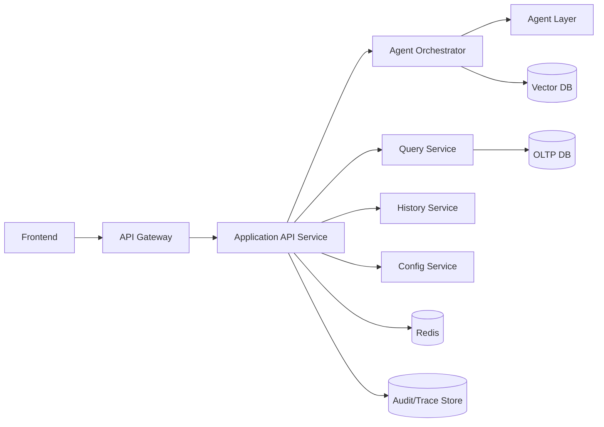
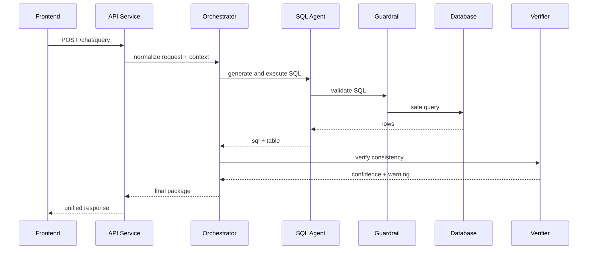

# 后端API设计（中文）

## 1. 文档信息
- 版本：v1.0
- 状态：详细设计
- 负责人：后端平台组
- 最后更新：2026-06-16

## 2. 设计目标
1. 定义统一、稳定、可扩展的后端 API 体系，支撑 ChatBI 全链路能力。
2. 建立清晰的服务边界与协议，支持前端、Agent、数据层协同。
3. 在安全、性能、可观测性与可维护性上达到生产标准。

## 3. 作用范围
In Scope：
1. API 网关与应用服务接口设计。
2. 会话、查询、结果、历史、管理类 API。
3. 错误模型、幂等策略、分页策略、限流策略。
4. 安全鉴权、审计日志、trace 标准。

Out of Scope：
1. 公网开放 API 商业化能力（计费/配额平台）。
2. GraphQL 方案（首版采用 REST）。

## 4. 服务架构图



## 5. API 分组设计
1. 会话与提问 API。
2. 查询结果与历史 API。
3. 指标与数据集目录 API。
4. 评估与审计 API。
5. 系统配置与健康检查 API。

## 6. 核心接口清单（v1）
1. POST /api/v1/chat/query
2. GET /api/v1/chat/history
3. GET /api/v1/query/{trace_id}
4. GET /api/v1/metrics/catalog
5. GET /api/v1/datasets/catalog
6. GET /api/v1/audit/{trace_id}
7. POST /api/v1/evals/run
8. GET /api/v1/health

## 7. 请求与响应契约
统一请求头：
1. Authorization: Bearer token
2. X-Trace-Id
3. X-Request-Id
4. X-User-Role
5. Accept-Language

统一响应体：

```json
{
	"code": 0,
	"message": "ok",
	"data": {},
	"trace_id": "trc_xxx",
	"warnings": [],
	"timestamp": "2026-06-16T12:00:00Z"
}
```

查询接口 data 建议字段：
1. answer_text
2. sql_text
3. table_result
4. chart_spec
5. analytics_result
6. evidence_list
7. confidence

## 8. 时序流程（查询主路径）



## 9. 错误码与异常模型
错误分类：
1. 4xx：参数错误、权限不足、请求过载。
2. 5xx：内部错误、下游超时、服务不可用。

关键错误码：
1. AUTH_UNAUTHORIZED
2. AUTH_FORBIDDEN
3. REQ_INVALID_ARGUMENT
4. SQL_GUARDRAIL_BLOCKED
5. QUERY_TIMEOUT
6. AGENT_PARTIAL_FAILURE
7. INTERNAL_ERROR

异常返回策略：
1. 可恢复错误返回 retry_hint。
2. 不可恢复错误返回 support_id。

## 10. 幂等、分页与限流
幂等：
1. POST /chat/query 支持 Idempotency-Key（60 秒窗口）。

分页：
1. 历史接口使用 cursor 分页。
2. 默认 page_size=20，最大 100。

限流：
1. 用户级 QPS 限制。
2. 租户级并发限制。
3. 高峰期降级为“仅查询不预测”。

## 11. 安全与治理
1. JWT 鉴权 + 角色授权。
2. 接口级 RBAC。
3. 输出字段级脱敏。
4. 所有请求写入审计日志。
5. 高风险调用触发二次审计标记。

## 12. 缓存与性能策略
1. 热门问题结果缓存（短 TTL）。
2. 指标目录缓存（长 TTL）。
3. 历史列表缓存 + 异步刷新。
4. 慢查询识别与自动降级。

性能目标：
1. /chat/query P95 <= 8s。
2. /chat/history P95 <= 500ms。

## 13. 可观测性
核心指标：
1. api_success_rate
2. api_latency_p95/p99
3. downstream_timeout_rate
4. partial_response_ratio

日志字段：
1. trace_id
2. request_id
3. user_id
4. endpoint
5. latency_ms
6. error_code

## 14. 测试与验收
单元测试：
1. 参数校验与序列化测试。
2. 错误码映射测试。
3. 幂等逻辑测试。

集成测试：
1. 端到端查询路径。
2. 降级与部分失败路径。
3. 审计日志完整性路径。

验收标准：
1. 核心 API 可稳定返回统一 schema。
2. 关键错误场景可定位且有友好提示。
3. 监控指标和告警可观测。

## 15. 风险与待决事项
风险：
1. 下游 AI 服务不稳定影响 API 可用性。
2. 峰值流量导致排队时间上升。
3. 错误模型不统一导致前端处理复杂。

待决事项：
1. 是否拆分独立 Query API 与 Agent API 服务。
2. 是否启用 API 级流式返回（SSE）。
3. 是否引入 API 网关插件统一审计。

## 16. 里程碑
1. M1（第 1 周）：完成 API 契约和错误模型。
2. M2（第 2 周）：完成核心接口开发和联调。
3. M3（第 3 周）：完成性能压测、告警与发布准备。
