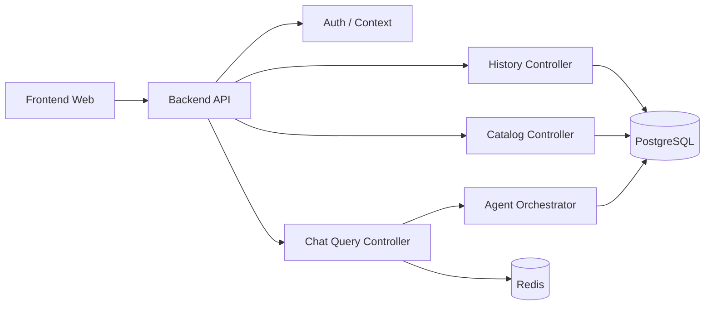

# Backend API Design v2 (English)

## 1. Document Info
- Version: v2.0
- Status: Engineering Architecture Upgrade Design
- Last Updated: 2026-06-22
- Baseline Document: [README.en.md](README.en.md)

## 2. v2 Upgrade Goals
v2 upgrades the backend API from module interface design into an API platform that can be containerized, connected to databases, serve the frontend, and deploy to Kubernetes.

Core upgrades:
1. The backend API is the unified entry point for frontend requests and does not expose databases or internal Agent APIs.
2. Integrate PostgreSQL, Redis, vector store, and Agent orchestration service.
3. Add health checks, configuration, migrations, observability, and error governance.
4. Support Docker Compose local integration and Kubernetes production deployment.

## 3. v2 Service Architecture



## 4. API Groups
1. `POST /api/v1/chat/query`: submit a question and return synchronous or asynchronous results.
2. `GET /api/v1/chat/tasks/{task_id}`: query long-running task status.
3. `GET /api/v1/chat/history`: query conversation history.
4. `GET /api/v1/query/{trace_id}`: replay a single query result.
5. `GET /api/v1/metrics/catalog`: metric catalog.
6. `POST /api/v1/documents/index`: trigger a document indexing task.
7. `GET /healthz`, `GET /readyz`, `GET /metrics`: runtime probes.

## 5. Database Integration
1. Create PostgreSQL and Redis connection pools at application startup.
2. API requests use a request-scoped `trace_id` for logs, audit, and trace records.
3. All business queries run through Query Executor and Guardrail; Controllers are not allowed to execute SQL directly.
4. History and audit write failures must not be silently swallowed; they must enter error logs and retry policy.

## 6. Frontend Response Model
Unified envelope:

```json
{
  "data": {},
  "warnings": [],
  "error": null,
  "trace_id": "tr_...",
  "request_id": "req_..."
}
```

Error model:
1. `VALIDATION_ERROR`
2. `SQL_GUARDRAIL_DENIED`
3. `PERMISSION_DENIED`
4. `QUERY_TIMEOUT`
5. `AGENT_PARTIAL_FAILURE`
6. `INTERNAL_ERROR`

## 7. Docker and Kubernetes
1. The API image contains application runtime only, not database data or secrets.
2. `DATABASE_URL`, `REDIS_URL`, and `MODEL_PROVIDER_CONFIG` are injected through environment variables.
3. Kubernetes readiness probes check PostgreSQL and Redis availability.
4. The API Deployment can scale horizontally, and session state must not live only in single-Pod memory.
5. Ingress handles TLS, path routing, and basic rate limiting.

## 8. v2 Acceptance Criteria
1. The frontend can complete a full query and history replay through the API.
2. The API fails readiness and returns explainable errors when the database is unavailable.
3. Every endpoint returns the unified envelope and trace id.
4. Docker Compose and Kubernetes use the same environment variable semantics.
