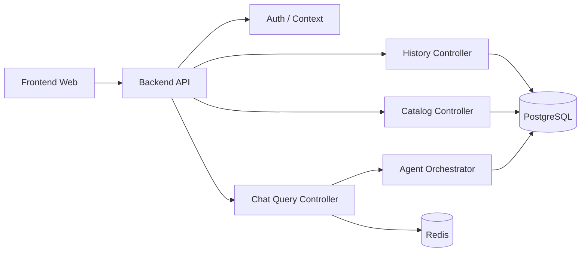

# 后端 API 设计 v2（中文）

## 1. 文档信息
- 版本：v2.0
- 状态：工程化架构升级设计
- 最后更新：2026-06-22
- 基线文档：[README.zh-CN.md](README.zh-CN.md)

## 2. v2 升级目标
v2 将后端 API 从模块接口设计升级为可容器化、可连接数据库、可服务前端、可部署 Kubernetes 的 API 平台。

核心升级：
1. 后端 API 统一承接前端请求，不暴露数据库和 Agent 内部接口。
2. 接入 PostgreSQL、Redis、向量库和 Agent 编排服务。
3. 增加健康检查、配置、迁移、观测和错误治理。
4. 支持 Docker Compose 本地联调和 K8s 生产发布。

## 3. v2 服务架构



## 4. API 分组
1. `POST /api/v1/chat/query`：提交问题并返回同步或异步结果。
2. `GET /api/v1/chat/tasks/{task_id}`：查询长任务状态。
3. `GET /api/v1/chat/history`：查询会话历史。
4. `GET /api/v1/query/{trace_id}`：回放单次查询结果。
5. `GET /api/v1/metrics/catalog`：指标目录。
6. `POST /api/v1/documents/index`：触发文档索引任务。
7. `GET /healthz`、`GET /readyz`、`GET /metrics`：运行时探针。

## 5. 数据库接入
1. 应用启动时创建 PostgreSQL 和 Redis 连接池。
2. API 请求使用 request-scoped `trace_id` 写入日志、审计和 trace。
3. 所有业务查询通过 Query Executor 和 Guardrail，不允许 Controller 直连执行 SQL。
4. 历史和审计写入失败不能吞掉，需要进入错误日志和重试策略。

## 6. 前端响应模型
统一 envelope：

```json
{
  "data": {},
  "warnings": [],
  "error": null,
  "trace_id": "tr_...",
  "request_id": "req_..."
}
```

错误模型：
1. `VALIDATION_ERROR`
2. `SQL_GUARDRAIL_DENIED`
3. `PERMISSION_DENIED`
4. `QUERY_TIMEOUT`
5. `AGENT_PARTIAL_FAILURE`
6. `INTERNAL_ERROR`

## 7. Docker 与 K8s
1. API 镜像包含应用运行时，不包含数据库数据和密钥。
2. `DATABASE_URL`、`REDIS_URL`、`MODEL_PROVIDER_CONFIG` 通过环境变量注入。
3. K8s 使用 readiness probe 检查数据库和 Redis 可用性。
4. API Deployment 可水平扩缩容，session 状态不得只存在单 Pod 内存中。
5. Ingress 负责 TLS、路径路由和基础限流。

## 8. v2 验收标准
1. 前端可通过 API 完成完整查询和历史回放。
2. API 在数据库不可用时 readiness 失败，并返回可解释错误。
3. 每个接口输出统一 envelope 和 trace id。
4. Docker Compose 与 K8s 使用同一套环境变量语义。
