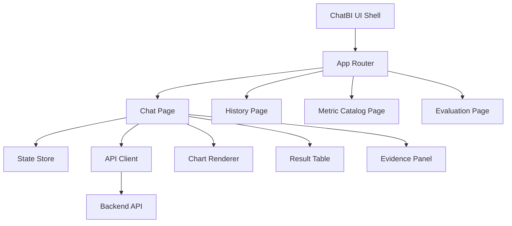
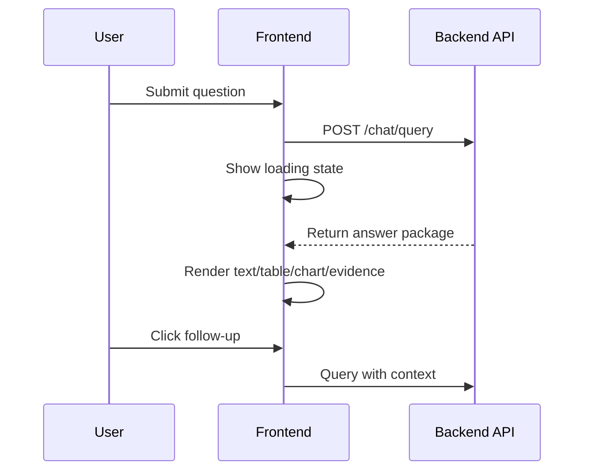

# Frontend ChatBI Interaction and Visualization Design (English)

## 1. Document Info
- Version: v1.0
- Status: Detailed Design
- Owner: Frontend Experience Team
- Last Updated: 2026-06-16

## 2. Design Goals
1. Build an explainable, interactive, and traceable ChatBI frontend experience.
2. Present complex AI/data outputs as conversation + structured results + charts.
3. Meet enterprise standards in performance, accessibility, and maintainability.

## 3. Scope
In Scope:
1. Chat page, result panels, chart rendering, history, and metric-catalog pages.
2. In-progress, partial-failure, degraded, and risk-warning UI states.
3. Bilingual UX (CN/EN) with consistent interaction standards.

Out of Scope:
1. Native mobile apps.
2. Drag-and-drop BI dashboard editor in v1.

## 4. Core Requirements
Functional requirements:
1. Natural-language question input with multi-turn follow-ups.
2. Render tables, charts, evidence citations, and risk labels.
3. Query history filtering and replay.
4. SQL copy and result export (permission-controlled).

Non-functional requirements:
1. First meaningful render < 2s under cache-hit conditions.
2. Interaction latency < 100ms.
3. Reusable, theme-ready, and i18n-ready components.

## 5. Frontend Architecture

## 6. Page and Component Design
Pages:
1. Chat page: prompt input, message stream, result cards, follow-up shortcuts.
2. History page: query list, filters, replay links.
3. Catalog page: metric definitions and dataset metadata.
4. Evaluation page: benchmark cases and expected vs actual views.

Core components:
1. MessageBubble
2. QueryResultCard
3. ChartCard
4. SqlExplainCard
5. EvidenceCard
6. RiskBanner
7. PartialFailureBanner

## 7. Primary Interaction Flow

Exception interactions:
1. SQL blocked: show safety message and rewrite suggestions.
2. Partial failure: render available parts with warnings.
3. No evidence: show data-only insight with evidence-gap notice.

## 8. State Management and Data Flow
State layers:
1. session state: conversation context and question chain.
2. query state: request lifecycle, latency, and errors.
3. ui state: modals, filters, pagination, and theme.

Suggested stack:
1. React Query for server state.
2. Zustand/Redux for session and UI state.

## 9. Chart and Result Rendering Specs
Chart schema fields:
1. chart_type
2. x_field
3. y_fields
4. series
5. annotations
6. forecast_band

Chart mapping rules:
1. Time series -> line.
2. Category comparison -> bar.
3. Proportion -> pie/stacked.
4. Anomaly -> line + markers.
5. Forecast -> history + forecast + confidence band.

## 10. API Contracts (Frontend View)
Request:
1. question
2. session_id
3. locale
4. trace_id (optional)

Response:
1. answer_text
2. table_result
3. chart_spec
4. evidence_list
5. warnings
6. confidence
7. trace_id

## 11. Security and Governance
1. No plaintext sensitive-field caching in frontend.
2. Export buttons follow backend authorization and frontend visibility checks.
3. All user actions carry trace_id for audit linkage.
4. High-risk answers are collapsed by default with review warnings.

## 12. Observability and UX Metrics
Metrics:
1. first_contentful_paint
2. interaction_to_next_paint
3. query_render_success_rate
4. chart_render_error_rate
5. retry_click_rate

Telemetry events:
1. question_submitted
2. answer_rendered
3. followup_clicked
4. evidence_opened
5. export_triggered

## 13. Accessibility and Internationalization
1. Full keyboard accessibility for core interactions.
2. Charts provide text summaries and aria labels.
3. CN/EN strings are centralized in i18n dictionaries.
4. Time, number, and currency formatting follow locale.

## 14. Testing and Acceptance
Unit tests:
1. component rendering logic.
2. state reducers/stores.
3. chart config adapters.

Integration tests:
1. question-to-render end-to-end path.
2. partial-failure/degraded rendering path.
3. history replay consistency path.

Acceptance criteria:
1. No blocking issue on key UX flows.
2. Structured outputs render correctly.
3. Main pages meet Lighthouse baseline targets.

## 15. Risks and Open Questions
Risks:
1. Frequent chart schema changes may break FE-BE compatibility.
2. Large result rendering may cause UI performance jitter.
3. Missing i18n coverage may reduce UX consistency.

Open questions:
1. Chart library selection: ECharts vs Recharts.
2. Whether to enable SSE streaming responses.
3. Whether to support block-level copy/export actions.

## 16. Milestones
1. M1 (Week 1): page skeleton and core components.
2. M2 (Week 2): API integration and chart rendering.
3. M3 (Week 3): UX polish, accessibility, and acceptance.
