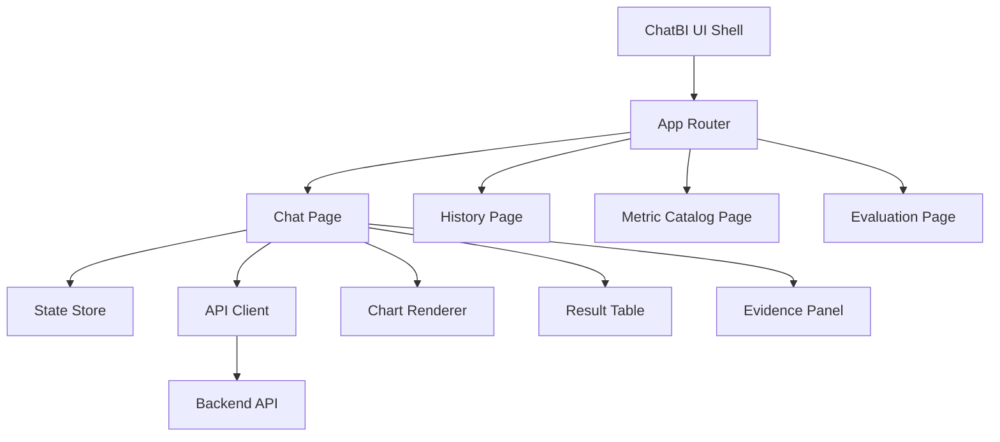
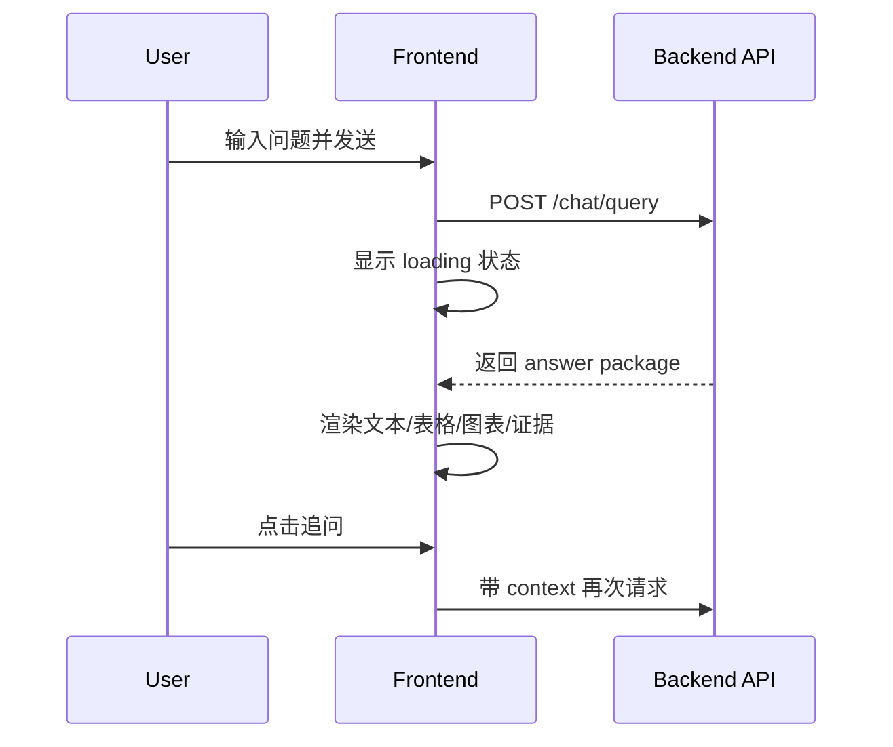

# 前端ChatBI交互与可视化设计（中文）

## 1. 文档信息
- 版本：v1.0
- 状态：详细设计
- 负责人：前端体验组
- 最后更新：2026-06-16

## 2. 设计目标
1. 构建可解释、可交互、可追溯的 ChatBI 前端体验。
2. 将复杂 AI/数据分析结果以“对话 + 结构化结果 + 图表”方式清晰呈现。
3. 在性能、可访问性、可维护性上达到企业级标准。

## 3. 作用范围
In Scope：
1. 会话页面、结果面板、图表渲染、历史查询、指标目录页面。
2. 查询中状态、部分失败状态、降级提示与风险提示。
3. 多语言文案（中文/英文）与统一交互规范。

Out of Scope：
1. 移动端原生 App。
2. BI 仪表盘拖拽编辑器（首版不含）。

## 4. 核心需求
功能需求：
1. 支持自然语言提问与多轮追问。
2. 支持表格、图表、证据引用、风险标注展示。
3. 支持查询历史检索与回放。
4. 支持复制 SQL、导出结果（受权限限制）。

非功能需求：
1. 首屏渲染 < 2s（缓存命中）。
2. 交互响应延迟 < 100ms。
3. 组件可复用、可主题化、可国际化。

## 5. 前端架构图

## 6. 页面与组件设计
页面：
1. Chat 页面：问题输入、消息流、结果卡片、追问入口。
2. History 页面：历史查询列表、筛选、回放。
3. Catalog 页面：指标定义与数据集说明。
4. Evaluation 页面：测试样例与结果对比。

核心组件：
1. MessageBubble
2. QueryResultCard
3. ChartCard
4. SqlExplainCard
5. EvidenceCard
6. RiskBanner
7. PartialFailureBanner

## 7. 交互主流程

异常交互：
1. SQL 被拦截：显示安全提示与可改写建议。
2. 局部失败：展示可用结果 + 风险提示。
3. 无证据：标注“证据不足，仅基于结构化数据”。

## 8. 状态管理与数据流
状态分层：
1. session state：会话上下文、问题序列。
2. query state：当前查询状态、耗时、错误。
3. ui state：弹窗、筛选、分页、主题。

推荐方案：
1. React Query 管理服务端状态。
2. Zustand/Redux 管理会话与 UI 状态。

## 9. 图表与结果渲染规范
图表协议字段：
1. chart_type
2. x_field
3. y_fields
4. series
5. annotations
6. forecast_band

图表规则：
1. 时间序列 -> line。
2. 类别比较 -> bar。
3. 占比 -> pie/stacked。
4. 异常检测 -> line + marker。
5. 预测 -> history + forecast + confidence band。

## 10. 接口契约（前端视角）
请求：
1. question
2. session_id
3. locale
4. trace_id（可选）

响应：
1. answer_text
2. table_result
3. chart_spec
4. evidence_list
5. warnings
6. confidence
7. trace_id

## 11. 安全与治理
1. 前端不缓存明文敏感字段。
2. 导出按钮由后端权限控制 + 前端显隐双重保护。
3. 所有操作附带 trace_id，方便审计关联。
4. 高风险回答默认折叠并提示“需人工复核”。

## 12. 可观测性与体验指标
指标：
1. first_contentful_paint
2. interaction_to_next_paint
3. query_render_success_rate
4. chart_render_error_rate
5. retry_click_rate

埋点事件：
1. question_submitted
2. answer_rendered
3. followup_clicked
4. evidence_opened
5. export_triggered

## 13. 可访问性与国际化
1. 键盘可达（输入、发送、结果导航）。
2. 图表提供文本摘要与 aria 标签。
3. 中英文文案统一在 i18n 词典管理。
4. 时间、数字、货币按 locale 格式化。

## 14. 测试与验收
单元测试：
1. 组件渲染逻辑。
2. 状态管理与 reducer。
3. 图表配置适配器。

集成测试：
1. 提问到结果渲染闭环。
2. 局部失败与降级提示。
3. 历史回放一致性。

验收标准：
1. 关键路径交互无阻断。
2. 结构化结果正确渲染。
3. 主要页面 Lighthouse 指标达标。

## 15. 风险与待决事项
风险：
1. 图表协议变动频繁可能导致前后端不一致。
2. 大结果集渲染可能造成性能抖动。
3. 国际化文案缺失影响体验一致性。

待决事项：
1. 图表库选型 ECharts 还是 Recharts。
2. 是否启用 SSE 流式回答渲染。
3. 是否支持结果块级别复制与导出。

## 16. 里程碑
1. M1（第 1 周）：页面骨架与核心组件完成。
2. M2（第 2 周）：联调 API 与图表渲染完成。
3. M3（第 3 周）：体验优化、可访问性、验收完成。
