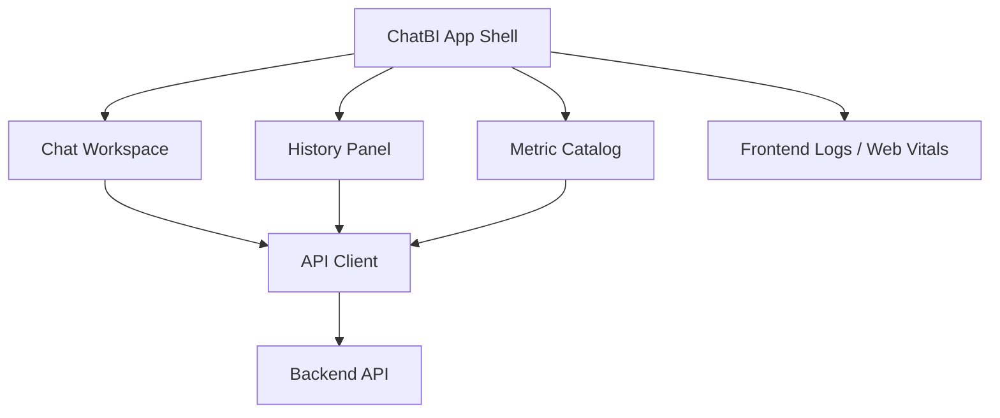

# Frontend ChatBI Interaction and Visualization Design v2 (English)

## 1. Document Info
- Version: v2.0
- Status: Engineering Architecture Upgrade Design
- Last Updated: 2026-06-22
- Baseline Document: [README.en.md](README.en.md)

## 2. v2 Upgrade Goals
v2 upgrades the frontend from component design into a deployable and observable ChatBI Web application that connects to a real backend.

Core upgrades:
1. The frontend gets answers, history, metric catalog, and task status through backend REST APIs.
2. Support Docker image builds and exposure through Kubernetes Ingress.
3. Support environment-based API base URL configuration without hard-coding addresses into build artifacts.
4. Support long-running query status, partial failure, risk warnings, evidence citations, and trace display.
5. Frontend errors, API latency, and key interactions are written into the observability pipeline.

## 3. v2 Frontend Architecture

## 4. Pages and States
1. Chat Workspace: question input, answer stream, tables, charts, evidence, and risk warnings.
2. History Panel: search history by time, metric, status, and trace id.
3. Metric Catalog: show metric definitions, dimensions, business definitions, permissions, and example questions.
4. Task Status: show queued, running, partially complete, failed, and completed states for long tasks.
5. Error Boundary: unified rendering for API failure, authentication failure, and degraded results.

## 5. API Client Contract
1. All requests automatically attach `request_id`, `session_id`, and `locale`.
2. All responses are parsed through the unified envelope.
3. `trace_id` can be copied in the UI for debugging and audit.
4. `AGENT_PARTIAL_FAILURE` renders a yellow risk state instead of a full-page failure.
5. `SQL_GUARDRAIL_DENIED` renders a safety reason and retry suggestion.

## 6. Docker and Kubernetes Deployment
1. The frontend builds static assets and serves them through Nginx or a lightweight web server.
2. The Docker image reads runtime configuration such as `API_BASE_URL` at startup.
3. Kubernetes uses ConfigMap to inject API address and environment name.
4. Ingress routes `/` to the frontend and `/api` to the backend.
5. Static assets use hashed file names to support browser caching.

## 7. Observability
1. Record first render, API latency, frontend exceptions, and user query count.
2. Frontend logs must include `trace_id` or `request_id`.
3. Provide visible degradation for chart render failures, oversized tables, and missing evidence.

## 8. v2 Acceptance Criteria
1. After local Docker Compose startup, a browser can complete an end-to-end query.
2. The frontend can display the full answer structure without relying on mock data.
3. Kubernetes Ingress can access the frontend and proxy APIs correctly.
4. History replay and trace id display are available.
