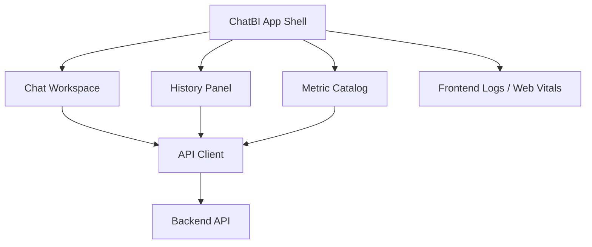

# 前端 ChatBI 交互与可视化设计 v2（中文）

## 1. 文档信息
- 版本：v2.0
- 状态：工程化架构升级设计
- 最后更新：2026-06-22
- 基线文档：[README.zh-CN.md](README.zh-CN.md)

## 2. v2 升级目标
v2 将前端从组件设计升级为可接入真实后端、可部署、可观测的 ChatBI Web 应用。

核心升级：
1. 前端通过后端 REST API 获取回答、历史、指标目录和任务状态。
2. 支持 Docker 镜像构建，并通过 Kubernetes Ingress 暴露。
3. 支持环境化配置 API base URL，不在构建产物中写死地址。
4. 支持长查询状态、部分失败、风险提示、证据引用和 trace 展示。
5. 前端错误、接口耗时和关键交互写入观测链路。

## 3. v2 前端架构

## 4. 页面与状态
1. Chat Workspace：问题输入、回答流、表格、图表、证据、风险提示。
2. History Panel：按时间、指标、状态、trace id 检索历史。
3. Metric Catalog：展示指标定义、维度、口径、权限和示例问题。
4. Task Status：长任务显示排队、执行、部分完成、失败和完成。
5. Error Boundary：接口失败、鉴权失败、降级结果的统一展示。

## 5. API Client 契约
1. 所有请求自动附加 `request_id`、`session_id`、`locale`。
2. 所有响应解析统一 envelope。
3. `trace_id` 在 UI 中可复制，用于排查和审计。
4. 对 `AGENT_PARTIAL_FAILURE` 展示黄色风险状态，而不是整页失败。
5. 对 `SQL_GUARDRAIL_DENIED` 展示安全原因和可重试建议。

## 6. Docker 与 K8s 部署
1. 前端构建静态资源并由 Nginx 或轻量 Web server 托管。
2. Docker 镜像启动时读取运行时配置，例如 `API_BASE_URL`。
3. K8s 使用 ConfigMap 注入 API 地址和环境名。
4. Ingress 将 `/` 路由到前端，将 `/api` 路由到后端。
5. 静态资源使用 hash 文件名，支持浏览器缓存。

## 7. 可观测性
1. 记录首屏渲染、接口耗时、前端异常、用户触发查询次数。
2. 前端日志必须带 `trace_id` 或 `request_id`。
3. 对图表渲染失败、表格过大、证据缺失提供可见降级。

## 8. v2 验收标准
1. 本地 Docker Compose 启动后，浏览器可完成端到端查询。
2. 前端不依赖 mock 数据也能展示完整回答结构。
3. K8s Ingress 可访问前端，并正确代理 API。
4. 历史回放与 trace id 展示可用。
