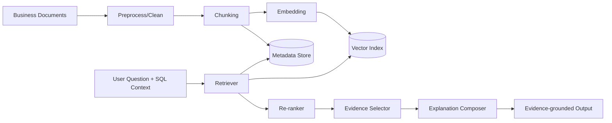
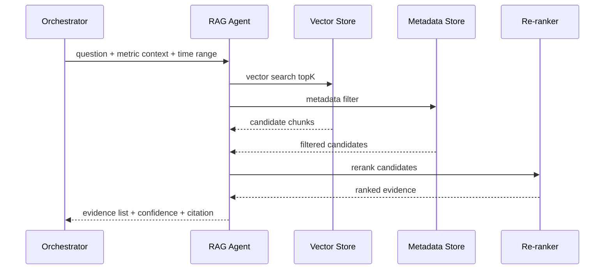

# RAG Retrieval and Evidence Explanation Design (English)

## 1. Document Info
- Version: v1.0
- Status: Detailed Design
- Owner: Knowledge Retrieval Team / AI Reasoning Team
- Last Updated: 2026-06-16

## 2. Design Goals
1. Build traceable and explainable RAG capabilities to support KPI-change explanations with evidence.
2. Reduce unsupported explanations through retrieval constraints and evidence scoring.
3. Produce outputs that clearly separate facts, evidence, hypotheses, and uncertainty.

## 3. Scope
In Scope:
1. Document ingestion, cleaning, chunking, embedding, and indexing.
2. Online retrieval, reranking, evidence deduplication, and citation generation.
3. Faithfulness constraints and post-retrieval validation.

Out of Scope:
1. Automatic translation and multilingual corpus alignment.
2. Live internet crawling in v1.

## 4. Core Requirements
Functional requirements:
1. Support weekly reports, release notes, campaigns, tickets, and incident documents.
2. Support retrieval by time window, document type, and business tags.
3. Return snippets with source, time, and confidence.
4. Distinguish factual findings from possible causes in final responses.

Non-functional requirements:
1. Retrieval latency P95 <= 1.5s.
2. Continuous measurement of recall and relevance quality.
3. Incremental index update support.

## 5. RAG Architecture

## 6. Offline Ingestion Pipeline
1. Source ingestion from upload, object storage, and internal knowledge systems.
2. Document cleaning to remove templates/noise and normalize encoding.
3. Semantic chunking with token-length control.
4. Metadata extraction: source_id, doc_type, publish_time, owner, tags.
5. Embedding generation and persistence into vector + metadata stores.

Chunking recommendations:
1. chunk_size: 300-600 tokens.
2. overlap: 50-100 tokens.
3. preserve section headings as context anchors.

## 7. Online Retrieval Sequence

## 8. Retrieval Strategy
Recall strategy:
1. Hybrid retrieval: vector + keyword.
2. Time-window filters applied early.
3. Document-type weighting (incidents/releases prioritized for root causes).

Reranking strategy:
1. semantic relevance score.
2. temporal proximity score.
3. source-trust score.

Dedup strategy:
1. merge adjacent chunks from same document.
2. similarity-threshold deduplication.

## 9. Evidence and Citation Specification
Output structure:
1. evidence_summary
2. evidence_items[]
3. possible_causes[]
4. uncertainty_notes[]

evidence_items fields:
1. source_id
2. title
3. publish_time
4. snippet
5. relevance_score
6. citation_anchor

Citation rules:
1. each causal statement must map to at least one evidence item.
2. insufficient evidence must trigger explicit uncertainty messaging.

## 10. Faithfulness and Safety Constraints
1. No factual claims outside retrieved evidence.
2. Causal statements must use probabilistic wording when not definitive.
3. Low-confidence evidence is down-weighted or excluded.
4. No content from out-of-scope permission domains.

## 11. Data and Interface Contracts
Input:
1. question
2. metric_context
3. time_range
4. user_role
5. trace_id

Output:
1. evidence_list
2. explanation_text
3. confidence
4. uncertainty
5. retrieval_stats
6. trace_id

## 12. Observability and Evaluation
Metrics:
1. rag_retrieval_latency_p95
2. recall_at_k
3. precision_at_k
4. citation_coverage
5. unsupported_claim_rate

Evaluation dimensions:
1. retrieval correctness.
2. citation completeness.
3. explanation faithfulness.
4. uncertainty expression quality.

## 13. Testing and Acceptance
Unit tests:
1. chunking behavior tests.
2. metadata filtering tests.
3. citation format tests.

Integration tests:
1. question -> retrieval -> explanation path.
2. permission-filter path for restricted docs.
3. low-recall degradation path.

Acceptance criteria:
1. citation_coverage >= 95% on key scenarios.
2. unsupported_claim_rate <= 2%.
3. retrieval latency meets P95 target.

## 14. Risks and Open Questions
Risks:
1. stale documents can produce outdated explanations.
2. conflicting documents on same topic can reduce consistency.
3. embedding drift can degrade retrieval quality.

Open questions:
1. embedding model selection and refresh cadence.
2. whether to add cross-encoder reranking.
3. whether to build a human-labeled evidence benchmark set.

## 15. Milestones
1. M1 (Week 1): ingestion, chunking, and embedding pipeline.
2. M2 (Week 2): online retrieval, reranking, and citation output.
3. M3 (Week 3): faithfulness evaluation and optimization.
