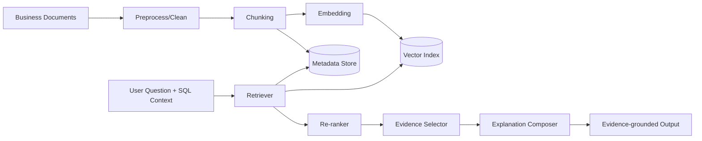
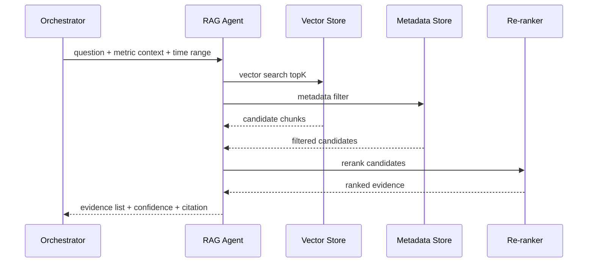

# RAG检索与证据解释设计（中文）

## 1. 文档信息
- 版本：v1.0
- 状态：详细设计
- 负责人：知识检索组 / AI 推理组
- 最后更新：2026-06-16

## 2. 设计目标
1. 构建可追溯、可解释的 RAG 能力，为指标变化提供证据支持。
2. 通过检索约束和证据评分，降低“无依据解释”风险。
3. 与结构化数据分析结果协同输出“事实 + 证据 + 假设 + 不确定性”。

## 3. 作用范围
In Scope：
1. 文档接入、清洗、切片、向量化与索引。
2. 在线检索、重排、证据去重、引用生成。
3. Faithfulness 约束与结果后验校验。

Out of Scope：
1. 文档自动翻译与多语料对齐。
2. 外部互联网实时爬虫检索（首版不做）。

## 4. 核心需求
功能需求：
1. 支持业务周报、发布说明、营销活动、工单、事故报告等文档源。
2. 支持按时间窗口、文档类型、业务标签检索。
3. 返回证据片段、来源、时间、置信度。
4. 在最终回答中区分“事实结论”与“可能原因”。

非功能需求：
1. 检索延迟 P95 <= 1.5s。
2. 证据召回率与相关性可持续评估。
3. 支持增量索引更新。

## 5. RAG架构图

## 6. 文档接入与离线流程
1. 数据源接入：上传文件、对象存储、内部知识库同步。
2. 文档清洗：去模板噪音、去空白、统一编码。
3. 切片策略：按语义段落切片，控制 token 长度。
4. 元数据抽取：source_id、doc_type、publish_time、owner、tags。
5. 向量化与入库：写入向量库与元数据索引。

切片建议：
1. chunk_size：300-600 tokens。
2. overlap：50-100 tokens。
3. 保留章节标题作为上文锚点。

## 7. 在线检索时序

## 8. 检索策略设计
召回策略：
1. 向量召回 + 关键词召回混合。
2. 时间窗口过滤优先。
3. 文档类型加权（事故报告、发布说明优先级更高）。

重排策略：
1. 相关性得分。
2. 时间接近度得分。
3. 来源可信度得分。

去重策略：
1. 同文档相邻 chunk 合并。
2. 相似文本阈值去重。

## 9. 证据解释与引用规范
输出结构：
1. evidence_summary
2. evidence_items[]
3. possible_causes[]
4. uncertainty_notes[]

evidence_items 字段：
1. source_id
2. title
3. publish_time
4. snippet
5. relevance_score
6. citation_anchor

引用规则：
1. 每个因果性陈述至少绑定 1 条证据。
2. 证据不足时必须显示“不确定性说明”。

## 10. Faithfulness与安全约束
1. 禁止输出未在证据中出现的具体事实。
2. 对“原因推断”使用概率性表述（如“可能”“疑似”）。
3. 对低置信证据默认降权或不输出。
4. 不返回权限范围外文档内容。

## 11. 数据与接口契约
输入：
1. question
2. metric_context
3. time_range
4. user_role
5. trace_id

输出：
1. evidence_list
2. explanation_text
3. confidence
4. uncertainty
5. retrieval_stats
6. trace_id

## 12. 可观测性与评估
指标：
1. rag_retrieval_latency_p95
2. recall_at_k
3. precision_at_k
4. citation_coverage
5. unsupported_claim_rate

评估维度：
1. 检索正确性。
2. 引用完整性。
3. 解释忠实度。
4. 不确定性表达质量。

## 13. 测试与验收
单元测试：
1. chunk 切片测试。
2. metadata 过滤测试。
3. 引用格式测试。

集成测试：
1. 问题 -> 检索 -> 解释链路。
2. 权限不足文档过滤链路。
3. 低召回场景降级链路。

验收标准：
1. 关键场景 citation_coverage >= 95%。
2. unsupported_claim_rate <= 2%。
3. 检索延迟满足 P95 目标。

## 14. 风险与待决事项
风险：
1. 文档时效性不足导致解释过时。
2. 同主题冲突文档导致解释不一致。
3. 向量漂移导致召回质量下降。

待决事项：
1. 向量模型选型与更新频率。
2. 是否引入 cross-encoder 重排。
3. 是否建立证据人工标注集用于长期评估。

## 15. 里程碑
1. M1（第 1 周）：完成文档接入、切片、向量化流程。
2. M2（第 2 周）：完成在线检索、重排和引用生成。
3. M3（第 3 周）：完成 Faithfulness 评估与优化。
