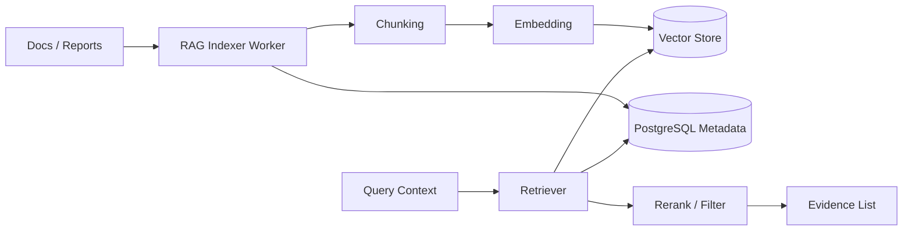

# RAG Retrieval and Evidence Explanation Design v2 (English)

## 1. Document Info
- Version: v2.0
- Status: Engineering Architecture Upgrade Design
- Last Updated: 2026-06-22
- Baseline Document: [README.en.md](README.en.md)

## 2. v2 Upgrade Goals
v2 upgrades RAG from a conceptual retrieval pipeline into an evidence service that can store documents, build indexes, update incrementally, and deploy.

Core upgrades:
1. Store document metadata, chunks, and indexing state in PostgreSQL.
2. Store embeddings in pgvector or an independent vector database.
3. Run document indexing asynchronously in workers to avoid blocking the API.
4. Include retrieval results and evidence citations in the final answer and audit flow.
5. Both Docker and Kubernetes environments can initialize sample documents and run indexing.

## 3. v2 RAG Architecture

## 4. Data Model
1. `documents`: source, title, type, publish time, business tags, and permission tags.
2. `doc_chunks`: chunk text, position, summary, token count, and document_id.
3. `doc_embeddings`: chunk_id, embedding vector, embedding_model, and version.
4. `index_jobs`: indexing task status, error, duration, and processed count.
5. `evidence_events`: trace_id, chunk_id, relevance, and whether the evidence entered the final answer.

## 5. Retrieval Strategy
1. First filter candidate documents by time window, business tags, and permission tags.
2. Then run vector recall and keyword recall.
3. After reranking, keep a small number of high-quality evidence items.
4. Final answers must cite evidence ids and cannot provide only free-form causal text.
5. Empty recall returns "not enough evidence found" instead of fabricating explanations.

## 6. Docker and Kubernetes
1. Mount sample docs in the local environment and index them manually or automatically after startup.
2. Run the RAG indexer as a worker that can scale independently.
3. Inject embedding model configuration through Secret/ConfigMap.
4. Process large documents through asynchronous jobs, with status queryable through the API.
5. Use pgvector locally, and switch to Qdrant, Milvus, or a managed vector service in production if needed.

## 7. v2 Acceptance Criteria
1. Sample documents can be chunked, embedded, and retrieved.
2. The RAG Agent outputs an evidence list, and the frontend can display source and snippet.
3. Documents with mismatched permission tags do not enter retrieval results.
4. Indexing task status is traceable and failures can be retried.
