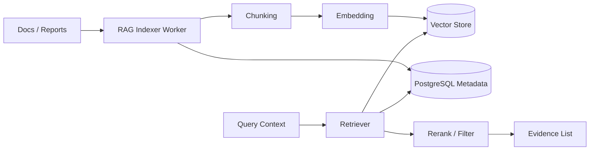

# RAG 检索与证据解释设计 v2（中文）

## 1. 文档信息
- 版本：v2.0
- 状态：工程化架构升级设计
- 最后更新：2026-06-22
- 基线文档：[README.zh-CN.md](README.zh-CN.md)

## 2. v2 升级目标
v2 将 RAG 从概念检索链路升级为可入库、可索引、可增量更新、可部署的证据服务。

核心升级：
1. 文档元数据、chunk 和索引状态存储在 PostgreSQL。
2. embedding 存储使用 pgvector 或独立向量库。
3. 文档索引由 worker 异步执行，避免阻塞 API。
4. 检索结果和证据引用进入最终回答和审计链路。
5. Docker 和 K8s 环境都可初始化样例文档并执行索引。

## 3. v2 RAG 架构

## 4. 数据模型
1. `documents`：来源、标题、类型、发布时间、业务标签、权限标签。
2. `doc_chunks`：chunk 文本、位置、摘要、token 数、document_id。
3. `doc_embeddings`：chunk_id、embedding vector、embedding_model、版本。
4. `index_jobs`：索引任务状态、错误、耗时、处理数量。
5. `evidence_events`：trace_id、chunk_id、相关性、是否进入最终回答。

## 5. 检索策略
1. 先根据时间窗口、业务标签、权限标签过滤候选文档。
2. 再执行向量召回和关键词召回。
3. rerank 后保留少量高质量证据。
4. 最终回答必须引用 evidence id，不能只写自由文本原因。
5. 空召回时返回“未找到足够证据”，不编造解释。

## 6. Docker 与 K8s
1. 本地环境挂载 sample docs，启动后可手动或自动索引。
2. RAG indexer 作为 worker 运行，可独立扩缩容。
3. embedding 模型配置通过 Secret/ConfigMap 注入。
4. 大文档处理使用异步 job，状态可通过 API 查询。
5. 向量库可在本地用 pgvector，生产可切换 Qdrant、Milvus 或托管向量服务。

## 7. v2 验收标准
1. 样例文档可被切片、embedding 并检索。
2. RAG Agent 输出 evidence list，前端能展示来源和片段。
3. 权限标签不匹配的文档不会进入召回结果。
4. 索引任务状态可追踪，失败可重试。
