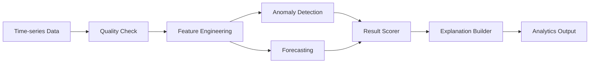
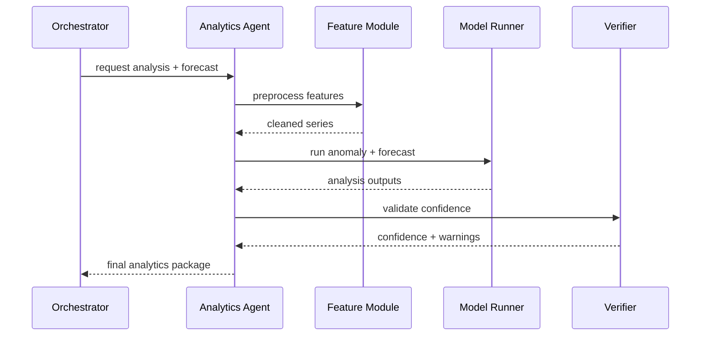

# Analytics and Forecasting Design (English)

## 1. Document Info
- Version: v1.0
- Status: Detailed Design
- Owner: Data Science Team / Analytics Engine Team
- Last Updated: 2026-06-16

## 2. Design Goals
1. Build explainable anomaly-detection and forecasting capabilities for enterprise KPI monitoring.
2. Integrate with semantic layer, SQL query pipeline, visualization, and verifier for a full analytics loop.
3. Ensure outputs are traceable, evaluable, and uncertainty-aware.

## 3. Scope
In Scope:
1. Time-series preprocessing and quality checks.
2. Anomaly detection (Bollinger, rolling z-score, SPC rules).
3. Forecasting (ARIMA, Prophet) with confidence intervals.
4. Analysis narrative generation and risk warnings.

Out of Scope:
1. Advanced causal inference frameworks.
2. Full MLOps training platform automation.

## 4. Core Requirements
Functional requirements:
1. Detect anomalies over recent N days.
2. Forecast future N days with upper/lower bounds.
3. Summarize trend, seasonality, and volatility.
4. Return visualization-friendly structured outputs.

Non-functional requirements:
1. Analytics stage latency P95 <= 6s after query data is ready.
2. Graceful fallback to statistical rules when model fitting fails.
3. Reproducible outputs for identical inputs.

## 5. Analytics Engine Architecture

## 6. Anomaly Detection Strategy
Methods:
1. Bollinger Bands based on rolling mean and standard deviation.
2. Rolling z-score for local deviation spikes.
3. SPC rules for run patterns and control-limit violations.

Decision outputs:
1. anomaly_points[]
2. anomaly_score (0-1)
3. anomaly_level (low/medium/high)

Fallback policy:
1. For sparse data, return threshold-based anomaly hints only.

## 7. Forecasting Strategy
Methods:
1. ARIMA for stationary or differenced series.
2. Prophet for trend/seasonality-heavy series.

Model-selection rules:
1. Daily series with < 90 points -> prefer Prophet.
2. Stable differenced series -> prefer ARIMA.
3. On fit failure -> fallback to moving-average extrapolation.

Output fields:
1. forecast_series
2. lower_bound
3. upper_bound
4. model_used
5. model_quality_score

## 8. Processing Sequence

## 9. Input and Output Contracts
Input:
1. metric_id
2. time_series[]
3. forecast_horizon
4. granularity
5. trace_id

Output:
1. anomaly_result
2. forecast_result
3. seasonality_summary
4. confidence
5. warnings
6. trace_id

## 10. Explanation Rules
1. Start with facts: what changed.
2. Then model interpretation: anomaly/trend assessment.
3. End with uncertainty: confidence interval and risk notes.

Template examples:
1. "In the last 30 days, metric X shows 4 high-confidence anomaly points."
2. "The next 14-day median trend is upward, but interval width is high; validate with business events."

## 11. Security and Governance
1. Analytics module does not query sensitive row-level fields directly.
2. Outputs must not expose personally identifiable details.
3. All model executions must log trace_id and model version.

## 12. Observability and Evaluation
Key metrics:
1. analytics_latency_p95
2. model_failure_rate
3. anomaly_precision_proxy
4. forecast_mape
5. forecast_coverage_rate

Alerts:
1. sustained model_failure_rate above threshold.
2. sudden forecast_mape spikes.
3. abnormal input-missing-rate increase.

## 13. Testing and Acceptance
Unit tests:
1. feature-engineering utilities.
2. anomaly-rule logic.
3. confidence-band generation.

Integration tests:
1. query -> analytics -> visualization full path.
2. small-sample fallback path.
3. model-failure fallback path.

Acceptance criteria:
1. anomaly detection aligns with predefined benchmark scenarios.
2. forecast outputs include complete intervals and model metadata.
3. generated narratives follow fact-judgment-uncertainty structure.

## 14. Risks and Open Questions
Risks:
1. missing data and outliers can destabilize models.
2. sudden business shocks can invalidate historical patterns.
3. over-reliance on a single model can cause bias.

Open questions:
1. final default model-priority policy for v1.
2. whether to include holiday feature configuration.
3. whether to launch a model-drift monitoring dashboard.

## 15. Milestones
1. M1 (Week 1): anomaly and forecasting baseline modules.
2. M2 (Week 2): explanation generator and visualization integration.
3. M3 (Week 3): evaluation, threshold tuning, and release prep.
