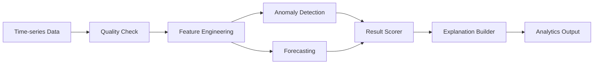
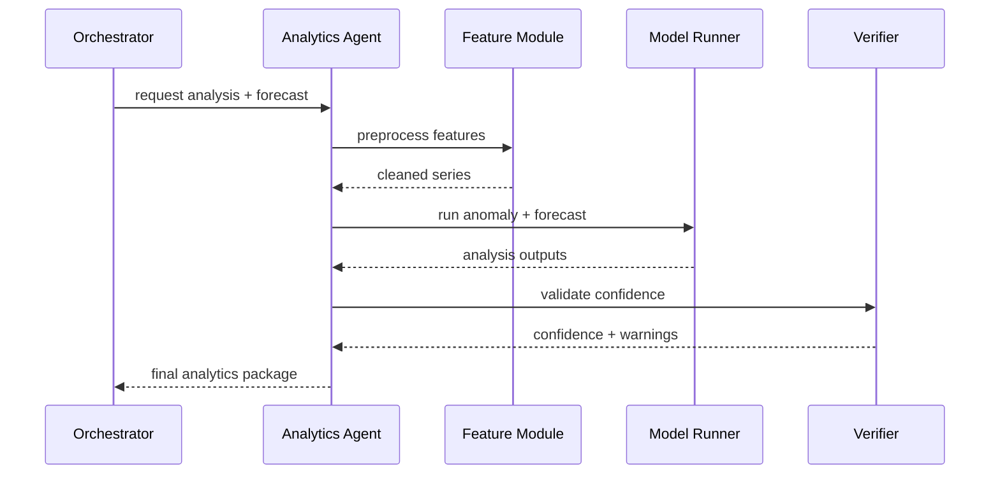

# 分析与预测设计（中文）

## 1. 文档信息
- 版本：v1.0
- 状态：详细设计
- 负责人：数据科学组 / 分析引擎组
- 最后更新：2026-06-16

## 2. 设计目标
1. 构建可解释的异常检测与预测能力，支持企业 KPI 预警和趋势判断。
2. 与语义层、SQL 查询、可视化、Verifier 协同形成完整分析闭环。
3. 保证分析结果可追溯、可评估，并明确不确定性边界。

## 3. 作用范围
In Scope：
1. 时序特征预处理与数据质量检查。
2. 异常检测（Bollinger、rolling z-score、SPC）。
3. 趋势预测（ARIMA、Prophet）与置信区间。
4. 分析解释文本生成与风险提示。

Out of Scope：
1. 复杂因果推断模型。
2. 自动化模型训练平台（MLOps 全流程）。

## 4. 核心需求
功能需求：
1. 支持最近 N 天异常检测。
2. 支持未来 N 天预测并输出上下置信区间。
3. 支持季节性、趋势、波动性摘要。
4. 输出可视化友好的结构化数据。

非功能需求：
1. 分析任务 P95 <= 6s（在查询结果可用后）。
2. 模型失败可降级为统计规则分析。
3. 同一输入重复执行结果稳定可复现。

## 5. 分析引擎架构图

## 6. 异常检测策略
方法：
1. Bollinger Bands：基于移动均值与标准差区间。
2. Rolling z-score：识别短期偏离。
3. SPC 规则：连续上升、连续下降、超控制线等规则。

判定输出：
1. anomaly_points[]：异常时间点。
2. anomaly_score：0-1 评分。
3. anomaly_level：low/medium/high。

降级策略：
1. 数据量过少时，仅输出阈值型检测结果。

## 7. 预测策略
方法：
1. ARIMA：适合平稳或可差分序列。
2. Prophet：适合存在节假日/季节性模式。

模型选择规则：
1. 日序列且点数 < 90 时优先 Prophet。
2. 序列稳定且可差分时优先 ARIMA。
3. 模型拟合失败则回退到移动平均趋势外推。

输出字段：
1. forecast_series
2. lower_bound
3. upper_bound
4. model_used
5. model_quality_score

## 8. 处理时序图

## 9. 输入输出契约
输入：
1. metric_id
2. time_series[]
3. forecast_horizon
4. granularity
5. trace_id

输出：
1. anomaly_result
2. forecast_result
3. seasonality_summary
4. confidence
5. warnings
6. trace_id

## 10. 解释生成规范
1. 先描述事实：发生了什么。
2. 再描述模型判断：是否异常、趋势方向。
3. 最后描述不确定性：预测区间与风险提示。

文本模板示例：
1. “在过去 30 天中，X 指标在 4 个时间点出现高置信异常。”
2. “未来 14 天预测中位趋势为上升，但波动区间较宽，建议结合业务事件判断。”

## 11. 安全与治理
1. 分析模块不直接访问敏感明细字段。
2. 输出不包含个人级别可识别信息。
3. 所有模型调用记录 trace_id 与版本号。

## 12. 可观测性与评估
关键指标：
1. analytics_latency_p95
2. model_failure_rate
3. anomaly_precision_proxy
4. forecast_mape
5. forecast_coverage_rate

告警：
1. model_failure_rate 持续高于阈值。
2. forecast_mape 突增。
3. 输入数据缺失率异常。

## 13. 测试与验收
单元测试：
1. 特征工程函数。
2. 异常规则判定。
3. 预测区间生成。

集成测试：
1. 查询 -> 分析 -> 可视化全链路。
2. 小样本降级链路。
3. 模型失败回退链路。

验收标准：
1. 预设场景下异常检出符合预期。
2. 预测结果含完整区间与模型信息。
3. 结果文本符合“事实-判断-不确定性”结构。

## 14. 风险与待决事项
风险：
1. 时序缺失与异常值会影响模型稳定性。
2. 业务突发事件会使历史规律失效。
3. 过度依赖单模型可能导致偏差。

待决事项：
1. 首版默认模型优先级最终策略。
2. 是否引入节假日特征配置。
3. 是否上线模型漂移监控面板。

## 15. 里程碑
1. M1（第 1 周）：完成异常检测与预测基础模块。
2. M2（第 2 周）：完成解释生成与可视化联调。
3. M3（第 3 周）：完成评估、阈值调优和上线准备。
