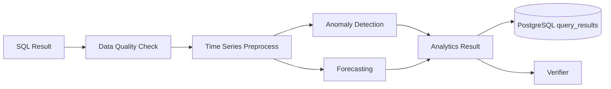

# Analytics and Forecasting Design v2 (English)

## 1. Document Info
- Version: v2.0
- Status: Engineering Architecture Upgrade Design
- Last Updated: 2026-06-22
- Baseline Document: [README.en.md](README.en.md)

## 2. v2 Upgrade Goals
v2 upgrades analytics and forecasting from algorithm modules into an analytics service that can run asynchronously, cache results, audit decisions, and render in the frontend.

Core upgrades:
1. Analytics inputs come from controlled SQL query results and semantic-layer metric definitions.
2. Long-running forecasting tasks can move to workers without blocking the API.
3. Results are written to PostgreSQL and can be replayed by the frontend through trace id.
4. Statistical rules, model versions, parameters, and anomaly points are written to audit records.
5. Docker and Kubernetes environments both support reproducible analytics runs.

## 3. v2 Analytics Flow

## 4. Data Contract
Input:
1. `metric_id`
2. `semantic_version_id`
3. `time_column`
4. `value_column`
5. `grain`
6. `rows`
7. `analysis_options`

Output:
1. `anomaly_points`
2. `forecast_points`
3. `confidence_interval`
4. `quality_warnings`
5. `method`
6. `model_version`
7. `explanation`

## 5. Runtime Strategy
1. Run small datasets synchronously and complex forecasting asynchronously.
2. When data quality is insufficient, degrade to a trend summary and avoid strong forecasts.
3. Forecast results must include confidence intervals and business risk warnings.
4. Store analytics parameters and results for the same trace in the database to support replay.
5. Use Redis for short-lived cache of common time windows and metrics.

## 6. Kubernetes Deployment
1. Deploy analytics workers independently and scale them by CPU usage or queue length.
2. Define resource limits clearly so forecasting tasks do not starve API services.
3. Pin model dependency versions and lock dependencies during image build.
4. When large tasks time out, write failure state and let the frontend show degraded results.

## 7. v2 Acceptance Criteria
1. SQL query results can trigger anomaly detection and return visualization-ready structures.
2. Forecasting tasks can run synchronously or asynchronously and write history.
3. Insufficient data quality returns explicit warnings.
4. The frontend can render anomaly points, forecast intervals, and method descriptions.
