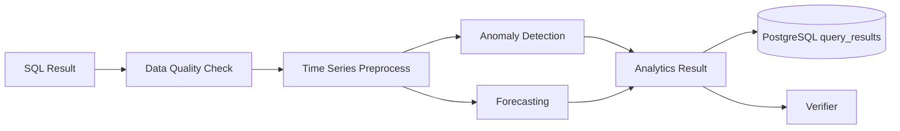

# 分析与预测设计 v2（中文）

## 1. 文档信息
- 版本：v2.0
- 状态：工程化架构升级设计
- 最后更新：2026-06-22
- 基线文档：[README.zh-CN.md](README.zh-CN.md)

## 2. v2 升级目标
v2 将分析与预测从算法模块升级为可异步运行、可缓存、可审计、可前端展示的分析服务。

核心升级：
1. 分析输入来自受控 SQL 查询结果和语义层指标定义。
2. 长耗时预测任务可进入 worker，不阻塞 API。
3. 结果写入 PostgreSQL，前端可通过 trace id 回放。
4. 统计规则、模型版本、参数和异常点进入审计记录。
5. Docker 和 K8s 环境都支持可复现的分析运行。

## 3. v2 分析链路

## 4. 数据契约
输入：
1. `metric_id`
2. `semantic_version_id`
3. `time_column`
4. `value_column`
5. `grain`
6. `rows`
7. `analysis_options`

输出：
1. `anomaly_points`
2. `forecast_points`
3. `confidence_interval`
4. `quality_warnings`
5. `method`
6. `model_version`
7. `explanation`

## 5. 运行策略
1. 小数据量同步运行，复杂预测异步运行。
2. 数据质量不足时降级为趋势摘要，不给出强预测。
3. 预测结果必须带置信区间和业务风险提示。
4. 同一 trace 的分析参数和结果写入数据库，支持回放。
5. 对常见时间窗口和指标可用 Redis 缓存短期结果。

## 6. Kubernetes 部署
1. analytics worker 独立部署，按 CPU 使用率或队列长度扩缩容。
2. 资源限制必须明确，防止预测任务挤占 API 服务。
3. 模型依赖固定版本，镜像构建时锁定依赖。
4. 大任务超时后写入失败状态，前端显示降级结果。

## 7. v2 验收标准
1. SQL 查询结果可触发异常检测并返回可视化结构。
2. 预测任务可同步或异步执行并写入历史。
3. 数据质量不足时返回明确 warning。
4. 前端可渲染异常点、预测区间和方法说明。
