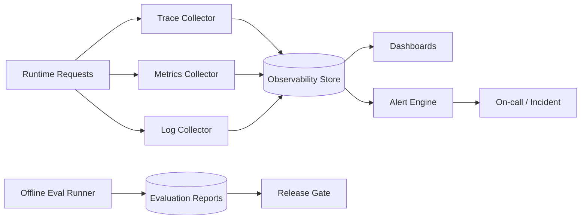
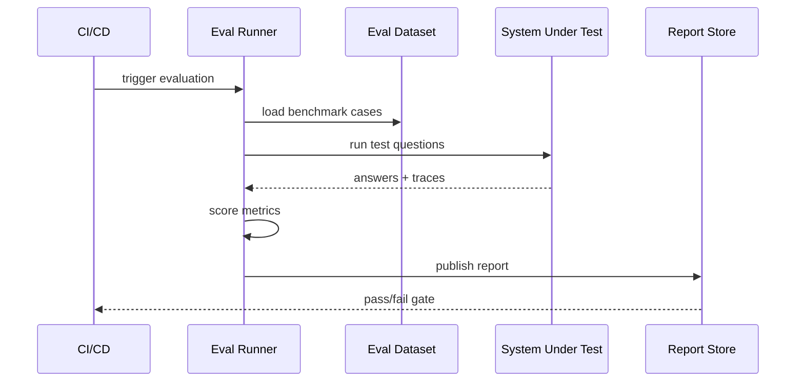

# Evaluation and Observability Design (English)

## 1. Document Info
- Version: v1.0
- Status: Detailed Design
- Owner: Quality Engineering Team / Observability Platform Team
- Last Updated: 2026-06-16

## 2. Design Goals
1. Build a unified quality system from offline evaluation to online monitoring.
2. Make outputs measurable, alertable, replayable, and continuously improvable.
3. Evaluate SQL accuracy/safety, routing quality, and RAG faithfulness in one framework.

## 3. Scope
In Scope:
1. Offline benchmark suites and scoring metrics.
2. Online SLI/SLO and alerting.
3. Traces, logs, metrics, and replay tooling.
4. Evaluation reports and release gate policies.

Out of Scope:
1. Customized enterprise APM platform development.
2. Multi-cloud unified observability governance.

## 4. Evaluation and Observability Architecture

## 5. Evaluation Dimensions and Metrics
Offline dimensions:
1. SQL Accuracy: table, fields, filters, aggregation, time clauses.
2. SQL Safety: dangerous-query interception and false-positive rate.
3. Agent Routing: correct agent-combination selection rate.
4. RAG Faithfulness: citation coverage and unsupported-claim rate.
5. Analytics Quality: anomaly validity and forecasting error.

Online dimensions:
1. E2E success rate.
2. E2E latency quantiles.
3. degraded response ratio.
4. low-confidence response ratio.

## 6. Key SLOs
1. SLO-Availability: monthly success rate >= 99.0%.
2. SLO-Latency: /chat/query P95 <= 8s.
3. SLO-Safety: high-risk SQL miss-interception rate = 0.
4. SLO-Faithfulness: unsupported_claim_rate <= 2%.

Error-budget policy:
1. Freeze feature rollout when budget is exhausted.
2. Trigger focused reliability remediation windows.

## 7. Evaluation Execution Flow

## 8. Trace and Log Model
Trace span standards:
1. request_received
2. orchestration_planned
3. sql_generated
4. sql_guardrail_checked
5. rag_retrieved
6. analytics_done
7. verifier_done
8. response_sent

Key log fields:
1. trace_id
2. session_id
3. user_role
4. agent_name
5. duration_ms
6. status
7. error_code

## 9. Alerting and Incident Response
Alert rules:
1. E2E error_rate > 2% for 10 minutes.
2. abnormal SQL guardrail deny-rate spike.
3. RAG unsupported_claim_rate over threshold.
4. /chat/query P95 above SLO for 15 minutes.

Severity levels:
1. P1: core functionality unavailable.
2. P2: major performance degradation.
3. P3: partial feature impact.

## 10. Replay and Root-Cause Analysis
Replay capabilities:
1. full path replay by trace_id.
2. reconstruct input, SQL, evidence, and model outputs.
3. compare old/new versions for regression diagnosis.

RCA template:
1. What happened.
2. Impact scope.
3. Direct cause.
4. Systemic cause.
5. Fix and prevention.

## 11. Data and Interface Contracts
Evaluation run input:
1. eval_suite_id
2. target_env
3. model_version
4. semantic_version
5. trace_sampling_rate

Evaluation report output:
1. overall_score
2. metric_breakdown
3. failed_cases
4. regression_flags
5. release_recommendation

## 12. Security and Governance
1. Collect observability data with least-necessary principle.
2. Mask sensitive fields in logs.
3. Permission-isolate sensitive benchmark samples.
4. Audit-approve release-gate policy changes.

## 13. Dashboard Design
Core dashboards:
1. quality overview dashboard.
2. latency/performance dashboard.
3. safety interception dashboard.
4. RAG faithfulness dashboard.
5. agent routing stability dashboard.

## 14. Testing and Acceptance
Tests:
1. metric computation correctness tests.
2. alert trigger/recovery tests.
3. replay chain completeness tests.

Acceptance criteria:
1. key SLOs are observable in real time.
2. alert false-positive rate is controlled.
3. release gate blocks regression builds correctly.

## 15. Risks and Open Questions
Risks:
1. inconsistent metric definitions can skew evaluation.
2. high monitoring noise can cause alert fatigue.
3. sample-distribution bias can reduce offline representativeness.

Open questions:
1. benchmark suite refresh cadence.
2. default trace sampling rate.
3. whether to add automated RCA clustering.

## 16. Milestones
1. M1 (Week 1): evaluation metrics and benchmark suite definition.
2. M2 (Week 2): online observability and alert integration.
3. M3 (Week 3): release gate, replay tooling, and ops process.
