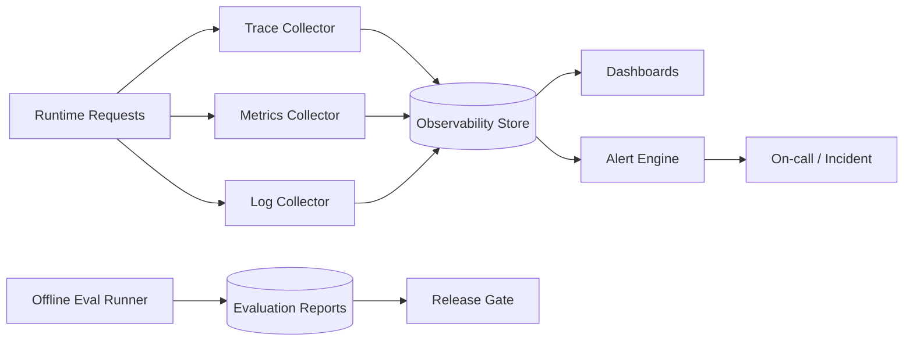
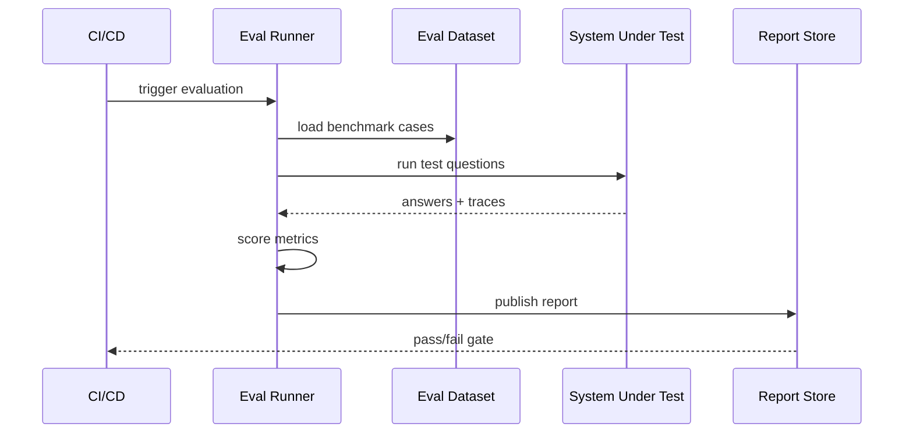

# 评估与可观测性设计（中文）

## 1. 文档信息
- 版本：v1.0
- 状态：详细设计
- 负责人：质量工程组 / 可观测性平台组
- 最后更新：2026-06-16

## 2. 设计目标
1. 建立从离线评估到在线监控的统一质量体系。
2. 让系统输出可度量、可告警、可回放、可持续优化。
3. 将 SQL 准确性、安全性、路由正确性、RAG 忠实度纳入同一评估框架。

## 3. 作用范围
In Scope：
1. 离线评估集与评估指标设计。
2. 在线 SLI/SLO 与告警机制。
3. Trace、日志、指标、回放平台。
4. 评估报告与发布准入标准。

Out of Scope：
1. 企业级 APM 平台二次开发。
2. 多云统一观测治理平台。

## 4. 评估与观测架构图

## 5. 评估维度与指标
离线评估维度：
1. SQL Accuracy：表、字段、过滤、聚合、时间条件是否正确。
2. SQL Safety：危险语句拦截率与误拦截率。
3. Agent Routing：路由到正确 Agent 组合的准确率。
4. RAG Faithfulness：引用覆盖率与无依据陈述率。
5. Analytics Quality：异常检出合理性与预测误差。

在线质量维度：
1. E2E 成功率。
2. E2E 延迟分位数。
3. 降级率。
4. 低置信输出比例。

## 6. 关键 SLO 设计
1. SLO-Availability：月度成功率 >= 99.0%。
2. SLO-Latency：/chat/query P95 <= 8s。
3. SLO-Safety：高危 SQL 漏拦截率 = 0。
4. SLO-Faithfulness：unsupported_claim_rate <= 2%。

误差预算策略：
1. 超预算时冻结新功能发布。
2. 启动专项稳定性修复窗口。

## 7. 评估执行流程

## 8. Trace与日志模型
trace span 规范：
1. request_received
2. orchestration_planned
3. sql_generated
4. sql_guardrail_checked
5. rag_retrieved
6. analytics_done
7. verifier_done
8. response_sent

日志关键字段：
1. trace_id
2. session_id
3. user_role
4. agent_name
5. duration_ms
6. status
7. error_code

## 9. 告警与事件响应
告警规则：
1. E2E error_rate > 2% 持续 10 分钟。
2. SQL guardrail deny_rate 异常突增。
3. RAG unsupported_claim_rate 超阈值。
4. /chat/query P95 超过 SLO 持续 15 分钟。

响应分级：
1. P1：核心功能不可用。
2. P2：性能明显退化。
3. P3：局部功能异常。

## 10. 回放与根因分析
回放能力：
1. 按 trace_id 回放完整链路。
2. 重建当时输入、SQL、证据、模型输出。
3. 对比新旧版本结果差异。

根因分析模板：
1. 发生了什么。
2. 影响范围。
3. 直接根因。
4. 系统性根因。
5. 修复与预防措施。

## 11. 数据与接口契约
评估任务输入：
1. eval_suite_id
2. target_env
3. model_version
4. semantic_version
5. trace_sampling_rate

评估报告输出：
1. overall_score
2. metric_breakdown
3. failed_cases
4. regression_flags
5. release_recommendation

## 12. 安全与治理
1. 观测数据按最小必要原则采集。
2. 日志中敏感字段脱敏存储。
3. 评估集含敏感样本需权限隔离。
4. 发布门禁变更需审计审批。

## 13. 仪表板设计
核心看板：
1. 质量总览看板。
2. 性能延迟看板。
3. 安全拦截看板。
4. RAG 证据忠实度看板。
5. Agent 路由稳定性看板。

## 14. 测试与验收
测试：
1. 指标计算正确性测试。
2. 告警触发与恢复测试。
3. 回放链路完整性测试。

验收标准：
1. 关键 SLO 可实时观测。
2. 告警误报率可控。
3. 发布门禁可正确阻断回归版本。

## 15. 风险与待决事项
风险：
1. 指标口径不统一导致评估失真。
2. 监控噪声过大导致告警疲劳。
3. 样本分布偏差影响离线评估代表性。

待决事项：
1. 评估集更新周期。
2. trace 采样率默认值。
3. 是否引入自动根因聚类。

## 16. 里程碑
1. M1（第 1 周）：完成评估指标与数据集定义。
2. M2（第 2 周）：完成在线观测与告警接入。
3. M3（第 3 周）：完成发布门禁、回放与运营流程。
