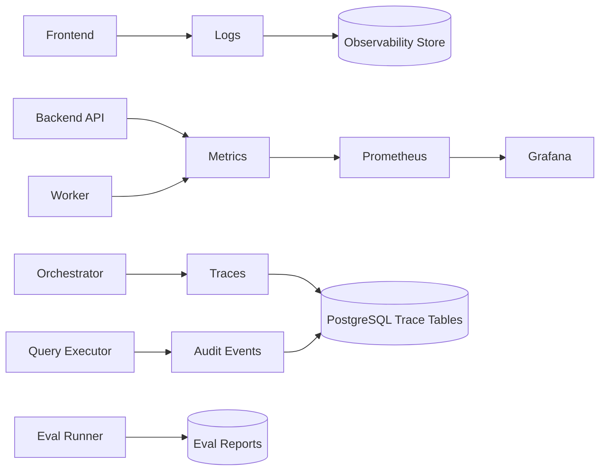

# Evaluation and Observability Design v2 (English)

## 1. Document Info
- Version: v2.0
- Status: Engineering Architecture Upgrade Design
- Last Updated: 2026-06-22
- Baseline Document: [README.en.md](README.en.md)

## 2. v2 Upgrade Goals
v2 upgrades evaluation and observability from a metric checklist into an engineering system that spans Docker, local integration, Kubernetes, and release gates.

Core upgrades:
1. Every service exposes health, readiness, and metrics endpoints.
2. Every ChatBI request generates a unified trace id across frontend, backend, Agents, SQL, and RAG.
3. Runtime logs, metrics, audit records, and evaluation results enter queryable storage.
4. Docker Compose provides basic local observability, and Kubernetes integrates Prometheus/Grafana.
5. Offline evaluation runs before release and acts as a release gate.

## 3. v2 Observability Architecture

## 4. Metrics System
Service metrics:
1. Request volume, error rate, and P50/P95/P99 latency.
2. Pod restarts, CPU, memory, and connection pool usage.
3. Redis hit rate and number of slow database queries.

Agent metrics:
1. Routing accuracy.
2. SQL Guardrail denial rate.
3. RAG hit rate and evidence citation rate.
4. Verifier low-confidence rate.
5. Partial failure rate and degradation rate.

Business quality metrics:
1. SQL execution success rate.
2. Metric definition match rate.
3. Answer verifiability rate.
4. User retry rate.

## 5. Evaluation Data Model
1. `eval_cases`: question, expected metric, expected SQL fragments, and permission context.
2. `eval_runs`: version, environment, commit hash, start time, and end time.
3. `eval_scores`: SQL correctness, safety, RAG faithfulness, and final answer quality.
4. `eval_failures`: failure reason, trace id, and reproduction input.

## 6. Docker and Kubernetes
1. Local Compose can start API, database, and Redis while preserving metrics endpoints.
2. Kubernetes collects Prometheus metrics through ServiceMonitor or equivalent configuration.
3. Logs are JSON formatted and include `trace_id`, `service`, `level`, and `event`.
4. Alert rules are included in deployment configuration, such as error rate, latency, and database connection exhaustion.
5. The release pipeline runs unit tests, integration tests, and the eval runner before deployment.

## 7. v2 Acceptance Criteria
1. A single end-to-end query can be inspected by trace id across frontend, backend, Agent, and SQL records.
2. `/metrics` output can be collected by Prometheus.
3. The eval runner can generate archivable reports.
4. Release gates can block versions with clear regressions in SQL safety or core accuracy.
