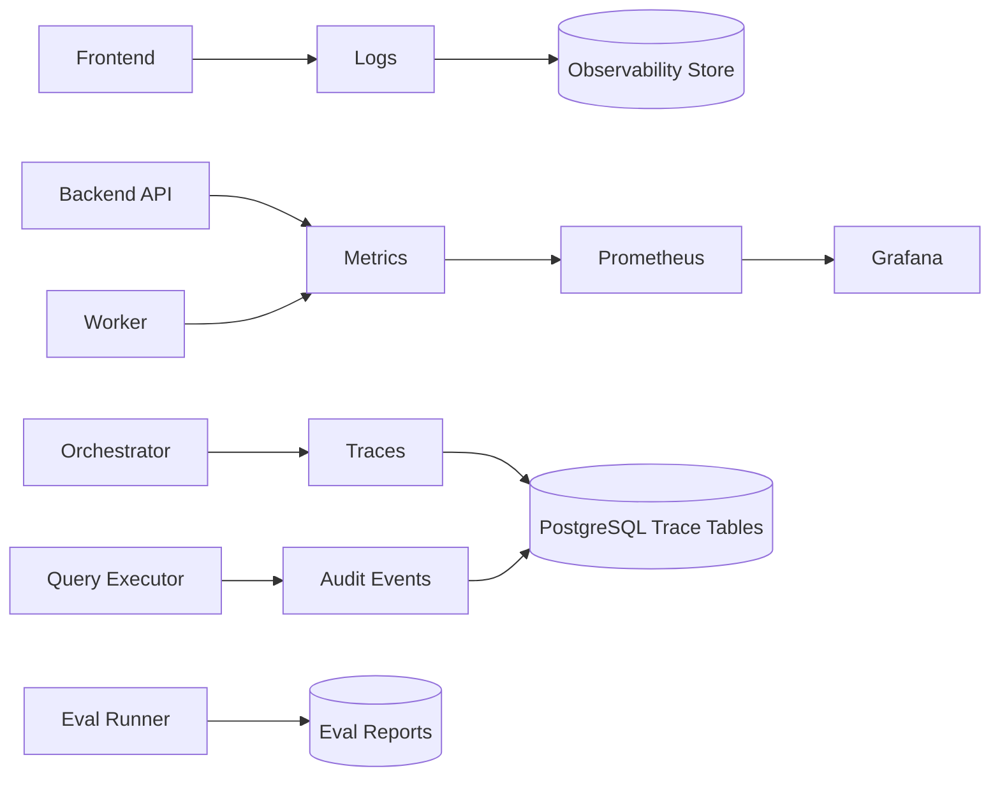

# 评估与可观测性设计 v2（中文）

## 1. 文档信息
- 版本：v2.0
- 状态：工程化架构升级设计
- 最后更新：2026-06-22
- 基线文档：[README.zh-CN.md](README.zh-CN.md)

## 2. v2 升级目标
v2 将评估与观测从指标清单升级为贯穿 Docker、本地联调、Kubernetes 和发布门禁的工程体系。

核心升级：
1. 每个服务暴露 health、readiness 和 metrics。
2. 每次 ChatBI 请求生成统一 trace id，贯穿前端、后端、Agent、SQL、RAG。
3. 运行日志、指标、审计和评估结果进入可查询存储。
4. Docker Compose 提供本地观测基础能力，K8s 接入 Prometheus/Grafana。
5. 发布前运行离线 eval，并将结果作为 release gate。

## 3. v2 观测架构

## 4. 指标体系
服务指标：
1. 请求量、错误率、P50/P95/P99 延迟。
2. Pod 重启次数、CPU、内存、连接池使用率。
3. Redis 命中率、数据库慢查询数量。

Agent 指标：
1. 路由准确率。
2. SQL Guardrail 拦截率。
3. RAG 命中率和证据引用率。
4. Verifier 低置信率。
5. 部分失败率和降级率。

业务质量指标：
1. SQL 执行成功率。
2. 指标口径匹配率。
3. 回答可验证率。
4. 用户重试率。

## 5. 评估数据模型
1. `eval_cases`：问题、期望指标、期望 SQL 片段、权限上下文。
2. `eval_runs`：版本、环境、提交号、开始结束时间。
3. `eval_scores`：SQL 正确性、安全性、RAG 忠实度、最终回答质量。
4. `eval_failures`：失败原因、trace id、复现输入。

## 6. Docker 与 K8s
1. 本地 Compose 可启动 API、数据库、Redis，并保留 metrics endpoint。
2. K8s 通过 ServiceMonitor 或等价配置采集 Prometheus 指标。
3. 日志输出 JSON 格式，包含 `trace_id`、`service`、`level`、`event`。
4. 告警规则纳入部署配置，例如错误率、延迟、数据库连接耗尽。
5. release pipeline 在部署前执行单元测试、集成测试和 eval runner。

## 7. v2 验收标准
1. 一次端到端查询可通过 trace id 查到前端、后端、Agent、SQL 记录。
2. `/metrics` 输出可被 Prometheus 采集。
3. eval runner 可生成可归档报告。
4. 发布门禁能阻止 SQL 安全或核心准确率明显下降的版本。
