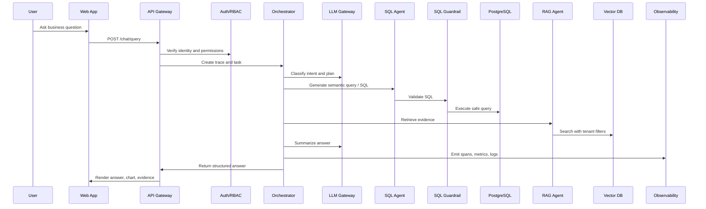

# 01 Production Architecture

## 1. Architecture Goals

The production architecture must ensure:

1. Users can safely use the system.
2. Backend services can orchestrate agents, access data, and call models reliably.
3. Admins can observe, audit, evaluate, and release the system.

The final platform should be more than a single FastAPI service. It should have clear runtime layers.

## 2. Runtime Layers

### User Entry Layer

Includes:

1. ChatBI Web App for business users.
2. Admin Console for administrators.
3. API Gateway as the unified backend entry point.

This layer handles authentication, authorization, request limits, trace IDs, and consistent error responses.

### Application Service Layer

Includes:

1. Auth Service.
2. Chat API.
3. Orchestrator Service.
4. Observability API.
5. Admin API.

This layer owns business workflow and permission boundaries.

### Intelligence Layer

Includes:

1. LLM Provider Gateway.
2. SQL Agent.
3. RAG Agent.
4. Analytics Agent.
5. Verifier Agent.

This layer provides intelligence, but it must not bypass governance.

### Data and Infrastructure Layer

Includes:

1. PostgreSQL for application data, business data, and audit data.
2. pgvector or another vector database for retrieval.
3. Redis for caching, rate limits, and short-lived state.
4. Queue infrastructure for async work.
5. Object storage for documents and reports.
6. Kubernetes for deployment and scaling.

## 3. Main Query Flow

## 4. Key Design Decisions

The API Gateway is the front door. It verifies tokens, resolves user and organization context, creates request IDs, applies rate limits, and routes internal calls.

The Orchestrator coordinates workflows but should not directly bypass guardrails or tenant filters.

The LLM Gateway isolates model providers so the rest of the system does not depend on a specific vendor SDK.

Observability is cross-cutting. APIs, agents, SQL checks, RAG retrieval, and LLM calls should all emit structured logs, metrics, and traces.

## 5. Service Boundary Recommendation

Start modular inside one backend application, then split services only when needed:

1. `api-service`
2. `worker-service`
3. `llm-gateway`
4. `rag-indexer`
5. `admin-service`

Modular first, microservices later.
