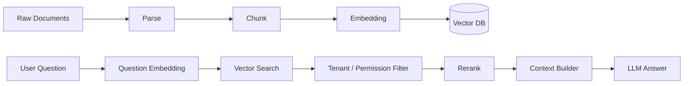

# 04 Embedding, Vector Database, and RAG

## 1. Problem Solved

ChatBI should not rely only on structured database queries. Business answers often live in documents such as metric definitions, finance policies, sales notes, product updates, and operating reviews.

RAG turns those documents into retrievable evidence.

## 2. Final RAG Flow

## 3. Document Ingestion

Document metadata should include:

1. `document_id`
2. `org_id`
3. `source_type`
4. `title`
5. `owner`
6. `created_at`
7. `version`
8. `access_policy`

Chunk metadata should include:

1. `chunk_id`
2. `document_id`
3. `org_id`
4. `text`
5. `embedding`
6. `page`
7. `section`
8. `token_count`

## 4. Vector Store Choice

Start with `pgvector` because it integrates well with PostgreSQL and is practical for an industrial MVP.

Later, the platform can support Pinecone, Weaviate, Milvus, or Qdrant behind a `VectorStore` abstraction.

## 5. Embedding Service

The embedding service should:

1. Call embedding providers.
2. Embed document chunks.
3. Embed user questions.
4. Track token and cost usage.
5. Avoid duplicate embeddings.
6. Support batch jobs.

## 6. Permission Filtering

Vector search must include:

1. Tenant filter.
2. User document permission filter.
3. Document status filter.
4. Chunk visibility filter.

Similarity alone is not enough. Relevant evidence must also be allowed evidence.

## 7. Token-Saving Strategy

RAG saves tokens by:

1. Sending only top-k chunks to the model.
2. Keeping chunks reasonably sized.
3. Using metadata filters.
4. Building summary indexes for long documents.
5. Caching common retrieval results.
6. Compressing multi-turn context.

## 8. Output Shape

RAG answers should include:

1. `answer`
2. `citations`
3. `evidence_chunks`
4. `confidence`
5. `missing_evidence_warning`

If no evidence is found, the system should say so instead of inventing an answer.

## 9. Implementation Order

1. Define `EmbeddingClient` and `VectorStore`.
2. Add pgvector tables.
3. Implement document chunk ingestion.
4. Implement query embedding and vector search.
5. Add tenant filtering to RAG.
6. Add citations to answers.
7. Test that tenant A cannot retrieve tenant B documents.
