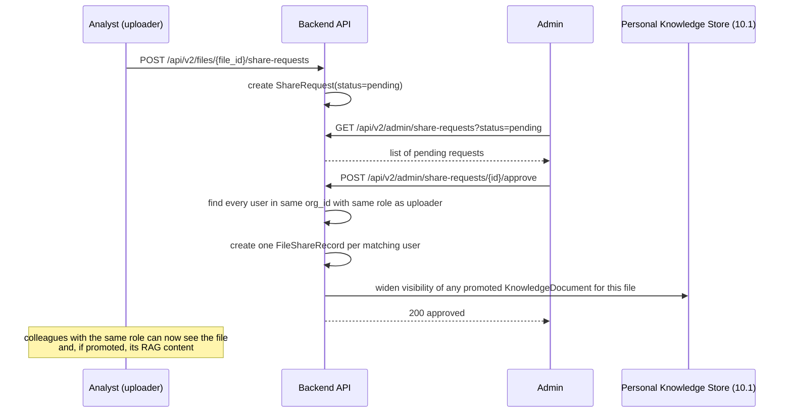

# 10.2 File Sharing Approval Workflow

## 1. Problem Solved

The Files Review admin panel built earlier lets an admin unilaterally browse any uploaded file and click "Promote" to widen its visibility. That model has the decision on the wrong side: the person who understands *why* a file is worth sharing is the uploader, not the admin scanning a list. It also does not match how this platform's role model works — "share with the org" is too broad; the right grain is "share with my peers," i.e. colleagues in the same organization who hold the same role.

This document replaces admin-initiated promotion with an **analyst-initiated request, admin-approved** flow, and defines the sharing grain precisely.

## 2. Flow



A rejected request is recorded (`status=rejected`, `decided_by`, `decided_at`, optional `reason`) so the analyst can see why, and can submit a new request later (e.g. after removing sensitive content).

## 3. Sharing Grain: "Same Org, Same Role"

"Share with the org" was the original ask; it was narrowed during design review because this platform's role model (`business_user`, `analyst`, `admin`) is the closest existing proxy for "department" — an admin approving a share is granting visibility to the uploader's functional peer group, not broadcasting to every role indiscriminately. Concretely: an `analyst` in `org_acme` requests sharing → approval grants access to every other `analyst` in `org_acme`, not to `admin`s or `business_user`s in that org.

This reuses `FileAccessChecker`'s existing `_ORG_SCOPE_ROLES` reasoning but scopes it down further to a single matching role, not "any role in `_ORG_SCOPE_ROLES`."

## 4. Data Model

New table/record, `file_share_requests`:

```python
@dataclass(frozen=True, slots=True)
class FileShareRequest:
    request_id: str          # req_share_<uuid>
    file_id: str
    requested_by: str        # user_id of the uploader
    org_id: str
    role: str                # the uploader's role at request time — this is the fan-out target
    status: Literal["pending", "approved", "rejected"]
    requested_at: datetime
    decided_by: str | None = None
    decided_at: datetime | None = None
    reason: str | None = None
```

No changes are needed to `FileShareRecord` (`src/chatbi/files/contracts.py`) — approval **generates** ordinary `FileShareRecord` rows, one per matching colleague, exactly as if the uploader had shared with each of them individually via the existing point-to-point share mechanism. `FileAccessChecker.check()` (`src/chatbi/files/access.py`) needs no changes at all: its existing `scope == "team"` + active-share branch already grants access once these records exist.

## 5. Endpoints

| Method | Path | Who | Effect |
|---|---|---|---|
| `POST` | `/api/v2/files/{file_id}/share-requests` | File owner | Create a pending request. 409 if a pending request already exists for this file. |
| `GET` | `/api/v2/admin/share-requests?status=pending` | Admin | List requests awaiting a decision, org-scoped to the admin's own org. |
| `POST` | `/api/v2/admin/share-requests/{request_id}/approve` | Admin | Resolve every same-org/same-role user, create a `FileShareRecord` for each, widen the file's promoted knowledge-document visibility per [10.1](01-rag-per-user-isolation.en.md) §4, mark the request approved. |
| `POST` | `/api/v2/admin/share-requests/{request_id}/reject` | Admin | Mark rejected with an optional reason; no `FileShareRecord`s created. |

## 6. Interaction With RAG Promotion (10.1)

Promoting a file into **the uploader's own private knowledge tier** stays self-service — no request, no approval, per the earlier design conversation ("分析师能自己把文件内容送进仅自己可见的检索，这个动作不需要审批"). A share request only matters once the uploader wants *other people* to see the file (and, if it is unstructured and already promoted, its RAG content too). Approval is therefore the single moment that both (a) file-level access and (b) RAG-level visibility widen together — there is no separate "share the RAG content" action distinct from "share the file."

## 7. What Changes on the Frontend

- File row in the uploader's own "My Files" panel: a "Request sharing" action (structured or unstructured — sharing widens *file* access either way; only unstructured files also carry promoted RAG content along with the share).
- Admin: a new "Share Requests" tab (or a filter within Files Review) listing pending requests with Approve/Reject actions.

## 8. Requirement IDs

| ID | Requirement |
|---|---|
| FR-FV10-041 | A file owner may submit at most one pending share request per file. |
| FR-FV10-042 | Approving a request creates a `FileShareRecord` for every user in the requester's `org_id` who holds the requester's role at approval time (not a live-updating group — later hires in that role are not retroactively granted). |
| FR-FV10-043 | Approving a request for an unstructured, already-promoted file also widens that file's `KnowledgeDocument` visibility to the same fan-out set. |
| FR-FV10-044 | Rejecting a request does not create any `FileShareRecord`s and does not affect the file's existing (private) visibility. |
