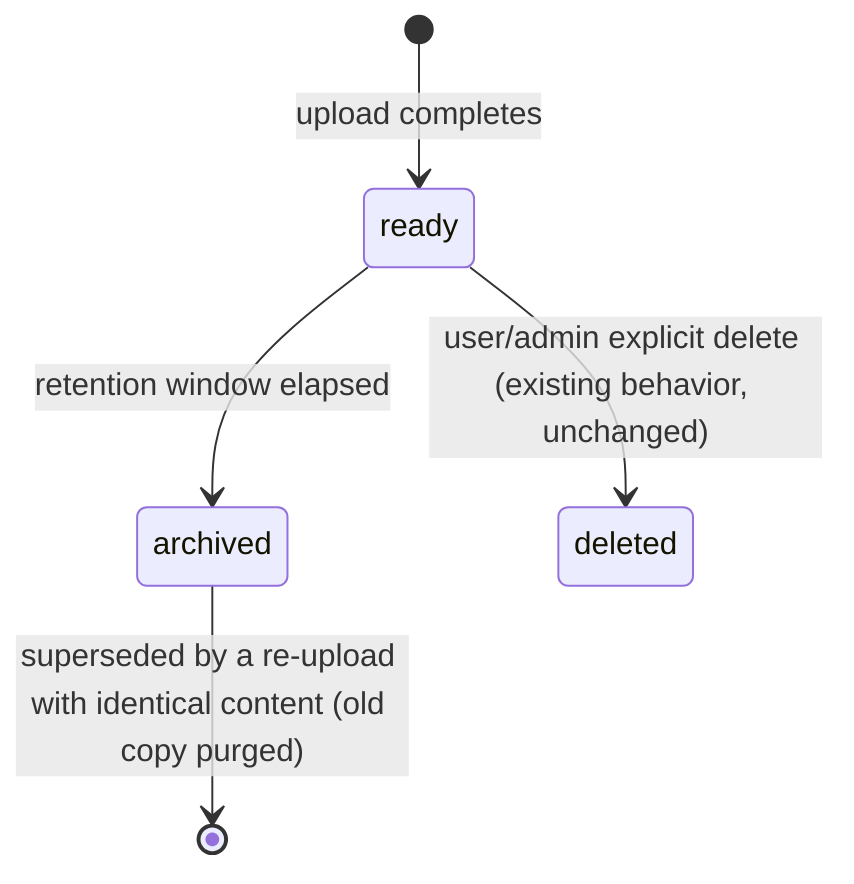

# 10.3 File Retention, Auto-Archival, and Re-Upload Dedup

## 1. Problem Solved

Uploaded files are meant to be a working set for active analysis, not permanent storage — a file an analyst used for a few days of work should not sit around indefinitely consuming space. At the same time, the platform must not be the system of record: if a file's content turns out to matter long-term, a *different* team owns the job of formally loading it into the governed business database. This project's job stops at making that handoff possible (an inspectable, exportable archive), not at performing the handoff itself.

The `RetentionWorker` (`src/chatbi/files/retention.py`) built earlier does not match this model in two ways: it is **destructive** (purges object-storage bytes and soft-deletes the record — there is no way back), and it is **never actually invoked** anywhere in the running system (no scheduler wires it up). This document replaces it with an archival model and wires it to run.

## 2. Lifecycle

| Scope | Retention window (unchanged from today unless noted) | On expiry |
|---|---|---|
| `session` | 24 hours (unchanged) | Archived |
| `user` (private, default) | **10 days** (was 30) | Archived |
| `team` (shared via [10.2](02-file-sharing-approval-workflow.en.md)) | **60 days** (was 90) | Archived |
| `org` | Not swept (unchanged — the spec never defined an org-scope expiry rule) | — |

The 10/60-day figures replace `RETENTION_THRESHOLDS` in `retention.py` directly; they are shorter than the original 30/90-day figures because "working set, not storage" is the explicit intent this time, not an incidental default.

## 3. What "Archived" Means

Archiving is **not** the same as today's soft-delete. Archiving:

- Keeps the file's object-storage bytes (original + any Parquet snapshot) and its Postgres metadata row intact.
- Sets a new `archived_at: datetime | None` timestamp on `UserUploadedFile` (a new field, distinct from the existing `deleted_at`).
- **Removes access for the file's owner and every share grantee.** `FileAccessChecker.check()` gains one precondition: if `file.archived_at is not None`, only `role == "admin"` may pass, regardless of ownership or share grants. The uploader who owns the file cannot query it, download it, or attach it to a chat request anymore — they must re-upload.
- If the file was unstructured and promoted into RAG (own private tier, or shared via 10.2), **that promoted content is deactivated at the same moment** — see §5.

Archived files do not show up in `GET /api/v2/files` (self-scoped listing) for the owner. They remain visible in a new admin-only listing (§6).

## 4. Content Hash and Re-Upload Dedup

`UserUploadedFile` gains a `content_hash: str` field — SHA-256 of the raw uploaded bytes, computed once at upload time (before parsing), stored alongside the existing metadata.

On every new upload, before creating the file record:

1. Compute the new file's `content_hash`.
2. Look up archived files (`archived_at IS NOT NULL`) belonging to the same `user_id` whose `content_hash` matches.
3. If found: purge that archived file's object-storage bytes and hard-delete its metadata row (this *is* a real, irreversible delete — but only for a duplicate that the user just proved is still wanted, by re-uploading the identical content).
4. Proceed with the new upload as a normal, fresh `ready` file (new `file_id`, new `file_group_id`, new 10/60-day retention clock).

Matching is scoped to the *same uploader*, not the whole org — two different people's identical-looking CSV exports are not assumed to be "the same file" just because the bytes happen to match; only a user re-uploading their own prior content triggers dedup.

## 5. Interaction With RAG (10.1)

This is the explicit rule confirmed during design review: **archiving a file freezes its RAG content along with the file itself.** Concretely, when `RetentionWorker` archives a file:

- If the file was promoted (`promoted_to_doc_id is not None`), the corresponding `KnowledgeDocument` is removed from the live per-user knowledge store (`InMemoryKnowledgeStore.remove_document`, already built for demote) and the Postgres `knowledge.documents`/`doc_chunks` rows are deleted, exactly as `KnowledgePromotionService.demote_document()` already does.
- `promoted_to_doc_id` is cleared on the archived file record.
- If the user later re-uploads the same content (§4) and wants it back in RAG, they must promote it again — there is no "auto-restore promotion" on re-upload. This is intentional: promotion is a decision about *current* content the user cares about right now, not a property that should silently reattach itself to a new upload.

## 6. Admin Visibility

New endpoint, `GET /api/v2/admin/files/archived` (or a `status=archived` filter on the existing `GET /api/v2/admin/files` from Files Review) — admin-only, lists archived files across the org with a way to download the original bytes (reusing the existing signed-URL download mechanism, gated by the same `role == "admin"` archived-file exception described in §3). This is the interface the "other team" mentioned in §1 would use to pull a file out of archive for their own, out-of-scope, permanent-ingestion process. Building that downstream ingestion pipeline is explicitly not part of this project.

## 7. Scheduling

`RetentionWorker.run()` needs an actual caller. Given this deployment has no dedicated job queue today (the `worker` container is a placeholder process, not a real task runner), the pragmatic fix in scope for this change is a periodic `asyncio` task started alongside the FastAPI app (e.g. on `startup`, loop with `asyncio.sleep` on an interval, matching the "runs at least once a day" requirement already stated in `retention.py`'s docstring) — not a new distributed scheduler. If a real job queue is introduced later for other reasons, moving this loop into it is a small follow-up, not a redesign.

## 8. Requirement IDs

| ID | Requirement |
|---|---|
| FR-FV10-045 | `user`-scope files are archived 10 days after last access; `team`-scope files 60 days after last access. |
| FR-FV10-046 | Archiving preserves object-storage bytes and the metadata row; it must not purge either. |
| FR-FV10-047 | An archived file is inaccessible to its owner and all share grantees; only `role == "admin"` may read or download it. |
| FR-FV10-048 | Archiving a promoted file removes its `KnowledgeDocument`/chunks from the live and persisted knowledge store, and clears `promoted_to_doc_id`. |
| FR-FV10-049 | A new upload whose content hash matches an archived file owned by the same user purges that archived duplicate (a genuine, irreversible delete, scoped to same-owner matches only). |
| FR-FV10-050 | `RetentionWorker` must run at least once daily against the live deployment, not merely exist as unwired code. |
