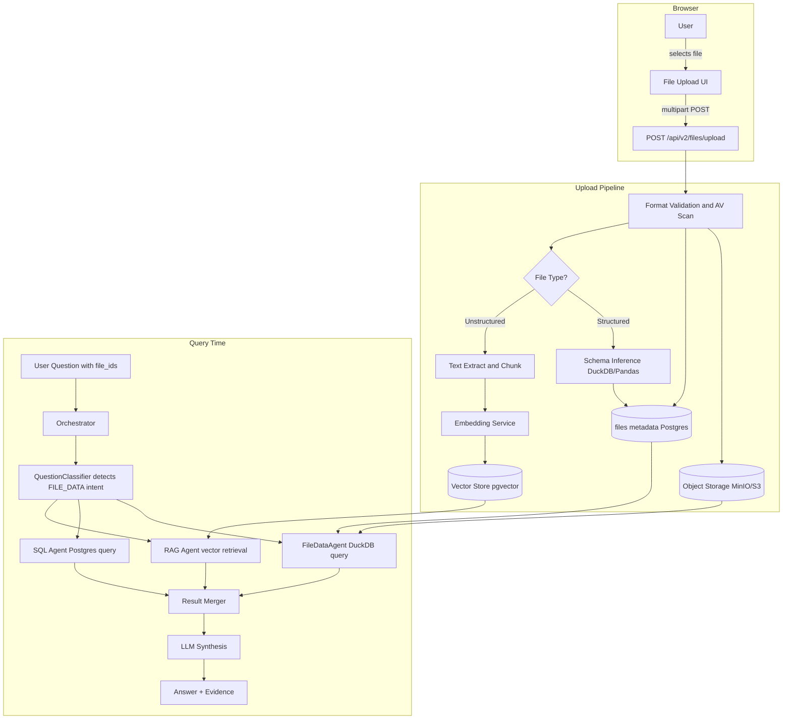
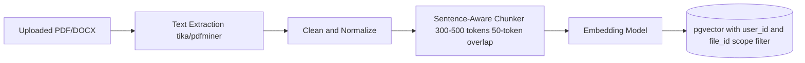
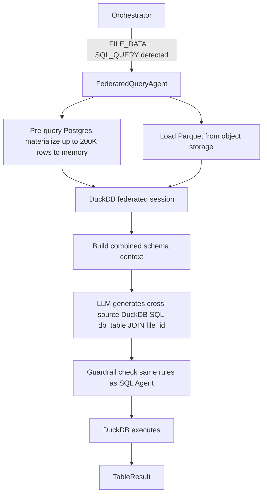

# 10 User File Upload and Hybrid Data Analysis

## 1. Problem Solved

Enterprise analysts and data staff routinely work with files that live outside the central data warehouse: budget spreadsheets from Finance, customer-segment exports from CRM, forecast models from Excel, or incident post-mortem reports in PDF.

Today, ChatBI can only answer questions against the governed PostgreSQL database. There is no way to bring a personal file into a conversation and ask the system to combine it with production data.

This design closes that gap. It lets any authorized user upload a file, and then ask questions that span both their uploaded data and the existing database — all within the same governed, audited session.

---

## 2. Two Modes of Uploaded Data

Every uploaded file falls into one of two processing modes based on its format.

| Mode | Formats | How it is used |
|---|---|---|
| **Structured** | CSV, XLSX, XLS, TSV, JSON (tabular) | Parsed into a virtual in-session table; agent can JOIN it with DB tables using DuckDB |
| **Unstructured** | PDF, DOCX, TXT, MD, PPTX | Chunked and embedded; RAG agent retrieves passages as evidence for natural language answers |

A single upload session can contain both types.

---

## 3. End-to-End Architecture



---

## 4. Storage Layer

### 4.1 Object Storage

All raw uploaded files are stored in object storage (MinIO for on-premise deployments; S3 for cloud).

```
bucket: chatbi-user-files
key:    {org_id}/{user_id}/{file_id}/{original_filename}
```

No file is publicly accessible. Download requires a signed URL generated server-side, valid for 15 minutes.

### 4.2 File Metadata Table

```sql
CREATE TABLE user_uploaded_files (
    file_id         TEXT PRIMARY KEY,
    org_id          TEXT NOT NULL,
    user_id         TEXT NOT NULL,
    original_name   TEXT NOT NULL,
    file_type       TEXT NOT NULL,         -- 'structured' | 'unstructured'
    mime_type       TEXT NOT NULL,
    size_bytes      BIGINT NOT NULL,
    storage_key     TEXT NOT NULL,
    schema_json     JSONB,                 -- column names and types (structured only)
    row_count       INTEGER,               -- (structured only)
    chunk_count     INTEGER,               -- (unstructured only)
    status          TEXT NOT NULL DEFAULT 'processing',
    scope           TEXT NOT NULL DEFAULT 'session',   -- 'session' | 'user' | 'team'
    session_id      TEXT,
    created_at      TIMESTAMPTZ NOT NULL DEFAULT NOW(),
    expires_at      TIMESTAMPTZ,
    deleted_at      TIMESTAMPTZ
);

CREATE INDEX ON user_uploaded_files (org_id, user_id, created_at DESC);
CREATE INDEX ON user_uploaded_files (session_id, status);
```

### 4.3 In-Session Structured Data (DuckDB)

When a structured file finishes uploading, the pipeline:

1. Downloads the raw file from object storage.
2. Uses DuckDB to infer column types and produce a Parquet snapshot.
3. Stores the Parquet file in object storage alongside the original.
4. Records the inferred schema in `schema_json`.

At query time, the `FileDataAgent` starts a DuckDB in-process session, reads the Parquet file, and executes SQL against it. Cross-file JOINs with PostgreSQL data use DuckDB's `postgres_scan` extension or by materializing a sample from Postgres into DuckDB's memory for the duration of the query.

---

## 5. Upload API

### 5.1 Endpoint

```
POST /api/v2/files/upload
Content-Type: multipart/form-data
Authorization: Bearer <token>

fields:
  file        — the binary payload
  scope       — "session" | "user" | "team"   (default: session)
  session_id  — required when scope = "session"
  description — optional human-readable label
```

### 5.2 Response

```json
{
  "trace_id": "tr_...",
  "request_id": "req_...",
  "data": {
    "file_id": "ufile_abc123",
    "original_name": "q2_forecast.xlsx",
    "file_type": "structured",
    "status": "processing",
    "schema": null,
    "size_bytes": 204800,
    "created_at": "2026-07-06T10:00:00Z"
  },
  "warnings": [],
  "error": null
}
```

Processing is asynchronous. The client polls `GET /api/v2/files/{file_id}` until `status` is `ready` or `failed`.

### 5.3 Other Endpoints

| Method | Path | Purpose |
|---|---|---|
| `GET` | `/api/v2/files` | List user's files (paginated, filterable by scope/status) |
| `GET` | `/api/v2/files/{file_id}` | Get file metadata and schema |
| `DELETE` | `/api/v2/files/{file_id}` | Soft-delete file |
| `GET` | `/api/v2/files/{file_id}/preview` | Return first 50 rows (structured) or first 3 chunks (unstructured) |

---

## 6. Query Flow with Uploaded Files

When a user submits a chat query, they can optionally attach one or more `file_ids`:

```json
{
  "request_id": "req_...",
  "session_id": "ses_...",
  "question": "Compare my uploaded Q2 forecast with actual revenue from the database.",
  "file_ids": ["ufile_abc123"],
  "locale": "en",
  "role": "analyst"
}
```

### 6.1 Question Classifier Extension

A new `TaskType.FILE_DATA` is added. The classifier detects file intent using:

1. Explicit `file_ids` in the request payload (definitive signal).
2. Keywords: `my file`, `uploaded`, `this spreadsheet`, `my data`, `my forecast`, `compare with`, `my numbers`.

If `FILE_DATA` is detected alongside `SQL_QUERY`, both agents run in parallel and their results are merged.

### 6.2 FileDataAgent

```
FileDataAgent:
  input:  file_id list, user question, role
  steps:
    1. Fetch file metadata from Postgres
    2. Verify file ownership and status = 'ready'
    3. Download Parquet from object storage
    4. Start DuckDB in-process session
    5. LLM generates DuckDB SQL for the file schema
    6. Apply same guardrail as SQL Agent (no writes, no functions blocked)
    7. Execute query
    8. Return TableResult
```

### 6.3 Cross-Source Merge

The `ResultMerger` receives outputs from all active agents and produces a unified context for the LLM synthesizer.

```
ResultMerger strategy:
  - If both FileDataAgent and SQL Agent returned tables:
      → pass both as separate labelled tables to LLM
      → LLM narrates the comparison (it does NOT join them in Python)
  - If only FileDataAgent returned data:
      → answer from file data alone
  - If RAG agent returned evidence:
      → include as supporting context alongside table data
```

---

## 7. Unstructured File Pipeline

PDF, DOCX, and similar files follow the same ingestion pipeline as existing RAG knowledge documents, but are tagged with user/org/session scope so they are never retrieved for other users.



At retrieval time, the RAG agent applies a metadata filter `user_id = current_user AND file_id IN request_file_ids` before performing vector similarity search.

---

## 8. Security and Governance

### 8.1 Isolation

- Files are isolated at the `(org_id, user_id)` level.
- A user can never access another user's files, even within the same organization, unless the file was explicitly shared (scope = `team` + team membership check).
- DuckDB queries against uploaded files pass through the same guardrail engine as Postgres SQL queries: write operations are denied.

### 8.2 File Validation

| Check | Rule |
|---|---|
| Format allowlist | CSV, XLSX, XLS, TSV, JSON, PDF, DOCX, TXT, MD, PPTX only |
| Size limit | 50 MB per file; 500 MB total storage per user |
| Virus scan | ClamAV or equivalent before any processing begins |
| Content-type match | Declared MIME type must match magic bytes |
| Row limit | Structured files with more than 1,000,000 rows are rejected |

### 8.3 Audit Trail

Every upload, query, preview, and deletion is recorded in the existing `chatbi_query_audit_log` with a `file_ids_used` JSON column added to the schema.

### 8.4 Retention Policy

| Scope | Auto-expiry |
|---|---|
| `session` | 24 hours after session last active |
| `user` | 30 days after last access |
| `team` | 90 days, or until explicitly deleted by owner/admin |

A background worker runs daily to purge expired files from object storage and soft-delete the metadata records.

---

## 9. Frontend Design

### 9.1 File Attachment Bar

A collapsed attachment bar appears below the question textarea. Users click `+` to open a file picker or drag-and-drop directly onto the textarea.

```
┌─────────────────────────────────────────────────────────┐
│  Ask a question...                                       │
│                                                          │
│  [+ Attach file]  q2_forecast.xlsx ✕   incidents.pdf ✕  │
└─────────────────────────────────────────────────────────┘
```

Attached files are displayed as chips with a remove button. The chips show the upload status (uploading spinner → ready → error).

### 9.2 File Library Drawer

A side drawer (accessible from the sidebar) shows the user's stored files across all scopes. Each entry shows: filename, status, row count or chunk count, created date, scope badge, and a delete button.

### 9.3 Answer Attribution

When an answer uses file data, the answer area shows:

- A `FILE DATA` source badge next to table results that came from uploaded files.
- An evidence card for unstructured file chunks, matching the existing RAG evidence card style but with a `📎 Uploaded` label instead of a document title.

---

## 10. Data Model Summary

```
user_uploaded_files        → file metadata, schema, status, scope
object_storage             → raw file + parquet snapshot
pgvector (knowledge store) → chunks from unstructured files (user-scoped)
chatbi_query_audit_log     → extended with file_ids_used
```

---

## 11. Solutions to Open Questions

This section provides a concrete design decision for each of the five open questions raised above.

---

### 11.1 Team File Collaboration

**Problem**: Should team-scoped files be visible to all org analysts or only to explicitly named members?

**Decision: Two-tier sharing granularity, no separate team entity**

Rather than introducing a full team membership model, the `scope` field is extended with two distinct sharing modes:

| scope value | Meaning |
|---|---|
| `org` | All users with role `analyst` or `admin` in the same `org_id` get read access |
| `team` | Only users explicitly listed in `user_file_shares` can read the file |

New sharing authorization table:

```sql
CREATE TABLE user_file_shares (
    share_id    TEXT PRIMARY KEY,
    file_id     TEXT NOT NULL REFERENCES user_uploaded_files(file_id),
    granted_by  TEXT NOT NULL,
    granted_to  TEXT NOT NULL,
    permission  TEXT NOT NULL DEFAULT 'read',
    created_at  TIMESTAMPTZ NOT NULL DEFAULT NOW(),
    revoked_at  TIMESTAMPTZ
);
CREATE UNIQUE INDEX ON user_file_shares (file_id, granted_to)
    WHERE revoked_at IS NULL;
```

**Access check logic** (evaluated on every file access):

```
allowed = (
    file.user_id == current_user_id
    OR (file.scope == 'org'  AND file.org_id == current_org_id
                              AND current_role IN ['analyst','admin'])
    OR (file.scope == 'team' AND EXISTS share
                              WHERE share.granted_to == current_user_id
                              AND share.revoked_at IS NULL)
    OR current_role == 'admin'
)
```

**Frontend**: Each file entry in the file library drawer gains a Share button that opens a modal for entering a colleague's email, or a one-click toggle to make the file org-visible.

---

### 11.2 Schema Evolution and Versioning

**Problem**: When a user re-uploads a revised file, which version do history queries use?

**Decision: Version chain keyed by file_group_id; queries anchor to the snapshot version**

Each upload creates a new record rather than overwriting the old one. A `file_group_id` links all versions of the same logical file.

```sql
ALTER TABLE user_uploaded_files
    ADD COLUMN file_group_id  TEXT,
    ADD COLUMN version_number INTEGER NOT NULL DEFAULT 1,
    ADD COLUMN is_latest      BOOLEAN NOT NULL DEFAULT TRUE;

CREATE INDEX ON user_uploaded_files (file_group_id, version_number DESC);
```

**Upload logic change**:

```
On upload:
  1. Check whether a file_group exists (match by org_id + user_id + original_name)
  2. If found:
       a. Set old is_latest = FALSE
       b. New record: version_number = max(old) + 1, is_latest = TRUE, same file_group_id
  3. If not found: generate new file_group_id, version_number = 1
```

**Audit log**:
`chatbi_query_audit_log.file_ids_used` stores the specific `file_id` (the version snapshot), not the `file_group_id`. History queries are therefore permanently anchored to the exact version that was active at query time, regardless of subsequent re-uploads.

**Frontend**: In the file library drawer, a file group can be expanded to show all historical versions. Each version can be downloaded independently or selected as an attachment in a new query.

---

### 11.3 Large File Chunked Streaming Upload

**Problem**: The 50 MB per-file limit is too restrictive for power users.

**Decision: Client-side chunking with direct-to-object-storage upload**

Large files bypass the backend service entirely. The client uploads chunks directly to pre-signed object storage URLs; the backend only coordinates metadata.

**Two new coordination endpoints**:

```
POST /api/v2/files/upload/init
Body: { original_name, file_size_bytes, mime_type, scope, session_id? }
Response: {
  upload_id: "upl_...",
  chunk_size_bytes: 5242880,        // 5 MB per chunk
  chunk_count: 42,
  presigned_urls: [                 // one pre-signed PUT URL per chunk, valid 30 min
    { chunk_index: 0, url: "https://minio/..." },
    ...
  ]
}

POST /api/v2/files/upload/{upload_id}/complete
Body: { etags: [{ chunk_index, etag }, ...] }
Response: { file_id, status: "processing" }
```

**Backend post-processing (async worker)**:

```
After complete:
  1. Call MinIO / S3 CompleteMultipartUpload to assemble chunks
  2. Stream-read file with DuckDB in 100K-row batches:
       → Infer schema immediately → status = 'schema_ready'
       → Continue generating full Parquet in background → status = 'ready'
  3. For unstructured files: stream-extract text, chunk, embed in batches
       → status = 'indexing' during processing → 'ready' when done
```

**Per-role file size limits**:

| Role | Per-file limit | Total storage per user |
|---|---|---|
| `business_user` | 50 MB | 500 MB |
| `analyst` | 500 MB | 5 GB |
| `admin` | 2 GB | 20 GB |

---

### 11.4 FederatedQueryAgent: Real Cross-Source SQL JOIN

**Problem**: The current LLM-narration approach does not execute a real JOIN between file data and database data.

**Decision: DuckDB federated session materializing both sources, then executing a real JOIN**

A new `FederatedQueryAgent` replaces the narration fallback when the question explicitly calls for a join.

**Execution flow**:



**Naming convention inside the DuckDB session**:

```sql
-- Postgres data registered as db_ prefixed views
CREATE VIEW db_sales AS SELECT * FROM read_parquet('/tmp/pg_sales_sample.parquet');

-- Uploaded file registered as file_ prefixed view
CREATE VIEW file_ufile_abc123 AS SELECT * FROM read_parquet('/tmp/user_file.parquet');

-- Example LLM-generated federated query
SELECT
    db_sales.month,
    db_sales.actual_revenue,
    file_ufile_abc123.forecast_revenue,
    db_sales.actual_revenue - file_ufile_abc123.forecast_revenue AS variance
FROM db_sales
JOIN file_ufile_abc123 ON db_sales.month = file_ufile_abc123.month
ORDER BY db_sales.month;
```

**Safety boundaries**:

| Constraint | Rule |
|---|---|
| Postgres materialization row cap | 200K rows; exceeding this triggers automatic fallback to LLM narration |
| DuckDB memory cap | 2 GB; exceeding this aborts the query with `QUERY_RESOURCE_EXCEEDED` |
| Blocked operations | CREATE / INSERT / UPDATE / DELETE / DROP (same guardrail as SQL Agent) |
| JOIN type compatibility | Both schemas included in LLM prompt; LLM is instructed to verify type compatibility before generating the JOIN |

**Degradation**: When the Postgres result exceeds the row cap, or when LLM fails to produce a valid JOIN query, the agent automatically falls back to separate-query + LLM-narration mode and surfaces a notice in the answer: "Due to data volume, this answer uses comparative narration rather than a direct federated query."

---

### 11.5 Promoting Files to the Team Knowledge Base

**Problem**: Team-scoped files should be promotable by an admin to become first-class entries in the org-wide RAG knowledge corpus.

**Decision: Admin promote action + bidirectional traceability; promoted documents live independently of the source file**

**New admin endpoint**:

```
POST /api/v2/admin/knowledge/promote-file
Body: {
  file_id: "ufile_abc123",
  target_collection: "official",
  title_override: "Q2 2026 Revenue Forecast",    // optional
  access_policy: { roles: ["analyst", "admin"] }
}
Response: { doc_id: "doc_...", status: "promoting" }
```

**Promotion pipeline (async worker)**:

```
1. Create a new record in knowledge.documents
   source_type = 'user_promoted', promoted_from_file_id = file_id
2. Copy all pgvector chunks for this file_id to the official knowledge store
   Remove user_id scope filter; attach doc_id instead
3. Copy the original file / Parquet to the knowledge-store storage bucket
4. Update user_uploaded_files:
   promoted_to_doc_id = doc_id, append 'promoted' marker to scope
5. Send an in-app notification to the original file owner
```

**Bidirectional traceability**:

```sql
-- Find the source file for a promoted knowledge document
SELECT uf.original_name, uf.user_id, uf.created_at
FROM knowledge.documents kd
JOIN user_uploaded_files uf ON uf.file_id = kd.promoted_from_file_id
WHERE kd.doc_id = 'doc_xyz';

-- Check whether a user file has been promoted
SELECT promoted_to_doc_id, scope
FROM user_uploaded_files
WHERE file_id = 'ufile_abc123';
```

**Rollback (demotion)**: `DELETE /api/v2/admin/knowledge/{doc_id}?mode=demote` removes the document from the knowledge store and restores the user-scope filter on the pgvector chunks. The user file record is untouched.

**Governance constraints**:
- Only the `admin` role can promote or demote.
- After promotion, the original file owner can still delete their user file record; the knowledge-store document survives independently.
- Every promote and demote action is recorded in `chatbi_query_audit_log` with `event_type = 'file_promoted_to_knowledge'` or `'file_demoted_from_knowledge'`.

---

## 12. Summary of All Five Solutions

| Question | Core decision | Key constraint |
|---|---|---|
| Team collaboration | Two-tier scope (org / team) + explicit share table | No separate team entity; keeps ops simple |
| Schema evolution | Version chain + query anchors to snapshot file_id | Audit log stores file_id, not group_id |
| Large file upload | Client-side chunking, direct to object storage + streaming post-processing | Per-role size tiers; streaming keeps UI responsive |
| Cross-source JOIN | FederatedQueryAgent + DuckDB federated session | Postgres materialize cap 200K rows; auto-degrade |
| Knowledge base promotion | Admin one-click promote + vector store copy + bidirectional trace | Promoted doc and source file have independent lifecycles |

## 13. Follow-Up Designs

Post-implementation review found a real cross-tenant data leak in the RAG knowledge base and refined the sharing/retention model further. See [10-followups/](10-followups/README.en.md) for the RAG per-user isolation fix, the corrected admin-approval sharing workflow, the retention/auto-archival redesign, and a multi-turn conversation memory design.
