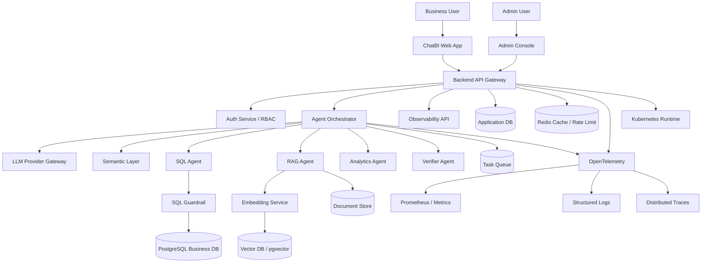

# Final Version System Design Index

中文版：[../zh-CN/README.zh-CN.md](../zh-CN/README.zh-CN.md)

This document set is the entry point for moving the Governed Multi-Agent ChatBI Platform from an engineering MVP toward an industrial final version.

The earlier `01` to `10` system design folders explain the core ChatBI modules. This `final-version` package answers a more production-oriented question:

> What should the platform look like if it must be reviewed as an industrial project, deployed to the cloud, support real users, call real LLM APIs, enforce permissions, and expose operational observability?

In plain terms: the earlier documents are module designs; this folder is the production blueprint.

## Recommended Reading Order

1. [00 Executive System Design](00-executive-system-design.en.md)
2. [01 Production Architecture](01-production-architecture.en.md)
3. [02 Auth, RBAC, and Tenant Isolation](02-auth-rbac-tenant-isolation.en.md)
4. [03 LLM Provider Gateway](03-llm-provider-gateway.en.md)
5. [04 Embedding, Vector Database, and RAG](04-embedding-vector-rag.en.md)
6. [05 Data Platform, Migrations, and Seed Data](05-data-platform-and-seed.en.md)
7. [06 Cloud and Kubernetes Deployment](06-cloud-kubernetes-deployment.en.md)
8. [07 Resilience, Rate Limiting, and Scale](07-resilience-and-scale.en.md)
9. [08 Security, Observability, and Admin Console](08-security-observability-admin.en.md)
10. [09 Final Delivery Roadmap](09-final-delivery-roadmap.en.md)

## Target Architecture

## Current MVP vs Final Version

The current project already has the skeleton of a governed multi-agent ChatBI system: API entry points, orchestration, SQL guardrails, RAG components, analytics and forecasting, evaluation, traces, metrics, and release gates.

The final version must add the capabilities that make the system credible as an industrial platform:

1. Real user accounts: sign-up, sign-in, JWT/session handling, organizations, roles, and permissions.
2. Real LLM integration: provider adapters, timeouts, retries, cost tracking, and model routing.
3. Embeddings and vector storage: real document retrieval for RAG.
4. Admin isolation: evals, audits, traces, and release gates visible only to authorized users.
5. Large test data: repeatable seed data, evaluation data, demo data, and load-test data.
6. Distributed-system resilience: rate limits, circuit breakers, retries, queues, graceful degradation, and load testing.
7. Cloud deployment: Docker images, Kubernetes, ingress, secrets, HPA, and CI/CD.
8. Security governance: tenant isolation, audit logs, masking, secret management, and least privilege.

## How to Use This Package

Use the documents as the implementation roadmap:

1. Start with Auth/RBAC because all admin visibility and tenant isolation depend on it.
2. Add the LLM Gateway so model integration is controlled and observable.
3. Add embeddings and a vector store so RAG becomes real.
4. Add seed data, migrations, and test datasets so the platform can be verified.
5. Finish with Kubernetes, resilience, load testing, and cloud deployment.
