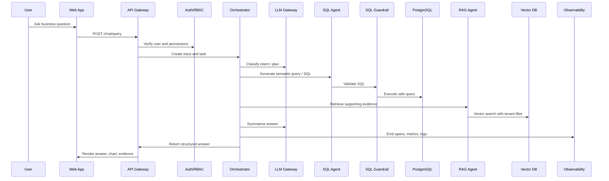

# 01 生产级总体架构

## 1. 架构目标

生产级架构要解决三个问题：

1. 用户能安全地使用系统。
2. 后端能稳定地编排 Agent、访问数据、调用模型。
3. 管理员能观察、审计、评估和发布系统。

所以最终系统不应该只有一个 FastAPI 服务，而应该拆成清晰的运行层。

## 2. 运行层划分

### 2.1 用户入口层

包含：

1. ChatBI Web App：普通业务用户使用。
2. Admin Console：管理员使用。
3. API Gateway：所有前端请求统一进入后端。

这一层的重点是身份识别、权限校验、请求限流和统一错误返回。

### 2.2 应用服务层

包含：

1. Auth Service：注册、登录、token、角色。
2. Chat API：对话、历史、查询结果。
3. Orchestrator Service：任务拆解和 Agent 调度。
4. Observability API：trace、metrics、eval、release gate。
5. Admin API：用户管理、权限管理、审计查询。

这一层的重点是业务流程和权限边界。

### 2.3 智能能力层

包含：

1. LLM Provider Gateway：统一调用不同大模型。
2. SQL Agent：生成和解释 SQL。
3. RAG Agent：检索文档和证据。
4. Analytics Agent：异常检测、趋势、预测。
5. Verifier Agent：验证答案、SQL 和证据。

这一层的重点是智能能力，但不能绕过安全治理。

### 2.4 数据与基础设施层

包含：

1. PostgreSQL：应用数据、业务数据、审计数据。
2. pgvector 或外部向量库：embedding 检索。
3. Redis：缓存、限流、短期状态。
4. Queue：异步任务和长任务。
5. Object Storage：文档、导出报告、评估结果。
6. Kubernetes：部署、扩缩容、滚动发布。

这一层的重点是稳定、可恢复、可扩展。

## 3. 用户提问主流程

## 4. 关键设计点

### 4.1 API Gateway 是总入口

所有请求先进入 API Gateway。它负责：

1. 验证 token。
2. 注入 `user_id`、`org_id`、`roles`。
3. 写入 request id 和 trace id。
4. 做基础限流。
5. 把请求转给内部服务。

大白话：门口先验票，再让你进不同房间。

### 4.2 Orchestrator 只管流程，不直接碰危险资源

Orchestrator 可以决定调用 SQL Agent，但不能绕过 SQL Guardrail 直接查库。它可以调用 RAG Agent，但必须带上租户过滤条件。

这样做是为了避免“智能编排器权限太大”。

### 4.3 LLM Gateway 隔离模型 Provider

业务代码不直接写 OpenAI、Anthropic 或 Gemini 的 SDK 调用，而是统一走 LLM Gateway。

好处：

1. 以后换模型不用重写业务逻辑。
2. 可以统一记录 token、成本、延迟。
3. 可以统一做重试、超时、降级。
4. 可以统一做 prompt 版本管理。

### 4.4 Observability 是横切能力

trace、metrics、logs、audit 不属于某一个模块，而是每个关键模块都要写。

最少要覆盖：

1. API 请求耗时。
2. Agent 执行耗时。
3. LLM 调用耗时、token、错误率。
4. SQL Guardrail 拦截次数。
5. RAG 检索命中率。
6. release gate 通过率。

## 5. 服务边界建议

初期可以一个 FastAPI 应用内按模块拆包，最终可拆成多个服务：

1. `api-service`：对外 REST API。
2. `worker-service`：异步 Agent 和评估任务。
3. `llm-gateway`：模型调用。
4. `rag-indexer`：文档解析、切片、embedding。
5. `admin-service`：后台管理。

建议先模块化，再微服务化。过早拆服务会增加部署和调试成本。
