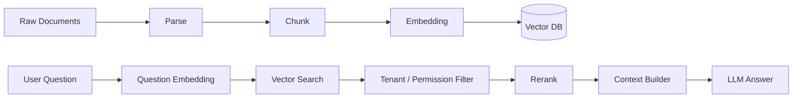

# 04 Embedding、向量数据库与 RAG

## 1. 这部分解决什么问题

ChatBI 不能只查数据库。很多业务答案藏在文档里，比如：

1. 指标口径说明。
2. 财务政策。
3. 销售策略。
4. 产品更新说明。
5. 运营复盘。

RAG 的作用就是把这些文档变成可检索证据，让模型回答时有依据。

## 2. 最终 RAG 流程

## 3. 文档入库

文档入库不只是把文件丢进去，要保存元数据：

1. `document_id`
2. `org_id`
3. `source_type`
4. `title`
5. `owner`
6. `created_at`
7. `version`
8. `access_policy`

每个 chunk 也要保存：

1. `chunk_id`
2. `document_id`
3. `org_id`
4. `text`
5. `embedding`
6. `page`
7. `section`
8. `token_count`

## 4. 向量库选择

初期建议使用 `pgvector`，因为它和 PostgreSQL 集成简单，适合课程项目升级到工业 MVP。

后期如果数据量很大，可以切换到：

1. Pinecone
2. Weaviate
3. Milvus
4. Qdrant

但是代码层不要写死具体后端，要有 `VectorStore` 抽象。

## 5. Embedding Service

Embedding Service 负责：

1. 调用 embedding provider。
2. 对文档 chunk 生成向量。
3. 对用户问题生成向量。
4. 记录 token 和成本。
5. 避免重复 embedding。
6. 支持批量处理。

## 6. 检索时必须做权限过滤

向量搜索不能只按相似度排。必须先保证：

1. `org_id` 匹配。
2. 用户有文档访问权限。
3. 文档没有被删除或禁用。
4. chunk 没有超过可见范围。

正确顺序是：

1. 生成 query embedding。
2. 在同一租户范围内搜索。
3. 根据权限过滤。
4. rerank。
5. 构造上下文。

## 7. Token 节省策略

用户前面提到 token 消耗，这里是关键。

RAG 可以减少 token 的方法：

1. 只把 top-k 相关 chunk 放入 prompt。
2. chunk 不要太大。
3. 用 metadata filter 缩小搜索范围。
4. 对长文档做摘要索引。
5. 对常见问题缓存检索结果。
6. 对多轮对话做上下文压缩。

大白话：不要把整本书塞给模型，而是先用向量库找到最可能有用的几页。

## 8. RAG 输出结构

最终答案应包含：

1. `answer`
2. `citations`
3. `evidence_chunks`
4. `confidence`
5. `missing_evidence_warning`

如果没有找到证据，系统应该明确说“没有足够证据”，而不是编一个答案。

## 9. 实施顺序

1. 定义 `EmbeddingClient` 和 `VectorStore` 接口。
2. 使用 pgvector 建表。
3. 实现文档 chunk 入库。
4. 实现 query embedding 和 vector search。
5. 给 RAG Agent 加租户过滤。
6. 给回答加 citation。
7. 写测试：A 租户不能搜到 B 租户文档。
