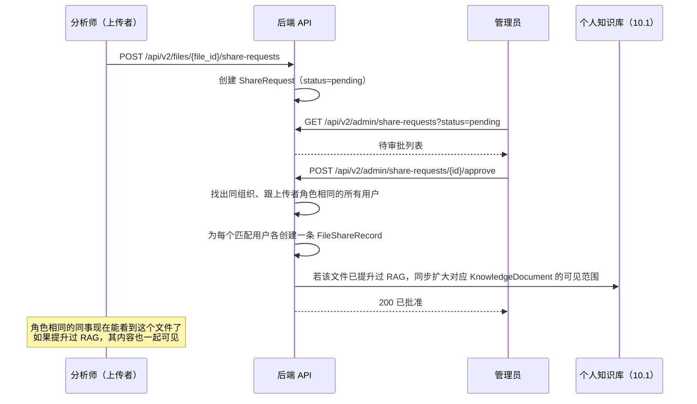

# 10.2 文件分享审批流程

## 1. 解决的问题

之前建的 Files Review 管理面板，是让 admin 自己浏览所有上传文件，看中哪个就点 "Promote" 扩大它的可见范围。这个模式的决策权放错了地方：真正清楚"这个文件值不值得分享"的是上传者本人，不是翻列表的 admin。而且这个模式也跟这个平台的角色体系对不上——"分享给整个组织"的粒度太粗，更合适的粒度是"分享给我的同行"，也就是同一个组织里、跟自己角色相同的同事。

本文档把"admin 主动发起提升"改成"分析师主动申请、admin 审批"的流程，并且把分享的粒度定精确。

## 2. 流程



被拒绝的申请也会被记录下来（`status=rejected`、`decided_by`、`decided_at`、可选的 `reason`），分析师能看到拒绝原因，之后可以（比如去掉敏感内容后）重新发起申请。

## 3. 分享粒度："同组织、同角色"

最初的想法是"分享给整个组织"，设计评审时收窄成了这个——因为这个平台的角色体系（`business_user`、`analyst`、`admin`）是目前最接近"部门"这个概念的现成东西，admin 批准分享，本质上是把可见性授予上传者的**同职能同事群体**，而不是不分角色地广播给所有人。具体来说：`org_acme` 里的一个 `analyst` 发起申请 → 批准后授予 `org_acme` 里**其他所有 `analyst`** 的访问权，不会授予该组织里的 `admin` 或 `business_user`。

这复用了 `FileAccessChecker` 里现有的 `_ORG_SCOPE_ROLES` 思路，但进一步收窄到"单一匹配角色"，而不是"`_ORG_SCOPE_ROLES` 里任意角色"。

## 4. 数据模型

新增一张表/记录，`file_share_requests`：

```python
@dataclass(frozen=True, slots=True)
class FileShareRequest:
    request_id: str          # req_share_<uuid>
    file_id: str
    requested_by: str        # 上传者的 user_id
    org_id: str
    role: str                # 申请时上传者的角色——这是扇出授权的目标群体
    status: Literal["pending", "approved", "rejected"]
    requested_at: datetime
    decided_by: str | None = None
    decided_at: datetime | None = None
    reason: str | None = None
```

`FileShareRecord`（`src/chatbi/files/contracts.py`）不需要任何改动——审批通过时**生成**普通的 `FileShareRecord` 记录，每个匹配的同事一条，效果跟上传者本人通过现有的点对点分享机制逐个分享给每个人完全一样。`FileAccessChecker.check()`（`src/chatbi/files/access.py`）也完全不用改：一旦这些记录存在，它现有的 `scope == "team"` + 有效分享判断分支就会自动生效。

## 5. 接口

| 方法 | 路径 | 谁能调用 | 效果 |
|---|---|---|---|
| `POST` | `/api/v2/files/{file_id}/share-requests` | 文件所有者 | 创建一条待审批申请。如果该文件已有待审批申请，返回 409。 |
| `GET` | `/api/v2/admin/share-requests?status=pending` | 管理员 | 列出待审批申请，范围限定在该管理员所在组织。 |
| `POST` | `/api/v2/admin/share-requests/{request_id}/approve` | 管理员 | 找出同组织同角色的所有用户，各创建一条 `FileShareRecord`，按 [10.1](01-rag-per-user-isolation.zh-CN.md) 第 4 节的方式同步扩大该文件已提升知识文档的可见范围，标记申请为已批准。 |
| `POST` | `/api/v2/admin/share-requests/{request_id}/reject` | 管理员 | 标记为已拒绝，可附带原因；不创建任何 `FileShareRecord`。 |

## 6. 跟 RAG 提升（10.1）的关系

把文件提升进**上传者自己的私有知识层**这件事保持自助式——不需要申请，不需要审批，跟之前讨论时确认的一致（"分析师能自己把文件内容送进仅自己可见的检索，这个动作不需要审批"）。分享申请只有在上传者想让**其他人**看到这个文件时才需要（如果该文件是非结构化且已经提升过，其 RAG 内容也会一起共享）。所以审批通过这一刻，是（a）文件级别的访问权限和（b）RAG 级别的可见性**同时**扩大的唯一时机——不存在一个独立于"分享文件"之外、单独"分享 RAG 内容"的动作。

## 7. 前端改动

- 上传者自己"My Files"面板里的文件行：加一个"申请分享"的操作（不管结构化还是非结构化都可以——分享都会扩大**文件**的访问权限；只有非结构化文件的分享会额外带上已提升的 RAG 内容）。
- 管理员：新增一个"待审批分享"tab（或者在 Files Review 里加个筛选项），列出待处理的申请，带批准/拒绝按钮。

## 8. 需求编号

| 编号 | 需求 |
|---|---|
| FR-FV10-041 | 一个文件所有者对同一个文件最多只能有一条待审批的分享申请。 |
| FR-FV10-042 | 批准申请时，会为申请者所在 `org_id` 内、在批准那一刻持有申请者角色的每个用户各创建一条 `FileShareRecord`（不是动态更新的群组——之后新入职这个角色的人不会被追溯授权）。 |
| FR-FV10-043 | 批准一个已提升的非结构化文件的申请，同时会把该文件的 `KnowledgeDocument` 可见范围扩大到同一批扇出对象。 |
| FR-FV10-044 | 拒绝申请不会创建任何 `FileShareRecord`，也不影响该文件现有的（私有）可见性。 |
