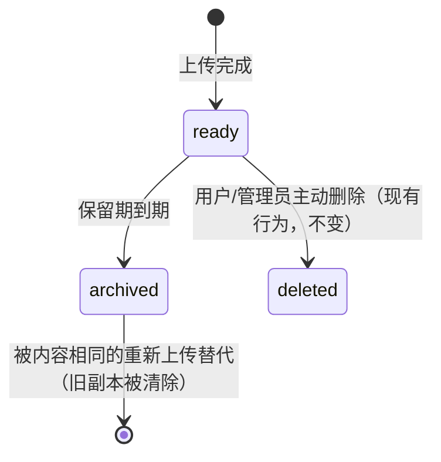

# 10.3 文件保留、自动归档与重新上传去重

## 1. 解决的问题

上传的文件本质上应该是一批"正在用的工作集"，不是永久存储——分析师用几天就不再需要的文件，不应该无限期占着空间。但与此同时，这个平台不应该充当"数据的最终归宿"：如果某份文件的内容长期来看确有价值，正式把它录入受治理业务数据库这件事，应该由**另一个团队**负责，本项目的职责止步于让这个交接成为可能（一份可查看、可导出的归档），而不是替他们完成这个交接。

之前建的 `RetentionWorker`（`src/chatbi/files/retention.py`）跟这个模型有两处对不上：它是**破坏性的**（销毁对象存储里的字节 + 软删除记录，没有回头路），而且它**从来没有被真正接到系统里运行过**（没有任何调度机制调用它）。本文档用"归档"模型替换它，并且把它接上真正的运行调度。

## 2. 生命周期

| Scope | 保留期（除非特别说明，否则跟现在一致） | 到期后 |
|---|---|---|
| `session` | 24 小时（不变） | 归档 |
| `user`（私有，默认） | **10 天**（原来是 30 天） | 归档 |
| `team`（通过 [10.2](02-file-sharing-approval-workflow.zh-CN.md) 分享出去的） | **60 天**（原来是 90 天） | 归档 |
| `org` | 不清理（不变——spec 里从未定义过 org scope 的过期规则） | — |

10/60 天这两个数字直接替换 `retention.py` 里的 `RETENTION_THRESHOLDS`；比原来的 30/90 天更短，是因为这次"工作集而非存储"是明确的设计意图，不是随手定的默认值。

## 3. "归档"具体是什么意思

归档**不等于**现在的软删除。归档会：

- 保留该文件的对象存储字节（原始文件 + 任何 Parquet 快照）以及它在 Postgres 里的元数据行，两者都不动。
- 在 `UserUploadedFile` 上设置一个新的 `archived_at: datetime | None` 时间戳（新字段，跟现有的 `deleted_at` 区分开）。
- **收回文件所有者和所有被授权者的访问权限。** `FileAccessChecker.check()` 新增一条前置判断：只要 `file.archived_at is not None`，不管是不是所有者、有没有分享授权，只有 `role == "admin"` 能通过。文件的上传者本人也查不了、下载不了、也不能再把它挂到聊天请求里——必须重新上传。
- 如果该文件是非结构化的且已经提升进了 RAG（不管是自己私有那层，还是通过 10.2 分享出去的），**它在 RAG 里的内容会在同一时刻一起失效**——见第 5 节。

归档文件不会出现在 `GET /api/v2/files`（用户自查的文件列表）里。它们仍然会出现在一个新增的、仅管理员可见的列表里（见第 6 节）。

## 4. 内容指纹与重新上传去重

`UserUploadedFile` 新增一个 `content_hash: str` 字段——上传原始字节的 SHA-256（在解析之前算一次），跟其他元数据一起存下来。

每次新上传，在创建文件记录之前：

1. 计算新文件的 `content_hash`。
2. 查找同一个 `user_id` 名下、`content_hash` 匹配的已归档文件（`archived_at IS NOT NULL`）。
3. 如果找到：清除该归档文件的对象存储字节，硬删除其元数据行（这**确实是**一次真正的、不可逆的删除——但只针对用户刚刚用重新上传相同内容的行为证明"这份数据我还要用"的那个归档副本）。
4. 新上传照常走正常流程，成为一个全新的 `ready` 文件（新的 `file_id`、新的 `file_group_id`、重新计时的 10/60 天保留期）。

匹配范围限定在**同一个上传者**，不扩大到整个组织——两个不同的人碰巧上传了字节完全一样的 CSV 导出文件，不会被当成"同一份文件"；只有用户重新上传自己此前的内容才会触发去重。

## 5. 跟 RAG（10.1）的联动

设计评审时明确确认过这条规则：**文件归档时，它在 RAG 里的内容跟文件本身一起冻结。** 具体来说，`RetentionWorker` 归档一个文件时：

- 如果该文件已被提升（`promoted_to_doc_id is not None`），对应的 `KnowledgeDocument` 会从实时的个人知识库中移除（复用 demote 时已经建好的 `InMemoryKnowledgeStore.remove_document`），Postgres 里的 `knowledge.documents`/`doc_chunks` 记录也会被删除，跟 `KnowledgePromotionService.demote_document()` 现在的行为完全一致。
- 归档文件记录上的 `promoted_to_doc_id` 会被清空。
- 如果用户之后重新上传了相同内容（第 4 节）并且还想要它出现在 RAG 里，需要重新提升一次——重新上传**不会**自动恢复之前的提升状态。这是有意为之：提升是对"用户当下关心的内容"做出的决定，不应该在新上传时悄悄自动重新附着。

## 6. 管理员可见性

新增接口 `GET /api/v2/admin/files/archived`（或者在 Files Review 现有的 `GET /api/v2/admin/files` 上加一个 `status=archived` 筛选项）——仅管理员可用，列出组织内所有归档文件，并提供下载原始字节的方式（复用现有的签名 URL 下载机制，用第 3 节里同样的"归档文件仅 admin 例外"规则来放行）。这就是第 1 节提到的"另一个团队"用来把文件从归档区取出去、进行他们自己那套（不在本项目范围内的）正式入库流程的接口。构建下游的正式入库管线明确不属于本项目范围。

## 7. 调度

`RetentionWorker.run()` 需要有个真正的调用方。考虑到现在的部署里没有专门的任务队列（`worker` 容器目前只是个占位进程，不是真正的任务执行器），这次改动范围内务实的做法是：随 FastAPI 应用一起启动一个周期性的 `asyncio` 任务（比如在 `startup` 时启动，用 `asyncio.sleep` 控制间隔，满足 `retention.py` 文档字符串里早就写好的"至少每天运行一次"这个要求），而不是引入一套新的分布式调度系统。以后如果因为别的原因引入了真正的任务队列，把这个循环挪过去是个小的后续工作，不需要重新设计。

## 8. 需求编号

| 编号 | 需求 |
|---|---|
| FR-FV10-045 | `user` scope 的文件在最后一次访问后 10 天归档；`team` scope 的文件 60 天归档。 |
| FR-FV10-046 | 归档必须保留对象存储字节和元数据行，两者都不能清除。 |
| FR-FV10-047 | 归档文件对所有者和所有被授权者都不可访问；只有 `role == "admin"` 能读取或下载。 |
| FR-FV10-048 | 归档一个已提升的文件，必须从实时知识库和持久化存储中移除其 `KnowledgeDocument`/分块，并清空 `promoted_to_doc_id`。 |
| FR-FV10-049 | 新上传的内容指纹如果匹配同一用户名下的某个已归档文件，会清除该归档副本（一次真正的、不可逆的删除，只匹配同一所有者）。 |
| FR-FV10-050 | `RetentionWorker` 必须在实际部署中每天至少运行一次，不能只是写好了却没人调用的代码。 |
